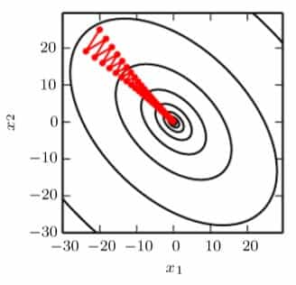

# Deep Learning

>*Ian Goodfellow, Yoshua Bengio, Aaron Courville*  
*2016, MIT Press, <https://www.deeplearningbook.org>{:target="_blank"}*  

---

## Applied Maths

### Norms

The $L^p$ norm is given by

$$
\|\boldsymbol{x}\|_p = \left(\sum_i|x_i|^p\right)^{\frac{1}{p}}
$$

for $p\in\mathbb{R}$, $p\ge1$.

当零和非零值之间的区别非常重要时，常用 $L^1$ 范数.

Analogous to $L^2$ norm (Euclidean distance), the *Frobenius norm* measures the size of a matrix:

$$
\|\boldsymbol{A}\|_F = \sqrt{\sum_{i,j}A_{i,j}^2}.
$$

### Trace

The trace provides another way of writing the Frobenius norm

$$
\|\boldsymbol{A}\|_F=\sqrt{\operatorname{Tr}(\boldsymbol{A}\boldsymbol{A}^\top)}.
$$

若各因子的形状使得乘积是方阵，

$$
\operatorname{Tr}(\boldsymbol{A}^{(1)}\boldsymbol{A}^{(2)}\cdots\boldsymbol{A}^{(n)})=\operatorname{Tr}(\boldsymbol{A}^{(n)}\boldsymbol{A}^{(1)}\cdots\boldsymbol{A}^{(n-1)}).
$$

### Useful Properties of Common Functions

$$
\text{Softplus:}\quad \zeta(x) = \ln(1+\mathrm{e}^x)
$$

$$
\text{Sigmoid:}\quad \sigma(x) = \frac{1}{1+\mathrm{e}^{-x}}
$$

$$
\sigma(x) = \frac{\mathrm{e}^x}{\mathrm{e}^0+\mathrm{e}^x}
$$

$$
\frac{\mathrm{d}}{\mathrm{d}x}\sigma(x) = \sigma(x)(1-\sigma(x))
$$

$$
1-\sigma(x) = \sigma(-x)
$$

$$
\zeta(x) = \int_{-\infty}^{x}\sigma(x)\mathrm{d}x, \quad \frac{\mathrm{d}}{\mathrm{d}x}\zeta(x) = \sigma(x)
$$

$$
\ln\sigma(x)=-\zeta(-x)
$$

$$
\zeta(x)-\zeta(-x)=x
$$

$$
\sigma^{-1}(x)=\ln\left(\frac{x}{1-x}\right)
$$

$$
\zeta^{-1}(x)=\ln(\mathrm{e}^x-1)
$$

### Information Theory

信息的含量取决于此信息代表的事件发生的可能性. 低概率事件包含的信息值高，高概率事件的信息则低，同时独立事件的信息值具有可加性. 由上面的性质，可以得到事件 $\mathrm{x}=x$ 的自信息（self-informaion）为

$$
I(x) = -\ln P(x).
$$

由于使用自然对数，此处 $I(x)$ 的单位为 nats，一个 nat 对应概率为 $\mathrm{e}^{-1}$ 的事件. 如果使用以 $2$ 为底的对数，则单位为比特.

香农熵用于衡量一个概率分布的不确定性：

$$
H(P)=H(\mathrm{x}) = \operatorname{E}\big[I(x)\big],
$$

也就是从一个概率分布中得到的信息量的期望. 比较集中的分布熵值低，分散的分布熵值高.

KL 距离（Kullback-Leibler divergence）衡量两个分布之间的差异：

$$
D_{\mathrm{KL}}(P\Vert Q)=\operatorname{E}_P \ln\frac{P(x)}{Q(x)}.
$$

KL 距离总是非负的，而且它并不对称，即 $D_{\mathrm{KL}}(P\Vert Q)\ne D_{\mathrm{KL}}(Q\Vert P)$.

交叉熵（cross-entropy）的定义是

$$
H(P,Q) = H(P) + D_{\mathrm{KL}}(P\Vert Q) =  -\operatorname{E}_P\ln Q(x).
$$

若以 $Q(x)$ 为参数，则交叉熵和 KL 距离同时有最值.

### Overflow and Underflow

数值处理的根本困难在于用有限位的计算机处理连续的实数，这导致了舍入误差（rounding error）.

以 $\operatorname{softmax}(\boldsymbol{x})_i = \mathrm{e}^{x_i}/\sum\limits_{j=i}^{n}\mathrm{e}^{x_j}$ 为例，令 $x_i=c\in\mathbb{R}$，那么函数值必然为 $1/n$. 但是在实际计算时，若 $c$ 是非常小的负数，导致分母下溢，则结果变为未定义. 如果 $c$ 是很大的正数，那么导致上溢，同样结果未定义. 解决的办法是利用性质 $\operatorname{softmax}(\boldsymbol{x})=\operatorname{softmax}(\boldsymbol{x}-c)$，将 $\boldsymbol{x}$ 换为 $\boldsymbol{x}-\max x_i$ 即可.

### Poor Conditioning

这种误差指的是微小的输入扰动导致输出大幅变化. 这会让之前产生的误差放大. 例如函数 $f(\boldsymbol{x}) = \boldsymbol{A}^{-1}\boldsymbol{x}$，当 $\boldsymbol{A}$ 可以做奇异值分解时，它的条件数（condition number）为 $\max\limits_{i,j}|\lambda_i/\lambda_j|$. 如果这个数非常大，就会导致这个函数非常敏感.

### Jacobian and Hessian Matrices

函数 $f: \mathbb{R}^m\rightarrow\mathbb{R}^n$ 的雅可比矩阵 $\boldsymbol{J}\in\mathbb{R}^{m\times n}$ 由下式决定：

$$
J_{i,j} = \frac{\partial}{\partial x_j}f(\boldsymbol{x})_i.
$$

$f$ 的海森矩阵

$$
\boldsymbol{H} = \boldsymbol{J}(\nabla f),
$$

即

$$
H_{i,j} = \frac{\partial^2}{\partial x_i x_j}f(\boldsymbol{x}).
$$

由克莱罗定理（Clairaut's Th.），对于具有连续一阶偏导的实函数，$\boldsymbol{H}$ 是实对称的. 所以可以将其分解为实特征值与规范正交的特征向量 $\boldsymbol{d}$. 对于每一个 $\boldsymbol{d}^{(i)}$，它所指方向上有 $f''(\boldsymbol{x})=\lambda^{(i)}$，在其它方向上，$f$ 的二阶导数可以由特征值加权平均求得.

对于单位向量，有

$$
f''(\boldsymbol{x})=\boldsymbol{d}^{\top}\boldsymbol{Hd}.
$$

二阶方向导数可以衡量这里的梯度下降的效果. 记 $\boldsymbol{g}=\nabla f$，有泰勒展开

$$
f(\boldsymbol{x})\approx f(\boldsymbol{x}^{(0)})+(\boldsymbol{x}-\boldsymbol{x}^{(0)})^\top\boldsymbol{g}+\frac{1}{2}(\boldsymbol{x}-\boldsymbol{x}^{(0)})^\top\boldsymbol{H}(\boldsymbol{x}-\boldsymbol{x}^{(0)}).
$$

设学习率为 $\varepsilon$，则 $\boldsymbol{x} = \boldsymbol{x}^{(0)}-\varepsilon\boldsymbol{g}$，代入得

$$
f(\boldsymbol{x}^{(0)}-\varepsilon\boldsymbol{g})\approx f(\boldsymbol{x}^{(0)})-\varepsilon\boldsymbol{g}^\top\boldsymbol{g}+\frac{1}{2}\varepsilon^2\boldsymbol{g}^\top\boldsymbol{Hg}.
$$

若 $\boldsymbol{g}^\top\boldsymbol{Hg}<0$，则在某个 $\varepsilon$ 范围内，$f$ 都是下降的. 如果 $\boldsymbol{g}^\top\boldsymbol{Hg}>0$，则可以直接得到

$$
\varepsilon^*=\frac{\boldsymbol{g}^\top\boldsymbol{g}}{\boldsymbol{g}^\top\boldsymbol{Hg}}.
$$

在高维空间，可以使用海森矩阵来判断驻点的极性. 当驻点的海森矩阵正定时，此处为极小值. 相反如果为负定，则有极大值. 若特征值有正有负，则函数在某一个截面是极大值，在另一个截面极小.

当海森矩阵的条件数很大时，梯度下降会受到很大影响. 这是因为会有两个方向上梯度变化速率一个过快而另一个过慢，故很难选择合适的步长. 由于最大曲率在右下到左上的方向取得，而事实上极值正好在垂直方向，导致梯度下降的路径非常曲折，沿着山谷摇摆下降.

{: width=200px}

最简单的解决办法是牛顿法. 首先泰勒展开

$$
f(\boldsymbol{x})\approx f(\boldsymbol{x}^{(0)})+(\boldsymbol{x}-\boldsymbol{x}^{(0)})^\top\nabla f(\boldsymbol{x}^{(0)})+\frac{1}{2}(\boldsymbol{x}-\boldsymbol{x}^{(0)})^\top\boldsymbol{H}(\boldsymbol{x}^{(0)})(\boldsymbol{x}-\boldsymbol{x}^{(0)}),
$$

得驻点

$$
\boldsymbol{x}^* = \boldsymbol{x}^{(0)}-\boldsymbol{H}^{-1}\nabla f(\boldsymbol{x}^{(0)}).
$$

若 $f$ 在附近可以近似为正定二次函数，则迭代上式便可以得到极值. 这个方法在鞍点处则会失效.

### Constrained Optimization

KKT 法（Karush-Kuhn-Tucker approach）是一种约束优化的一般方法，是拉格朗日乘数法的推广. 首先描述限制区域

$$
\mathbb{S} = \big\{\boldsymbol{x}\ |\ \forall i,g^{(i)}(\boldsymbol{x})=0\ \mathrm{and}\ \forall j,h^{(j)}(\boldsymbol{x})\le0\big\}.
$$

广义拉格朗日函数（generalized Lagrangian）为

$$
L(\boldsymbol{x}, \boldsymbol{\lambda},\boldsymbol{\alpha}) = \sum_i\lambda_ig^{(i)}(\boldsymbol{x})+\sum_j\alpha_jh^{(j)}(\boldsymbol{x}),
$$

那么优化问题 $\min\limits_{\boldsymbol{x}\in\mathbb{S}}f(\boldsymbol{x})$ 就转化为

$$
\min_{\boldsymbol{x}}\max_{\boldsymbol{\lambda}}\max_{\boldsymbol{\alpha}, \boldsymbol{\alpha}\ge0} L(\boldsymbol{x}, \boldsymbol{\lambda},\boldsymbol{\alpha}).
$$

### Example: Linear Least Squares

求 $f(\boldsymbol{x})=\dfrac{1}{2}\Vert\boldsymbol{Ax}-\boldsymbol{b}\Vert_2^2$ 的最小值. 可以使用梯度下降和牛顿法，并且由于此函数是正定二次的，牛顿法可以直接得到解. 如果加上限制 $\boldsymbol{x}^\top\boldsymbol{x}=1$，使用拉格朗日乘数法，

$$
L(\boldsymbol{x},\lambda)=f(\boldsymbol{x})+\lambda\big(\boldsymbol{x}^\top\boldsymbol{x}-1\big).
$$

极值点处，有

$$
\begin{cases}
\dfrac{\partial}{\partial\boldsymbol{x}}L=\boldsymbol{A}^\top\boldsymbol{Ax}-\boldsymbol{A}^\top\boldsymbol{b}+2\lambda\boldsymbol{x}=0,\\
\\
\dfrac{\partial}{\partial\lambda}L=\boldsymbol{x}^\top\boldsymbol{x}-1=0,
\end{cases}
$$

得

$$
\begin{cases}
\boldsymbol{x} = \big(\boldsymbol{A}^\top\boldsymbol{A}+2\lambda\boldsymbol{I}\big)^{-1}\boldsymbol{A}^\top\boldsymbol{b},\\
\boldsymbol{x}^\top\boldsymbol{x}=1.
\end{cases}
$$
