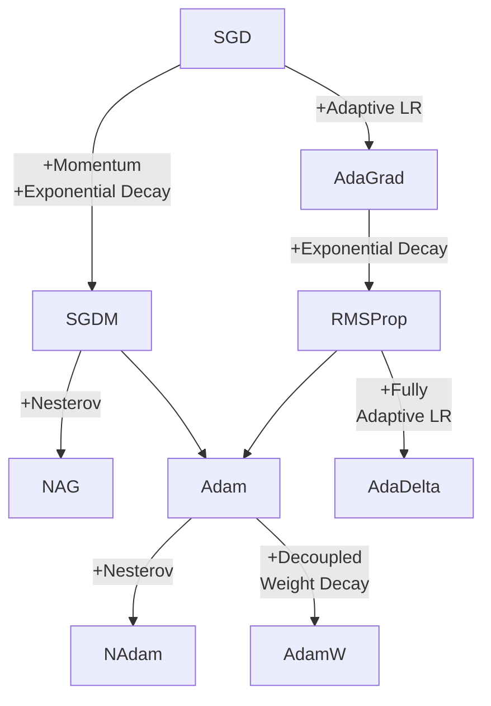

# 机器学习

## 模型评估与选择

### 评估方法

* 留出法（hold-out）：划分互斥的训练集与测试集.
* $k$ 折交叉验证（$k$-fold cross validation）：将数据集等分为 $k$ 个互斥的子集，每次使用 $k-1$ 个子集训练，剩下一个作为测试集. 这样一共 $k$ 次训练与测试，取结果的均值. 若每子集仅含一个样本，则称为留一法（Leave-One-Out，LOO）.
* 自助法（bootstrapping）：从数据集 $D$ 中，有放回地采样得到 $D'$ 作为训练集，$D\setminus D'$ 作为测试集.

自助法改变了初始数据集分布，会引入估计偏差，但是在数据量较小时较为有效. 若数据足够，则一般使用留出法或交叉验证法.

### 性能指标

* 错误率（error rate）：若分类错误样本有 $a$ 个，总样本数 $m$ 个，则错误率为

$$
E = \frac{a}{m}.
$$

* 精度（accuracy）：

$$
\mathrm{acc} = 1 - \frac{a}{m}.
$$

* 查准率（precision）：分类结果为正例的样本中，真正例之占比：

$$
P = \frac{\mathrm{TP}}{\mathrm{TP} + \mathrm{FP}}.
$$

* 查全率（recall）：在全部正样本中，识别为正之占比：

$$
R = \frac{\mathrm{TP}}{\mathrm{TP} + \mathrm{FN}}.
$$

平衡点（Break-Even Point，BEP）根据 $P = R$ 时的值评价分类器，一个更常用的综合 $P$ 与 $R$ 的评价指标是 $F_1$ 值，定义为 $P$ 与 $R$ 的调和平均

$$
F_1 = \frac{2PR}{P+R}.
$$

$F_\beta$ 则是 $P$ 与 $R$ 的调和平均

$$
F_\beta = \frac{(1+\beta^2)PR}{(\beta^2P + R)},
$$

即

$$
\frac{1}{F_\beta} = \frac{1}{1+\beta^2}\left(\frac{1}{P} + \frac{\beta^2}{R}\right).
$$

由于调和平均更重视较小值， $\beta$ 代表了 $R$ 的相对重要性.

当有多个二分类混淆矩阵时，可计算各混淆矩阵上的 $P$ 与 $R$，然后进行平均得到 $\text{macro-}P$ 与 $\text{macro-}R$，进而计算 $\text{macro-}F_1$；或平均混淆矩阵当中的各元素，得到 $\overline{\mathrm{TP}}$、$\overline{\mathrm{FP}}$、$\overline{\mathrm{TN}}$、$\overline{\mathrm{FN}}$，从而计算 $\text{micro-}P$ 与 $\text{micro-}R$ 与 $\text{micro-}F_1$.

ROC 曲线的纵轴是真正例率（TPR），横轴是假正例率（FPR），分别定义为正例中正确识别为正的占比与负例中误识别为正的占比：

$$
\mathrm{TPR} = \frac{\mathrm{TP}}{\mathrm{TP} + \mathrm{FN}},
$$

$$
\mathrm{FPR} = \frac{\mathrm{FP}}{\mathrm{TN} + \mathrm{FP}}.
$$

## Supervised Learning

### Logistic Regression

#### Logistic?

Logistic 分布的概率累积函数定义为

$$
F(x) = \frac{1}{1+\exp\left(-\dfrac{x-\mu}{\gamma}\right)}.
$$

这就是广为人知的“S 形曲线”. $F$ 取值范围为 $(0, 1)$，在 $x = \mu$ 处有值 $1/2$，且以此点 $(\mu, 1/2)$ 中心对称. $\gamma > 0$ 时 $F$ 单调递增，反之则递减；$\gamma$ 绝对值越小，$F$ 在 $x = \mu$ 附近变化越快；$\gamma = +\varepsilon$ 时 $F$ 退化为阶跃函数.

#### Regression?

Logistic regression 实际上处理的是分类问题，而采用的手段是使用 logistic 曲线拟合概率. 为何不直接用阶跃函数拟合？因为阶跃函数并非处处可微，带来优化上的困难. 下图是一个当 $x$ 为 1 维向量时的简单例子.再曲线上的点 $y$ 值越大，说明该样本为蓝色的概率越高.

<iframe src="https://www.desmos.com/calculator/qmzqy5pdix?embed" width="500" height="300" style="border: 1px solid #ccc" frameborder=0></iframe>

假设有样本集 $\{(x_i, y_i): x_i\in\mathbb{R}^m, \ y_i\in\{0, 1\}, \ i = 1, \cdots, n\}$，那么要估计的就是概率 $p = P(Y = 1 \mid x)$. 为了方便计算，这里用 $\hat{p} = 1 - F(x)$ 估计这个概率，也就是估计曲线的参数 $\mu$ 和 $\gamma$. 这里再把这两个参数换成更常用的形式：$-\frac{x-\mu}{\gamma} = w\cdot x'$，其中 $x' = [x, 1]^\top$. 以下均用 $x$ 代替 $x'$. 此时问题就已经初步形式化为：求最优的 $w$，使

$$
\hat{p} = \frac{\exp(w\cdot x)}{1+\exp(w\cdot x)}
$$

最接近 $p = P(Y = 1 \mid x)$.

#### Logit?

至此，这条曲线的拟合还并不直观. 这里做一个变换，将概率转换为 logit（称为对率）. 对于某事件的概率 $p$，其对率为

$$
\operatorname{logit}p = \log \mathrm{odds} = \log\frac{p}{1-p}.
$$

Logit 变换使得

* $p = 1$ 时，$\operatorname{logit}p = +\infty$,
* $p = \frac{1}{2}$ 时，$\operatorname{logit}p = 0$,
* $p = 1$ 时，$\operatorname{logit}p = -\infty$.

但是最重要的是 logit 和 logistic 曲线两者性质的完美配合使曲线变为了线性：当 $p$ 是 logistic 曲线时，代入 $p = \frac{\exp(w\cdot x)}{1+\exp(w\cdot x)}$，有

$$
\operatorname{logit} p = w\cdot x.
$$

即此时事件的对率是一个关于 $x$ 的线性函数.

#### 参数估计

再次强调，logistic regression 的目标是用一个 logistic 曲线 $\hat{p} = \frac{\exp(w\cdot x)}{1+\exp(w\cdot x)}$ 估计 $p = P(Y = 1 \mid x)$，从而可以实现根据 $x$ 预测 $y$. 由于 $y_i \in \{0, 1\}$，有对数似然函数

$$
\begin{aligned}
\log L(w) &= \log\prod_{i=1}^n \hat{P}(Y = 1\mid x)^{y_i} \hat{P}(Y = 0 \mid x)^{1-y_i} \\
&= \sum_{i=1}^n (y_i\log \hat{p} + (1-y_i)\log (1-\hat{p})) \\
&= \sum_{i=1}^n \left(y_i\log \frac{\hat{p}}{1-\hat{p}} + \log (1-\hat{p})\right) \\
&= \sum_{i=1}^n \left(y_i (w\cdot x_i) - \log (1+\exp(w\cdot x_i))\right).
\end{aligned}
$$

求解的目标是使 $\log L(w)$ 最大，那么定义损失函数样本平均的负对数似然

$$
\ell(w) = -\frac{1}{n}\log L(w).
$$

##### 随机梯度下降

损失函数的一阶梯度

$$
\frac{\partial \ell}{\partial w} = \left(\frac{\exp(w \cdot x_i)}{1 + \exp(w \cdot x_i)} - y_i\right)x_i,
$$

迭代下降

$$
w^{(k+1)} = w^{(k)} - \alpha \frac{\partial \ell}{\partial w},
$$

其中 $\alpha$ 为学习率.

##### 牛顿法

对于一个二阶连续可微函数，牛顿法在当前估计的极小值点 $w^{(k)}$ 处进行二阶泰勒展开

$$
\varphi(w) = \ell(w^{(k)}) + \ell'(w^{(k)})(w - w^{(k)}) + \frac{1}{2}\ell''(w^{(k)})(w - w^{(k)})^2.
$$

那么 $\varphi(w)$ 是 $\ell(w)$ 在 $w^{(k)}$ 附近的一个近似，所以 $\varphi(w)$ 的极小值点可用于近似 $\ell(w)$ 的极小值点. 令 $\varphi'(w^{(k+1)}) = 0$，有

$$
w^{(k+1)} = w^{(k)} - \frac{\ell'(w^{(k)})}{\ell''(w^{(k)})} = w^{(k)} - H_k^{-1} \ell'(w^{(k)}),
$$

其中 $H_k$ 为海森矩阵，$H_{ij} = \dfrac{\partial^2 \ell(w)}{\partial w_i \partial w_j}$.

### Regressions: Linear, LASSO and Ridge

#### Linear Regression

对于样本集

$$
\{(\boldsymbol{x}_i, y_i)\mid i = 1, \cdots N, \ \boldsymbol{x}_i \in \mathbb{R}^n, \ y_i \in \mathbb{R}\},
$$

在 $\boldsymbol{x}$ 末尾扩充一维为 $[\boldsymbol{x}^\top, 1]^\top$，以统一回归系数的形式. 那么线性回归模型为

$$
\hat{y}_i = \boldsymbol{w}^\top \boldsymbol{x}_i, \quad i = 1, \cdots, N,
$$

下面改写为矩阵形式：向量 $\hat{\boldsymbol{y}} \in \mathbb{R}^N$，其中第 $i$ 维为 $\hat{\boldsymbol{y}}_i = \hat{y}_i$；矩阵 $\boldsymbol{X}$ 的第 $i$ 行为 $\boldsymbol{x}_i^\top$，那么线性回归的矩阵形式为

$$
\hat{\boldsymbol{y}} = \boldsymbol{Xw}.
$$

#### Gaussian Error

假定估计误差 $\hat{y} - y$ 各自独立且服从零均值的高斯分布，那么可以列出关于 $\boldsymbol{w}$ 的似然

$$
L(\boldsymbol{w}) = \prod_{i=1}^N \frac{1}{\sigma\sqrt{2\pi}}\exp\left(-\frac{(\boldsymbol{w}^\top \boldsymbol{x}_i - y_i)^2}{\sigma^2}\right).
$$

取负对数并化简后得到

$$
-\log L(\boldsymbol{w}) = N\log(\sigma\sqrt{2\pi}) + \frac{1}{\sigma^2}\sum_{i=1}^N (\boldsymbol{w}^\top \boldsymbol{x}_i - y_i)^2.
$$

那么最大化似然就相当于最小化 $\sum_{i=1}^N (\boldsymbol{w}^\top \boldsymbol{x}_i - y_i)^2$，即平方误差作为损失函数的根据. 换句话说，**假定样本中噪声独立且服从零均值高斯分布时，应使用平方误差**.

这就是一般的线性回归，而基础资料中很少提及高斯分布这一重要角色. 这里再给出矩阵形式的求解过程. 将损失函数的最小化写为矩阵形式

$$
\begin{aligned}
& \text{minimize~~} \|\boldsymbol{Xw}-\boldsymbol{y}\|_2^2,\\
& \text{subject to~~} \boldsymbol{w}\in\mathbb{R^n}.
\end{aligned}
$$

只需令目标函数梯度为零：

$$
\frac{\partial}{\partial \boldsymbol{w}}\|\boldsymbol{Xw}-\boldsymbol{y}\|_2^2 = 2\boldsymbol{X}^\top(\boldsymbol{Xw}-\boldsymbol{y}) = \boldsymbol{0},
$$

解得

$$
\boldsymbol{w} = (\boldsymbol{X}^\top\boldsymbol{X})^{-1}\boldsymbol{X}^\top\boldsymbol{y}.
$$

#### Laplacian Error

假定估计误差独立且服从零均值的拉普拉斯分布，那么同理有似然

$$
L(\boldsymbol{w}) = \prod_{i=1}^N \frac{1}{2b}\exp\left(-\frac{|\boldsymbol{w}^\top\boldsymbol{x}_i-y_i|}{b}\right).
$$

同理可知最大化似然相当于最小化绝对值误差 $\sum_{i=1}^N |\boldsymbol{w}^\top \boldsymbol{x}_i - y_i|$.

#### LASSO and Ridge Regression

LASSO（least absolute shrinkage and selection operator）在线性回归时加入一个参数 $t$ 限制 $\boldsymbol{w}$ 的 L1 范数：

$$
\begin{aligned}
& \text{minimize~~} \|\boldsymbol{Xw}-\boldsymbol{y}\|_2^2,\\
& \text{subject to~~} \|\boldsymbol{w}\|_1 \le t.
\end{aligned}
$$

Ridge 回归在线性回归时加入一个参数 $t$ 限制 $\boldsymbol{w}$ 的 L2 范数：

$$
\begin{aligned}
& \text{minimize~~} \|\boldsymbol{Xw}-\boldsymbol{y}\|_2^2,\\
& \text{subject to~~} \|\boldsymbol{w}\|_2^2 \le t.
\end{aligned}
$$

其惩罚（正则化）形式为

$$
\text{minimize~~} \|\boldsymbol{Xw}-\boldsymbol{y}\|_2^2 + \|\boldsymbol{\Gamma w}\|_2^2,
$$

其中 $\boldsymbol{\Gamma}$ 称为 Tikhonov 矩阵，一般取单位矩阵的倍数 $\alpha\boldsymbol{I}$. 特别地，问题有解析的最优解

$$
\boldsymbol{w^*} = (\boldsymbol{X^\top X} + \boldsymbol{\Gamma^\top \Gamma})^{-1}\boldsymbol{X^\top y}.
$$

以上两种方法在广义模型上的推广同理.

##### Penalty Form Equivalence

记一般的损失函数为 $f(\boldsymbol{w})$，惩罚/约束方法为 $g(\boldsymbol{w})$，不再局限于平方误差、绝对值误差或 L1 范数、L2 范数. 下面证明惩罚形式的问题和约束形式的问题是等价的，即它们具有相同的最优解. [^penaltyconstraint]

有惩罚形式的优化问题

$$
\text{minimize~~} f(\boldsymbol{w}) + \lambda g(\boldsymbol{w}),
$$

记最优解为 $\boldsymbol{w}^*$.

令 $t = g(\boldsymbol{w}^*)$，约束形式的问题为

$$
\begin{aligned}
& \text{minimize~~} f(\boldsymbol{w}),\\
& \text{subject to~~} g(\boldsymbol{w}) \le t.
\end{aligned}
$$

记最优解为 $\boldsymbol{w}^{**}$.

由于 $\boldsymbol{w}^*$ 是惩罚形式问题最优解，$\forall \boldsymbol{w}$

$$
f(\boldsymbol{w^*}) + \lambda g(\boldsymbol{w}^*) \le f(\boldsymbol{w}) + \lambda g(\boldsymbol{w}).\tag{p}
$$

那么对于满足 $g(\boldsymbol{w}) \le t$ 的任意 $\boldsymbol{w}$ 有 $g(\boldsymbol{w}) \le g(\boldsymbol{w}^*)$，代入上式得

$$
f(\boldsymbol{w}^*) \le f(\boldsymbol{w}).
$$

所以 $\boldsymbol{w}^*$ 也是约束形式问题的最优解.

由于 $\boldsymbol{w}^{**}$ 是约束形式问题的最优解，$g(\boldsymbol{w}^{**}) \le t = g(\boldsymbol{w}^*)$ 且 $f(\boldsymbol{w}^{**}) \le f(\boldsymbol{w}^*)$. 将两式代回 $\text{(p)}$ 式，得 $\forall\boldsymbol{w}$

$$
f(\boldsymbol{w}^{**}) + \lambda g(\boldsymbol{w}^{**}) \le f(\boldsymbol{w}) + \lambda g(\boldsymbol{w}).
$$

故惩罚形式和约束形式的优化问题是等价的.

[^penaltyconstraint]: [Constraint form equivalent to penalty form - Mathematics Stack Exchange](https://math.stackexchange.com/a/3577409)

### Naive Bayes

对于在联合分布 $P(X, Y)$ 上独立采样得到的训练集 $T = \{(x_i, y_i): i = 1, \cdots, N\}$, 朴素贝叶斯通过估计先验分布 $P(Y=y)$ 和条件分布 $P(X=x \mid Y=y)$ 从而间接地估计联合分布.

所谓朴素，指的是此方法假设 $X$ 的各维分布是独立的，即

$$
P(X=x \mid Y=y) = \prod_j P(X^{(j)} = x^{(j)}\mid Y=y).
$$

给定样本特征 $x$，朴素贝叶斯分类器将其归类至 $y^*$ 的过程为

$$
\begin{aligned}
y^*
&= \arg \max_y P(Y=y \mid X=x) \\
&= \arg \max_y \frac{P(Y=y)P(X=x \mid Y=y)}{\displaystyle\sum_y P(Y=y)P(X=x \mid Y=y)} \\
&= \arg \max_y \frac{P(Y=y)\displaystyle\prod_j P(X^{(j)} = x^{(j)} \mid Y=y)}{\displaystyle\sum_y P(Y=y)\displaystyle\prod_j P(X^{(j)} = x^{(j)} \mid Y=y)} \\
&= \arg \max_y P(Y=y)\displaystyle\prod_j P(X^{(j)} = x^{(j)} \mid Y=y).
\end{aligned}
$$

要计算上式，还需要估计开头所述的 $Y$ 的先验分布和给定 $Y$ 时各维 $X^{(j)}$ 的条件分布. 依具体情况可使用以下估计方法：

#### Categorical Maximum Likelihood Estimation

对于离散特征，两个分布的最大似然估计即为对应的频率：

$$
P(Y=y) = \frac{n(Y=y)}{N},
$$

$$
P(X^{(j)} = x^{(j)}\mid Y=y) = \frac{n(X^{(j)} = x^{(j)}, Y = y)}{n(Y=y)}.
$$

#### Bayesian Estimation with Laplacian Smoothing

以上最大似然估计得到的条件概率可能在某些 $X$ 上取值为 0. 为了避免这种现象，使用拉普拉斯平滑：在最大似然估计的基础上，给每一个频数加上平滑参数 $\lambda$，一般取 1.

$$
P(Y=y) = \frac{n(Y=y) + \lambda}{N + \lambda n(Y)},
$$

$$
P(X^{(j)} = x^{(j)}\mid Y=y) = \frac{n(X^{(j)} = x^{(j)}, Y = y)}{n(Y=y) + \lambda |\mathcal{X}^{(j)}|}.
$$

#### Gaussian

若 $X$ 服从正态分布，依据最大似然估计可得到

$$
P(X^{(j)} = x^{(j)}\mid Y=y) = \mathcal{N}(x^{(j)}; \mu_{jy}, \sigma^2_{jy}),
$$

$$
\mu_{jy} = \frac{\displaystyle\sum_{Y=y}x^{(j)}}{n(Y=y)} ,\quad \sigma^2_{jy} = \frac{\displaystyle\sum_{Y=y}(x^{(j)}-\mu_{jy})^2}{n(Y=y)}.
$$

## Optimizations

### Regularizations

#### L0 正则化

使用最优参数子集选择，即认为好的模型参数数量不应过多. 在损失函数中加入正则化项 $\|w\|_0$，以使惩罚与非零参数数量成正比. 这样做的问题在于正则化项的梯度要么不存在，要么为 0，无法使用梯度下降优化，而遍历每一个参数子集的复杂度过高. 所以使用 L0 正则项的最优凸近似代替，这个最优凸近似就是 L1 正则项.

#### L1 正则化

使用 LASSO，即加入先验：$w_i$ 服从 0 均值的拉普拉斯分布：

$$
f(w_i; \mu, b) = \frac{1}{2b}\exp\left(-\frac{|w_i - \mu|}{b}\right).
$$

故似然函数为

$$
L_1(w) = P(y| w, x)P(w) = L(w)\cdot\prod_{i=1}^d \frac{1}{2b}\exp\left(-\frac{|w_j|}{b}\right).
$$

那么相应地，负对数似然为

$$
-\log L_1(w) = - \log L(w) + \frac{1}{2b} \|w\|_1.
$$

增加的这一项即为 L1 正则项.

#### L2 正则化

使用 ridge 回归，即加入先验：$w_i$ 服从零均值的正态分布：

$$
f(w_i; 0, \sigma) = \frac{1}{\sigma\sqrt{2\pi}}\exp\left(-\frac{w_i^2}{2\sigma^2}\right).
$$

通过与上面相似的计算，可以得到在损失函数中额外增加的项为

$$
d\log (\sigma\sqrt{2\pi}) + \frac{1}{2\sigma^2}w^\top w,
$$

忽略常数项，那么等价于增加了 L2 正则项.

#### Elastic Net 正则化

Elastic Net 正则化相当于同时加入了 L1 和 L2 正则项. 即正则项为 $\lambda_1\|w\|_1 + \lambda_2\|w\|_2$.

#### 几何解释

简单起见图中以二维的 $w$ 举例[^regularizations]. 图中红色线条为原损失函数的等高线，蓝/灰色线条为正则项的等高线. 可见在原损失函数的等高线上，要使正则项最小，则 $w$ 取交点处，正则项的等高线上，要使原损失函数越小，$w$ 也取交点. 故正则化后的损失函数最小值点往往在两项各自的某等高线交点处取得.

[^regularizations]: <https://en.wikipedia.org/wiki/File:L1_and_L2_balls.svg>{: target="_blank"}

对于 L1 正则化，这样的点倾向于使 $w$ 的一些分量为 0，从而得到稀疏解；而 L2 正则化处处可微，而且倾向于使 $w$ 各分量都较小.

从概率的角度解释，拉普拉斯分布在其期望处有一个显著的尖峰，所以 L1 正则化使 $w$ 分量为 0 的概率很高；正态分布的概率密度曲线则比较平缓，所以只使 $w$ 处于较小值时概率较大.

### Gradient Descent Optimizers

做以下一般约定，如有必要会在具体算法中说明更多细节：

* $t$：当前迭代次数
* $m$：当前训练 mini-batch 容量
* $\boldsymbol{\theta}$：模型参数
* $\Delta\boldsymbol{\theta}$：参数迭代变化量，$\boldsymbol{\theta}_{t+1} = \boldsymbol{\theta}_t + \Delta{\boldsymbol{\theta}}_t$
* $L(\boldsymbol{\theta})$：损失函数
* $\eta$：学习率
* $\delta$：某个很小的正数，保证数值稳定性
* $\boldsymbol{g}$：损失函数的梯度，默认 $\boldsymbol{g} = \boldsymbol{g}(\boldsymbol{\theta}) = \frac{1}{m}\nabla_{\boldsymbol{\theta}}L(\boldsymbol{\theta})$
* $\boldsymbol{v}$：梯度 $\boldsymbol{g}$ 的历史加权平均
* $\alpha$：关于 $\boldsymbol{v}$ 的权值（衰减系数）
* $\boldsymbol{r}$：梯度各维平方 $\boldsymbol{g}\odot\boldsymbol{g}$ 的历史加权平均
* $\rho$：关于 $\boldsymbol{r}$ 的权值（衰减系数）
* 各种历史加权平均初始值均取 $\boldsymbol{0}$

这些优化算法均由迭代求解，达到一定的条件时停止. 简洁起见，下面仅列出各算法迭代一次的过程.

#### SGD, Stochastic Gradient Descent

Mini-batch 版本的 SGD 每次计算一个 mini-batch 的平均梯度，然后沿梯度反方向下降.

1. $\Delta\boldsymbol{\theta} = -\eta\boldsymbol{g}$

#### SGDM, Stochastic Gradient Descent with Momentum

所谓动量，指的是参数变化量的历史平均. 衰减系数 $\alpha$ 保证了越远的历史更新对当前的影响越小.

1. $\boldsymbol{v} = \alpha\boldsymbol{v} + \eta\boldsymbol{g}$
2. $\Delta\boldsymbol{\theta} = -\boldsymbol{v}$

#### NAG, Nesterov Accelerated Gradient (SGD with Nesterov Momentum)

Nesterov 动量中，先根据当前速度初步更新参数，再根据此位置的梯度进一步更新参数.

1. $\boldsymbol{v} = \alpha\boldsymbol{v} + \eta\boldsymbol{g}(\boldsymbol{\theta}-\alpha\boldsymbol{v})$
2. $\Delta\boldsymbol{\theta} = -\boldsymbol{v}$

实现时使用以下等价算法：

1. $\boldsymbol{v} = \alpha\boldsymbol{v} + \eta\boldsymbol{g}$
2. $\Delta\boldsymbol{\theta} = -(\alpha\boldsymbol{v} + \eta\boldsymbol{g})$

可推出两种算法中虽然每次更新的参数有一定偏差，但是计算梯度的位置是一致的，故两种算法沿着相同的路径进行优化，而第二种只是在写法上将 $\Delta\boldsymbol{\theta}$ 计算式中的 $\boldsymbol{v}_{t}$ 换成了 $\boldsymbol{v}_{t+1}$.

#### AdaGrad, Adaptive Gradient

$\boldsymbol{r}$ 记录的是历史中梯度每一维各自平方的总和. 那么更新时 $\Delta\boldsymbol{\theta}$ 中每一维的学习率与根号下历史平方和成反比. 这样总变化较大的维度学习率减小得更快.

1. $\boldsymbol{r} = \boldsymbol{r} + \boldsymbol{g}\odot\boldsymbol{g}$
2. $\Delta\boldsymbol{\theta} = -\dfrac{\eta}{\delta+\sqrt{\boldsymbol{r}}}\odot \boldsymbol{g}$

#### RMSProp, Root Mean Squared Propagation

在 AdaGrad 中，由于 $\boldsymbol{r}$ 随时间增长不会减小，故可能使得学习率不受控制地降到非常小的值，而且远期和近期的梯度对当前学习率影响是平等的. RMSProp 加入了 $\boldsymbol{r}$ 的衰减系数，以解决这两个问题.

PyTorch 中 $\rho$ 默认取 0.99.

1. $\boldsymbol{r} = \rho\boldsymbol{r} + (1-\rho)\boldsymbol{g}\odot\boldsymbol{g}$
2. $\Delta\boldsymbol{\theta} = -\dfrac{\eta}{\delta+\sqrt{\boldsymbol{r}}}\odot \boldsymbol{g}$

#### AdaDelta

$\boldsymbol{s}$ 记录带衰减的参数变化值各维平方和，$\boldsymbol{r}$ 记录带衰减的梯度各维平方和. 参数各维的学习率直接由两者之比的平方根决定，这样使学习率完全由算法决定而不是作为超参数. 若参数具有单位 $\mathrm{u}$，而损失函数和学习率无单位，则梯度的单位是 $\mathrm{u}^{-1}$. 那么在 AdaGrad 中参数更新式两边单位并不相等，但 AdaDelta 将此式两边单位均统一为 $\mathrm{u}$.

PyTorch 中 $\rho$ 默认取 0.9.

1. $\boldsymbol{r} = \rho\boldsymbol{r} + (1-\rho)\boldsymbol{g}\odot\boldsymbol{g}$
2. $\Delta\boldsymbol{\theta} = -\dfrac{\sqrt{\delta+\boldsymbol{s}}}{\sqrt{\delta+\boldsymbol{r}}}\odot\boldsymbol{g}$
3. $\boldsymbol{s} = \rho\boldsymbol{s} + (1-\rho)\Delta\boldsymbol{\theta}\odot\Delta\boldsymbol{\theta}$

#### Adam, Adaptive Moment Estimator

Adam 结合了动量和 RMSProp 的思想，使低频的参数分量学习率大，高频的参数分量学习率小.

PyTorch 中 $\alpha$ 默认取 0.9，$\rho$ 默认取 0.999.

1. $\boldsymbol{v} = \alpha\boldsymbol{v} + (1-\alpha)\boldsymbol{g}$
2. $\hat{\boldsymbol{v}} = \boldsymbol{v}/(1-\alpha^t)$
3. $\boldsymbol{r} = \rho\boldsymbol{r} + (1-\rho)\boldsymbol{g}\odot\boldsymbol{g}$
4. $\hat{\boldsymbol{r}} = \boldsymbol{r}/(1-\rho^t)$
5. $\Delta\boldsymbol{\theta} = -\eta\cdot\dfrac{1}{\delta + \sqrt{\hat{\boldsymbol{r}}}}\odot\hat{\boldsymbol{v}}$

!!! Note "$\hat{\boldsymbol{v}}$ 和 $\hat{\boldsymbol{r}}$ 的期望修正"

    递推地

    $$
    \begin{aligned}
    \boldsymbol{v}_0 &= \boldsymbol{0} \\
    \boldsymbol{v}_1 &= (1-\alpha)\boldsymbol{g}_1 \\
    \boldsymbol{v}_2 &= \alpha(1-\alpha)\boldsymbol{g}_1 + (1-\alpha)\boldsymbol{g}_2 \\
    \boldsymbol{v}_3 &= \alpha^2(1-\alpha)\boldsymbol{g}_1 + \alpha(1-\alpha)\boldsymbol{g}_2 + (1-\alpha)\boldsymbol{g}_3,
    \end{aligned}
    $$

    易得

    $$
    \boldsymbol{v}_t = (1-\alpha)\sum_{i=1}^t\alpha^{t-i}\boldsymbol{g}_i.
    $$

    那么其期望

    $$
    \begin{aligned}
    \operatorname{E}\boldsymbol{v}_t &\approx (1-\alpha)\operatorname{E}\boldsymbol{g}_t\sum_{i=0}^{t-1}\alpha^i \\
    &= (1-\alpha)\operatorname{E}\boldsymbol{g}_t\cdot\frac{1-\alpha^t}{1-\alpha} \\
    &= (1-\alpha^t)\operatorname{E}\boldsymbol{g}_t.
    \end{aligned}
    $$

    这里使用 $\operatorname{E}\boldsymbol{g}_t$ 来近似 $\operatorname{E}\sum_{i-1}^t\boldsymbol{g}_i$，理由是 $\alpha$ 使距离较远的 $\boldsymbol{g}$ 逐渐衰减，估计误差不会过大.

    所以，使用 $\hat{\boldsymbol{v}} = \boldsymbol{v}/(1-\alpha^t)$ 进行修正使得 $\operatorname{E}\hat{\boldsymbol{v}}$ 和梯度的一阶原点矩 $\operatorname{E}\boldsymbol{g}_t$ 保持一致. 对于 $\boldsymbol{r}$ 的修正同理.

#### NAdam, Adam with Nesterov Momentum

若直接将 Nesterov 动量应用到 Adam 算法中可以得到梯度的迭代式 $\boldsymbol{g} = \frac{1}{m}\nabla L(\boldsymbol{\theta} - \eta\frac{1}{\delta+\sqrt{\boldsymbol{r}}}\odot\alpha\boldsymbol{v})$. 但为了方便实现，和 NAG 类似地有以下等价算法：

1. $\boldsymbol{v} = \alpha\boldsymbol{v} + (1-\alpha)\boldsymbol{g}$
2. $\hat{\boldsymbol{v}} = \boldsymbol{v}/(1-\alpha^t)$，带迭代数下标展开得到 $\hat{\boldsymbol{v}}_t = \dfrac{\alpha\boldsymbol{v}_{t-1}}{1-\alpha^t} + \dfrac{(1-\alpha)\boldsymbol{g}_t}{1-\alpha^t}$
3. $\bar{\boldsymbol{v}} = \dfrac{\alpha\boldsymbol{v}}{1-\alpha^{t+1}} + \dfrac{(1-\alpha)\boldsymbol{g}}{1-\alpha^t}$，与上式比较，将 $\boldsymbol{v}_{t-1}$ 替换为 $\boldsymbol{v}_t$，且对分母做相应修正
4. $\boldsymbol{r} = \rho\boldsymbol{r} + (1-\rho)\boldsymbol{g}\odot\boldsymbol{g}$
5. $\hat{\boldsymbol{r}} = \boldsymbol{r}/(1-\rho^t)$
6. $\Delta\boldsymbol{\theta} = -\eta\cdot\dfrac{1}{\delta + \sqrt{\hat{\boldsymbol{r}}}}\odot\bar{\boldsymbol{v}}$

#### AdamW, Adam with Decoupled Weight Decay

一般来说以上算法加入正则项时，都是在计算梯度后直接插入一步 $\boldsymbol{g} = \boldsymbol{g} + \lambda\boldsymbol{\theta}$. 但是这一项在 Adam 中会与 $\boldsymbol{v}$ 和 $\boldsymbol{r}$ 耦合，导致最优解产生偏移. 例如含正则项的 $\boldsymbol{v}$ 被 $\sqrt{\boldsymbol{r}}$ 除时就失去了正则化在各维度上的各向同性. 为此，AdamW 将正则化项后移至参数更新式中.

1. $\boldsymbol{v} = \alpha\boldsymbol{v} + (1-\alpha)\boldsymbol{g}$
2. $\hat{\boldsymbol{v}} = \boldsymbol{v}/(1-\alpha^t)$
3. $\boldsymbol{r} = \rho\boldsymbol{r} + (1-\rho)\boldsymbol{g}\odot\boldsymbol{g}$
4. $\hat{\boldsymbol{r}} = \boldsymbol{r}/(1-\rho^t)$
5. $\Delta\boldsymbol{\theta} = -\eta\cdot\dfrac{1}{\delta + \sqrt{\hat{\boldsymbol{r}}}} \odot \hat{\boldsymbol{v}} - \eta\lambda\boldsymbol{\theta}$
