# 树状数组 | Fenwick Tree | Binary Indexed Tree

树状数组是一种支持高效单点修改和区间求和两种操作的数据结构。

树状数组并不直接存储数组中的元素，而是将原有数据进行一定变换后再存入数组。如图所示，下方为原数组 $a$，下标用二进制表示。树状数组 $c$ 是与原数组大小相同的数组，对应图中圆形结点，这些结点之间的关系可以用类似树的结构表示。具体来说，树状数组中每一结点存储的是其子结点之和，也是以其为根的子树所覆盖的原数组中的元素之和。例如，$c_4 = c_2 + c_3 + a_4 = \sum_{i=1}^4 a_i$。

{: width=600px}

若结点序号 $x$ 是 $2^n$ （$n$ 尽可能大）的倍数，则它的子树管理小于等于 $x$ 的连续 $n+1$ 个元素，且 $n+1$ 正好是 $x$ 二进制表示中最低位的 1 代表的权值。利用补码的性质，可以直接得到 $n+1 = x \operatorname{\&} -x$，将这个运算记为 `lowbit`。

!!! Note "lowbit"

    对于 $x \in \mathbb{N}$，$\operatorname{lowbit}(x) = x \operatorname{\&} -x$ 为 $x$ 二进制表示中最低位的 1 的权值。

    $x = 0$ 时显然 $\operatorname{lowbit}(x) = 0 \operatorname{\&} 0 = 0$，符合定义。$x > 0$ 时，将 $x$ 的二进制从低到高拆分为若干位 0、一位 1、以及更高的其余位 $x'$。那么补码表示下的 $x$、$\text{\textasciitilde} x$、$-x = \text{\textasciitilde}x+1$ 和 $\operatorname{lowbit}(x)$ 分别为

    $$
    \begin{alignat*}{2}
    x &={}& (x')&10\cdots0, \\
    \text{\textasciitilde}x &=& (\text{\textasciitilde}x')&01\cdots1, \\
    -x &=& (\text{\textasciitilde}x')&10\cdots0, \\
    x \operatorname{\&} -x &=& 0\cdots 0&10\cdots 0
    \end{alignat*}
    $$

    可以看到 $\operatorname{lowbit}(x)$ 仅保留了 $x$ 最低位的 1，其余位均为 0。

在原数组某位置 $x$ 增加 $k$ 时，就需要从 $x$ 开始上溯每一祖先结点，均加上 $k$。每一次上溯所移动的距离正好就是当前结点序号的 `lowbit` 值。

在求取原数组某位置 $x$ 的前缀和时，只需要从 $x$ 开始向前，求取每一个子树之和。每一次向前移动的距离也是当前结点序号的 `lowbit` 值。

普通数组单点修改的复杂度是 $O(1)$，区间求和的复杂度是 $O(n)$。若使用前缀和数组，则两项指标互换。树状数组的单点修改和区间求和的复杂度都是 $O(\log n)$，很好地平衡了性能。

[树状数组 1 - 洛谷](https://www.luogu.com.cn/problem/P3374){:target="_blank"}

```c++
long long fenwick[500010];
inline int lowbit(int pos)
{
    return pos & -pos;
}
inline void add(int pos, long long k, int n)
{
    while(pos <= n)
    {
        fenwick[pos] += k;
        pos += lowbit(pos);
    }
}
inline long long sum(int pos)
{
    long long res = 0;
    while(pos >= 1)
    {
        res += fenwick[pos];
        pos -= lowbit(pos);
    }
    return res;
}
```

[树状数组 2 - 洛谷](https://www.luogu.com.cn/problem/P3368){:target="_blank"}

如果需要单点取值，区间修改，则可以使用将每一个数据表示为与之前一位的差分，再使用树状数组存储。则单点取值的操作为 `sum(x)`，区间 $[x, y)$ 增加 $k$ 的操作为 `add(x, k), add(y, -k)`。
