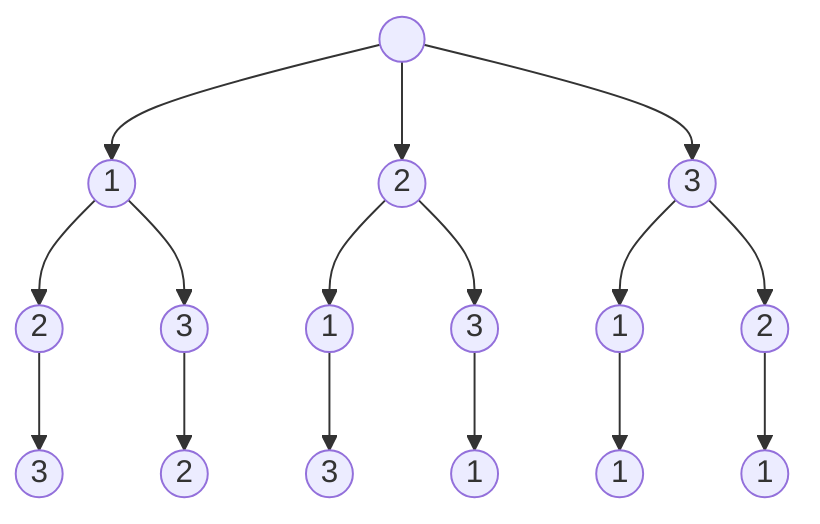
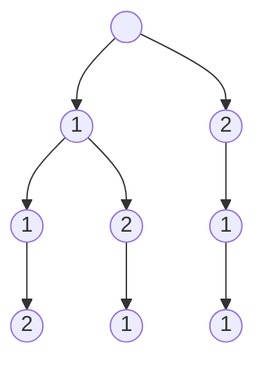
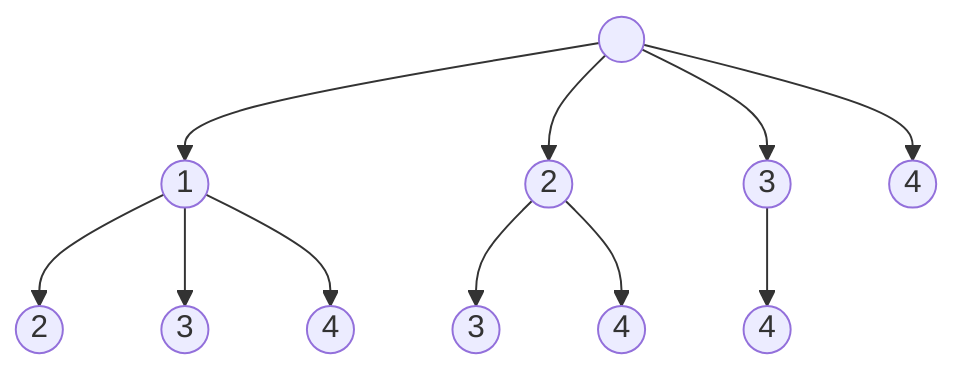
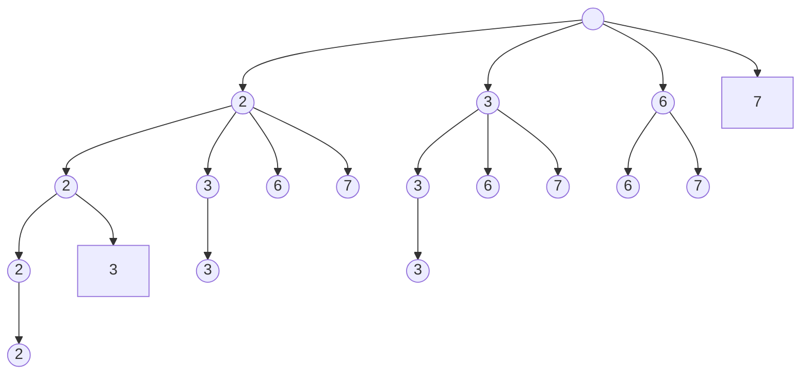
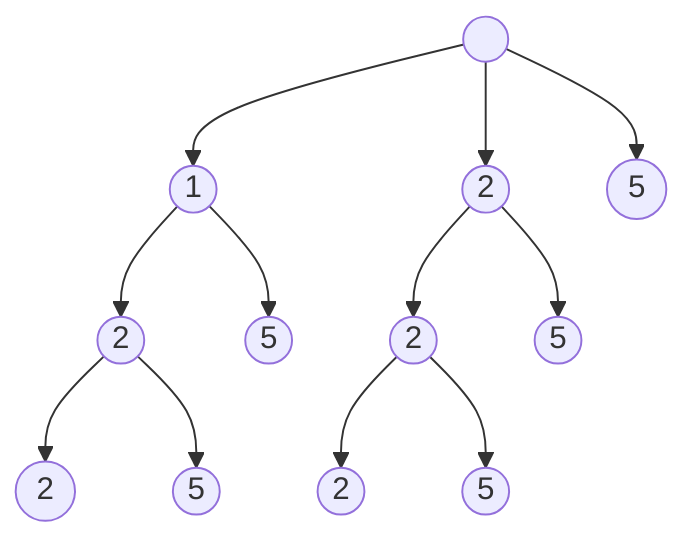
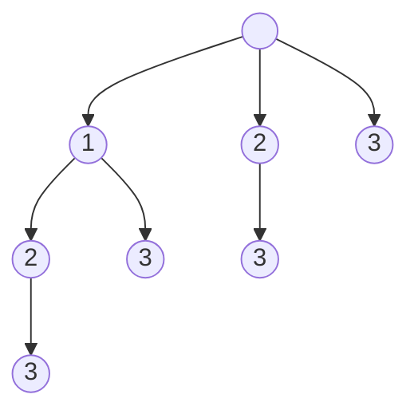
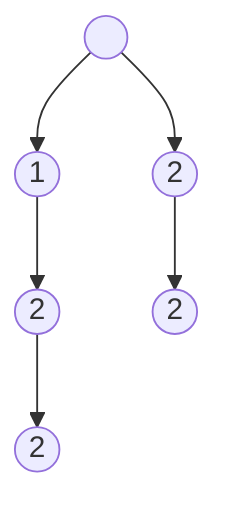

# 排列、组合、子集问题与回溯

求某列表的排列、组合、子集均可用回溯法。务必先**画出回溯树**！

## 排列问题

### 无重复元素列表的全排列

[46. 全排列 - 力扣（LeetCode）](https://leetcode.cn/problems/permutations/) 求某无重复元素的列表的所有元素排列。

以列表 $[1, 2, 3]$ 为例，有以下回溯树

树的每一条从根节点到叶子节点的路径为一个排列。任一节点的子节点是从根节点到当前节点路径上均未访问的元素。树的深度到达元素个数时，到达叶子节点，此时得到一种排列。故只需在每次回溯迭代时维护当前路径上的元素、各元素被访问状态、当前深度。

[全排列 - 提交记录 - 力扣（LeetCode）](https://leetcode.cn/submissions/detail/406003777/)

### 有重复元素列表的排列

[47. 全排列 II - 力扣（LeetCode）](https://leetcode.cn/problems/permutations-ii/) 求有重复元素的列表的全排列。

重复的元素交换位置后得到的是重复的排列，故此问题不能直接用上一问题的方法解决。这里以 $[1, 1, 2]$ 为例，画出如下回溯树：

此树与上一问题中不同的是，一节点的子节点是 `unique(从根节点到当前节点路径上未访问的元素)`，或者 `unique(原列表元素) \ {访问次数已达重复次数的元素}`。那么解决的办法是首先求原列表去重后的集合以及其中每一元素的重复数。在遍历时已经不需要原列表，而是维护可用的重复数列表，路径上每访问一元素即将其可用重复数减一，向上回溯时加回。节点的子节点为当前可用重复数大于零的元素。

先用 `sort` 将原列表排序。然后复制一份有序列表，使用 `unique`、`resize` 和 `distance` 去重，再遍历原列表计算重复数。

[全排列 II - 提交记录 - 力扣（LeetCode）](https://leetcode.cn/submissions/detail/406525423/)

## 组合问题

### 无重复元素列表的定长组合

[77. 组合 - 力扣（LeetCode）](https://leetcode.cn/problems/combinations/) 求列表 $[1, 2, \cdots, n]$ 中所有长为 $k$ 的组合。

模仿一般的求组合的思路，以从 $[1, 2, 3, 4]$ 中求长度为 $k = 2$ 的组合为例，有以下回溯树

任一节点的子节点均为原列表中更靠后的元素。当从根节点的路径深度到达 $k$ 时即为一中组合。

[组合 - 提交记录 - 力扣（LeetCode）](https://leetcode.cn/submissions/detail/406424345/)

### 可重复使用元素的组合

[39. 组合总和 - 力扣（LeetCode）](https://leetcode.cn/problems/combination-sum/)

可无限重复使用自然意味着问题必然和元素列表无重复的情况等价。那么在每次选用下一元素时，若不考虑总和的限制，序号相等或更大均可使用。以从 $[2, 3, 6, 7]$ 中选出和为 $7$ 的组合为例，有回溯树

由于列表中元素均为正，故停止继续向下搜索的条件为从根路径到当前路径的元素之和大于或等于目标。只需在遍历时维护当前路径上及其元素和与目标之差以及当前访问元素在原列表中位置即可。

[组合总和 - 提交记录 - 力扣（LeetCode）](https://leetcode.cn/submissions/detail/406543200/)

### 有重复元素列表的组合

[40. 组合总和 II - 力扣（LeetCode）](https://leetcode.cn/problems/combination-sum-ii/) 列表中元素有重复，且每一元素不能重复使用，求所有和为定值 $t$ 的组合。

以列表 $[2, 5, 2, 1, 2]$ 中和为 $5$ 的组合为例，回溯树为

这里对于重复元素的处理和以上一样，也是去重后计算重复数。任一节点的子节点是仍有可用重复数且序号相等或更大的元素。

[组合总和 II - 提交记录 - 力扣（LeetCode）](https://leetcode.cn/submissions/detail/406516825/)

### 定长且定和的组合

[216. 组合总和 III - 力扣（LeetCode）](https://leetcode.cn/problems/combination-sum-iii/) 从列表 $1, 2, \cdots, 9$ 中选取 $k$ 个元素使其和为 $n$，求所有组合方案。

此题增加了组合之和的限制，故利用此条件限制搜索继续进行的条件即可。

[组合总和 III - 提交记录 - 力扣（LeetCode）](https://leetcode.cn/submissions/detail/406631857/)

## 子集问题

### 集合的所有子集

[78. 子集 - 力扣（LeetCode）](https://leetcode.cn/problems/subsets/)

集合 $[1, 2, 3]$ 的回溯树为

此树的构造方式和组合问题一致，子节点均为序号比当前节点更大的元素。但是此树的每一个节点都代表一个子集。

[子集 - 提交记录 - 力扣（LeetCode）](https://leetcode.cn/submissions/detail/406411963/)

### 有重复元素列表的子集

[90. 子集 II - 力扣（LeetCode）](https://leetcode.cn/problems/subsets-ii/)

以 $[1, 2, 2]$ 的子集为例，有以下回溯树

这里处理重复元素的方法与以上相同。遍历至每一节点时均将其代表的子集加入解集即可。

[子集 II - 提交记录 - 力扣（LeetCode）](https://leetcode.cn/submissions/detail/406445472/)

## 总结

最重要的，无论如何，先画回溯树。当回溯树构造的规则确定下来，那么代码基本上就呼之欲出了。

1. 确定子节点。排列问题中子节点是所有未访问的元素；组合问题和子集问题中是序号大于（等于）当前节点的元素。
2. 元素重复的情况。需要先去重并记录重复数，子节点仅包括重复数未用尽的元素。
3. 其它限制。可以根据深度或题目给出的限制决定是否停止继续向下搜索。有一些题型中在某节点没有更多的可用元素时自然会停止搜索。
