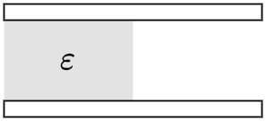

# Electric Field

*1*  
**10-14** 如图所示，一个电荷 $q$ 放在距无限大平面导体 $x = a$ 处. 可以证明，在这无限大平面前方的总电场，与用一负电荷 $-q$ 在 $x = -a$ 处代替该平面，所得的总电场效果完全相同. 这第二个电荷称为第一个电荷的像 (image). 试证明:

1. 电场垂直于该平面;
2. 该平面上电荷面密度为 $\sigma_\mathrm{e} = \cfrac{qa}{2\pi\sqrt{\left(r^2+a^2\right)^3}}$，式中 $r$ 为该平面上离开 $O$ 点的距离;
3. 该平面上的总电荷等于 $-q$.

{: width=140px}

??? note "Hint"
    电像法：空间电场只在有真实电荷的一边相同.

*2*  

**11-1** 如图所示，两平行导体板间距离为 $d$，板的面积均为 $S$. 在两板间放入一块厚度为 $b$，相对电容为 $\varepsilon_r$ 的电介质板. 在电介质未加入前，导体板与电池相连，使其分别带正、负电荷，大小为 $q = 8.9\times10^{-10}\mathrm{C}$，然后将电池断开，再将电介质板插入. 假设 $S = 100\mathrm{cm^3}$，$d = 1.0\mathrm{cm}$，$\varepsilon_r = 7.0$，$b = 0.50\mathrm{cm}$，试计算：(1) 导体板与电介质之间空隙中的电场强度 $E_0$；(2) 电介质中的电场强度 $E$；(3) 两导体板间的电势差.
{: width=250px}

??? note "Hint"

    (1) 如图所示，用虚线画一高斯面 I, 上底面在导体中，下底面在空隙中. 对这个高斯面应用高斯定理，得

    $$
    \oint_S \boldsymbol{D}\cdot \mathrm{d}\boldsymbol{S} = \int\limits_{下底面} D \mathrm{d} S = DS_1 = \sigma S_1,
    $$

    其中 $\sigma$ 为导体板上的电荷密度，故真空中的电位移的大小为

    $$
    D = \sigma = \frac{q}{S}.
    $$

    因为空隙中的 $\varepsilon_r = 1$，此高斯面并未通过电介质，又因为电介质引入后两导体板上的电荷并未改变，故导体板与电介质板之间空隙的场强 $E_0$ 仍保持不变，即

    $$
    E_0 = \frac{D}{\varepsilon_0} = \frac{q}{\varepsilon_0S} = 1.0\times 10^4 \mathrm{V/m}.
    $$

    (2) 用虚线画一高斯面 II，上底面在电介质中，下底面在下方的导体中，对这个高斯面应用高斯定理，因电位移穿入高斯面，故

    $$
    \oint_S \boldsymbol{D}\cdot \mathrm{d}\boldsymbol{S} =\int\limits_{上底面} D\mathrm{d}S \cos\pi = -DS_2 = -\sigma S_2,
    $$

    即介质中电位移的大小为

    $$
    D = \sigma = \frac{q}{S}.
    $$

    它与真空中的电位移是相同的，说明电位移是连续的. 而电介质中的场强

    $$
    E = \frac{D}{\varepsilon_r \varepsilon_0} = \frac{q}{\varepsilon_r \varepsilon_0 S} = \frac{E}{\varepsilon_r} = 0.14\times 10^4 \mathrm{V/m},
    $$

    电场强度的方向向下. 它与真空中的场强是不同的，也说明电场在两种不同介质的界面上是不连续的.

    (3) 两极板间的电势差为

    $$
    V = E_0(d-b) + Eb = 57\mathrm{V}.
    $$

*3*  
在由一定电荷分布形成的均匀电场 $\vec{E}_{0}$ 中，与 $\vec{E}_{0}$ 垂直地放入一个无限大的相对电容率为 $\varepsilon_{\mathrm{r}}$ 的电介质平板. 试问这时电场 $\vec{E}_{0}$ 是否变化？电介质内部电场 $\vec{E}$ 与 $\vec{E}_{0}$ 之比为多少？

*4*  
将一个接地的导体 A 移近一个孤立的导体 B，B 的电势如何变化？

??? note "Hint"
    若 B 带正电，则 A 感应出负电荷. 

    若以无限远处为电势零点，则讨论一正电荷从附近一点出发运动至无限远的能量情况.

    若以地为电势零点，则将两导体视为电容器，电容 $C$ 减少.

    所得结论一致，即若 B 带正电，则电势减小；带负电则电势增加.

*5*  
如图所示，一平行板电容器充电后与电源断开，然后将其一般体积中充满电容率为 $\varepsilon$ 的各向同性电介质，则下列说法正确的是  
A. 两部分中的电场强度相等  
B. 两部分中的电位移相等  
C. 两部分极板上的自由电荷面密度相等  
D. 以上三量分别都不相等

{: width=150px}

??? note "Hint"
    可将电容器视作极板面积 $S$ 与间距 $d$ 均相等的两个相连电容器 $C_1$ 和 $C_2$，电容率分别为 $\varepsilon$ 和 $\varepsilon_0$，则 $C_1 = \cfrac{\varepsilon S}{2d}$，$C_2 = \cfrac{\varepsilon_0 S}{2d}$，而 $V_1 = V_2$，$Q = VC$，故 $Q_1 > Q_2$，进而 $\sigma_1 > \sigma_2$，又由于 $V = Ed$，有 $E_1 = E_2$.

*6*  
**11-18** 两个同心圆金属球壳，半径分别为 $R_1$ 和 $R_2$ ($R_2 > R_1$)，多分别带上电荷量为 $q_1$ 和 $q_2$ 的电荷，则两者的电势分别为 $V_1$ 和 $V_2$ (选无限远处为电势零点). 现用导线将两球壳相连接，则它们的电势为  
A. $V_1$  
B. $V_2$  
C. $V_1 + V_2$  
D. $(V_1 + V_2)/2$

??? note "Hint"

    未连接时，

    $$
    V_2 = \frac{1}{4\pi\varepsilon_0}\frac{q_1+q_2}{R_2},
    $$

    $$
    V_1 = V_2 + \frac{q_1}{4\pi\varepsilon_0}\left(\frac{1}{R_1} - \frac{1}{R_2}\right) = \frac{1}{4\pi\varepsilon_0}\left(\frac{q_1}{R_1} + \frac{q_2}{R_2}\right)
    $$

    连接后，$R_1$ 和 $R_2$ 等势，故空隙中无电场，即所有电荷移动至 $R_2$.

    $$
    V = \frac{1}{4\pi\varepsilon_0}\frac{q_1+q_2}{R_2} = V_2.
    $$

*7*  
如图所示，三块平行金属板 A、B 和 C，面积都是 $20\mathrm{cm^2}$，A 和 B 相距 $4.0\mathrm{mm}$，A 和 C 相距 $2.0\mathrm{mm}$，B 和 C 两板都接地，如果使 A 板带正电荷，电荷量为 $3.0\times 10^{-7}\mathrm{C}$，并忽略边缘效应，试求：(1) 金属板 B 和 C 上的感应电荷量；(2) A 板相对于地的电势.

{: width=135px}

??? note "Hint"
    作包围整个电容器的高斯面，若总电通量非零，则说明有电场线延伸至无限远，与接地条件矛盾. 故 B 与 C 总电荷量与 A 等量异号.

    亦可将 A 看作左右两极板，分别与 B，C 构成电容器，分别带等量异号电荷.

    注意，此处情况和串联电容器充电过程不同. 串联电容器初始不带电，故满足各极板电荷量绝对值相等. 此处不满足此关系.

*8*  
如图所示，两无限大平行导体板 A、B，板面积均为 $S$，电荷面密度 $\sigma_1 = \sigma_2 = -\sigma_3 = \sigma_4 = \cfrac{Q_0}{2S}$. 试证：B 板接地后，两板间电势差 $V_{\mathrm{AB}}$ 是不接地时的 2 倍.

{: width=120px}

??? note "Hint"
    相同地，B 接地后，两极板电荷量代数和应为 0，四个面从左到右的电荷面密度分别为 $0,\,2\sigma,\,2\sigma,\,0$

*9*  
**11-7** 厚为 $d=2\mathrm{mm}$ 的云母 $(\varepsilon_{\mathrm{r}}=2)$ 作为平行板电容器的电介质. 当电容器充电至电压为 $V=400\mathrm{V}$ 时，求云母的电荷面密度.

??? note "Hint"
    $$
    P = \frac{|\sum\vec{p}|}{\Delta V} = \frac{qd}{dS} = \sigma,
    $$

    $$
    D = \varepsilon E = \varepsilon_0 E + P = \varepsilon_0 \varepsilon_r E,
    $$

    $$
    E = \frac{V}{d},
    $$

    故

    $$
    \sigma = \varepsilon_0 (\varepsilon_r - 1) \frac{V}{d} = 1.77\times10^{-6}\mathrm{C/m^2}
    $$
