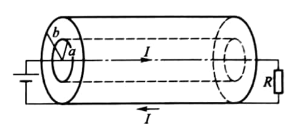
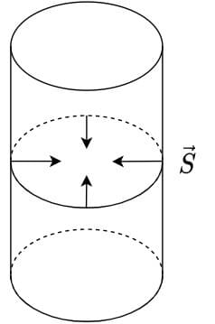

# Electromagnetic Wave

*1*  
如图所示，同轴电缆的内导体圆柱半径为 $a$，外导体圆筒半径为 $b$，电流由导体圆柱流出，由导体圆筒流回. 设电缆导体的电阻可忽略. 试证明单位时间内通过 $a$ 和 $b$ 之间绝缘介质的环形横截面的电磁能量正好等于电源提供的功率.

{: width=280px}

??? note "Hint"

    设电缆中的电流为 $I$，电源的端电压为 $V$，当忽略导体电阻时，导体内无电场，电缆外电场、磁场皆无，故导体中和电缆外皆无能流，能流仅存在于绝缘介质中.

    绝缘介质中电场分布为 $E = \lambda/2\pi\varepsilon r$（$\lambda$ 为内导体圆柱的电荷线密度，$\varepsilon$ 为电介质的电容率），$\boldsymbol{E}$ 的方向沿径向，因

    $$
    V = \int_a^b E\mathrm{d}r = \frac{\lambda}{2\pi\varepsilon}\int_a^b\frac{\mathrm{d}r}{r} = \frac{\lambda}{2\pi\varepsilon}\ln\frac{b}{a},
    $$

    所以

    $$
    E = \frac{1}{2\pi\varepsilon r}\frac{2\pi\varepsilon V}{\ln b/a} = \frac{V}{\ln b/a}\frac{1}{r}.
    $$

    磁感应线为与电缆共轴的圆环，在绝缘介质中，磁场强度大小为 $H = I/2\pi r$.

    由于坡印廷矢量方向沿轴向，大小为

    $$
    S = EH = \frac{V}{\ln b/a}\frac{1}{r}\frac{I}{2\pi r} = \frac{VI}{2\pi\ln b/a}\frac{1}{r^2},
    $$

    故单位时间通过绝缘介质中任一环形截面的电磁能量为

    $$
    \frac{\mathrm{d}W}{\mathrm{d}t} = \int_S EH\mathrm{d}S = \int_a^b \frac{VI}{2\pi\ln b/a}\frac{1}{r^2} \cdot 2\pi r \mathrm{d}r = VI.
    $$

*2*  
**14-29** 一很长的均匀带电圆筒, 半径为 $R$, 长度为 $L$, 电荷面密度为 $\sigma$. 今施加一力矩, 使该圆筒以角速度 $\omega(t) = at$ ($a$ 为常量) 绕圆筒的轴旋转.

1. 求圆筒内的磁感应强度;
2. 求圆筒内表面上的电场强度 $E$;
3. 求圆筒内表面上的坡印廷矢量 $S$;
4. 证明进入圆筒内部体积的坡印廷矢量的通量等于 $\cfrac{\mathrm{d}}{\mathrm{d}t}\left(\cfrac{\pi R^2 L}{2\mu_0}B^2\right)$.

??? note "Hint"
    {: width=100}

    $$
    \varPhi_S = S\cdot 2\pi RL.
    $$

*3*  
**14-24** 一飞机在离电台距离 $d$ 处飞行，收到电台信号强度为 $E$（单位为 $\mathrm{W/m^2}$），求该电台发射的信号在飞机所在处的电场强度峰值 $E_0$ 和磁场强度峰值 $H_0$.

??? note "Hint"
    $S$ 即坡印廷矢量大小平均值. 由于

    $$
    S = EH,\ \sqrt{\varepsilon_0}E = \sqrt{\mu_0}H
    $$

    得

    $$
    S = E^2\cdot\sqrt{\frac{\varepsilon_0}{\mu_0}},
    $$

    $$
    E = \sqrt{S} \sqrt[4]{\frac{\mu_0}{\varepsilon_0}},\ E_0 = \sqrt{2}E.
    $$

    同理得

    $$
    H_0 = \sqrt{2S}\sqrt[4]{\frac{\varepsilon_0}{\mu_0}}
    $$
