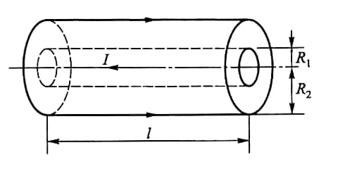
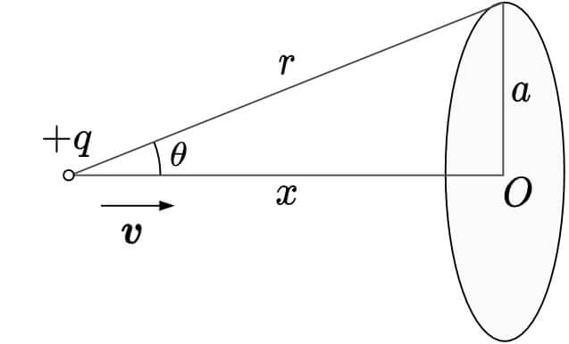

# Induction

*1*  
**14-3** 在半径为 $R$ 的圆柱形空间内有沿线方向均匀磁场 $\boldsymbol{B}$，已知磁感 $B$ 随时间增加的速率 $\cfrac{\mathrm{d}B}{\mathrm{d}t}$. 一金属棒 $ab$ 放在磁场外且垂直于圆柱轴线，两端点 $a$、$b$ 与圆心 $O$ 点连线 $ao$ 与 $bo$ 的夹角为 $\theta_0$，求 $ab$ 中的感生电动势.

{: width=220px}

??? note "Hint"

    穿过三角形回路 $aboa$ 的磁通量等于穿过圆心角为 $\theta_0$，半径为 $R$ 的扇形区域的磁通量，即

    $$
    \varPhi_{aboa} = -BS_{扇} = -\frac{1}{2}R^2\theta_0B,
    $$

    $$
    \mathscr{E}_{aboa} = -\frac{\mathrm{d}\varPhi_{aboa}}{\mathrm{d}t} = \frac{1}{2}R^2\theta_0\frac{\mathrm{d}B}{\mathrm{d}t}
    $$

    由于 $ao$ 及$bo$ 边上的感生电场 $\boldsymbol{E}$ 处处与 $ao$ 及 $bo$ 垂直，故此两边的感生电动势均为零：$\mathscr{E}_{oa} = 0$，$\mathscr{E}_{bo} = 0$. 故有

    $$
    \mathscr{E}_{ab} = \mathscr{E}_{aboa} = \frac{1}{2}R^2\theta_0\frac{\mathrm{d}B}{\mathrm{d}t},
    $$

    方向从 $a$ 到 $b$.

*2*  
**14-16** 如图所示，求长为 $l$ 的一段同轴电缆的自感. 设同轴电缆由半径为 $R_1$ 的内实心圆柱导体和半径为 $R_2$ 的外圆筒导体（厚度不计）组成，中间充以绝缘介质，绝缘介质的磁导率为 $\mu_0$.

{: width=280px}

*3*  
**14-17** 如图所示，由两块面积为 $S = 0.1\mathrm{m^2}$ 的圆形极板组成的电容器连接在电势差 $\mathscr{E} = \mathscr{E}_m\sin\omega t$ 的电源上，其中 $\mathscr{E}_m = 200\mathrm{V}$，而 $\omega = 200 \mathrm{rad/s}$，位移电流的最大值为 $I_d =8.9\times 10^{-6}\mathrm{A}$，略去极板边缘处的不规则电场，试求两极板之间的距离 $d$.

{:width=200px}

??? note "Hint"

    法 1：$Q = CU$，两边求导得

    $$
    i_d = \frac{\varepsilon_0\pi R^2}{d}\frac{\mathrm{d}}{\mathrm{d}t}\mathscr{E} = \frac{\varepsilon_0\pi R^2}{d}\mathscr{E}_m\omega\cos\omega t.
    $$

    所以

    $$
    I_d = \frac{\varepsilon_0\pi R^2}{d}\omega\mathscr{E}_m
    $$

    法 2：

    $$
    I_d = \frac{\mathrm{d}}{\mathrm{d}t}\varPhi_D = \varepsilon_0\pi R^2\frac{\mathrm{d}}{\mathrm{d}t}E = \frac{\varepsilon_0\pi R^2}{d}\frac{\mathrm{d}}{\mathrm{d}t}\mathscr{E} = ...
    $$

    思考：如何体现 $U$ 与 $I$ 的相位差？

*4*  
**14-19** 如图所示，电荷 $+q$ 以速度 $\boldsymbol{v}$ 向 $O$ 点运动，电荷到 $O$ 点的距离记为 $x$. 以 $O$ 点为圆心作一个半径为 $a$ 的圆，圆面与 $\boldsymbol{v}$ 垂直. 试计算通过此圆面的位移电流.

{: width=220px}

??? note "Hint"

    法 1: 在圆面上积分

    $$
    \begin{aligned}
    I_d &= \frac{\mathrm{d}}{\mathrm{d}t}\varPhi = \varepsilon_0 \frac{\mathrm{d}}{\mathrm{d}t}\int_S \frac{1}{4\pi\varepsilon_0}\frac{p}{d^2}\cos \theta \mathrm{d}S \\
    &= \frac{qa^2v}{2(a^2+x^2)^\frac{3}{2}}
    \end{aligned}
    $$

    注意: 由于带有 $\mathrm{d}/\mathrm{d}t$, 故应对长度积分而非角度.

    法 2: 在球面上积分. 球冠高度为 $r - x$,

    $$
    S = 2\pi r(r-x), \quad \varPhi = \varepsilon_0 \frac{1}{4\pi\varepsilon_0} \frac{q}{r^2} S.
    $$

    $$
    I_d = \frac{\mathrm{d}}{\mathrm{d}t}\varPhi.
    $$

*5*  
**14-22** 使电容器 $C$ 在电源 $\mathscr{E}$ 中充电后立即接至线圈 $L$ 上. （1）求 $L$ 中最大电流；（2）求电路能量均分与电容与电感上的时刻.

??? note "Hint"

    (1) 由能量关系, $I$ 最大时所有能量传导至电感

    $$
    \frac{1}{2}C\mathscr{E}^2 = \frac{1}{2}LI_m^2.
    $$

    所以

    $$
    I_m = \mathscr{E}\sqrt{\frac{C}{L}}
    $$

    (2) 能量均分时,

    $$
    \frac{1}{2}CU^2 \times 2 = \frac{1}{2} C\mathscr{E}^2,
    $$

    所以

    $$
    U = \frac{\sqrt{2}}{2}\mathscr{E}.
    $$

    而

    $$
    U(t) = \mathscr{E}\cos\omega t,\quad \omega = \frac{1}{2\pi\sqrt{LC}},
    $$

    故

    $$
    \omega t = (2k+1)\frac{\pi}{4},\ \ k = 0, 1, 2, \cdots
    $$

    即

    $$
    t = (2k+1) \frac{\pi^2}{2}\sqrt{LC},\ \ k = 0, 1, 2, \cdots
    $$
