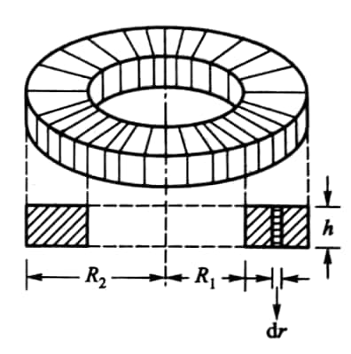

# Magnetic Field

*1*  
一截面为长方形的螺绕环如图所示，共有 $N$ 匝，其上所通电流为 $I$，其中充满相对磁导率为 $\mu_r$ 的各向同性均匀磁介质，求：(1) 穿过螺绕环的磁通量；(2) 磁介质内表面的总的磁化电流 $I_s$.

{: width=250px}

??? note "Hint"

    (1) 要求磁通量，必须首先知道磁感应强度，所以先求螺绕环中的 $\boldsymbol{B}$. 在环内任取一点，过该点作一与环同心、半径为 $r$ 的圆形回路，磁场强度 $\boldsymbol{H}$ 沿此回路的线积分为

    $$
    \oint_L \boldsymbol{H}\cdot\mathrm{d}\boldsymbol{l} = H\cdot 2\pi r,
    $$

    回路所围电流为 $NI$，于是

    $$
    H\cdot 2\pi r = NI.
    $$

    故环中磁感应强度为

    $$
    B = \mu H = \frac{\mu_0\mu_r NI}{2\pi r}.
    $$

    显然，$B$ 是位置 $r$ 的函数，各个不同的环上 $B$ 各不相同. 由磁通量的定义知，任一截面上的磁通量为

    $$
    \varPhi_m = \int \boldsymbol{B}\cdot\mathrm{d}\boldsymbol{S} = \int_{R_1}^{R_2} \frac{\mu_0\mu_r NI}{2\pi r}h\mathrm{d}r = \frac{\mu_0\mu_r NIh}{2\pi} \ln\frac{R_2}{R_1},
    $$

    螺绕环上的总磁通量为

    $$
    N\varPhi_m = \frac{\mu_0\mu_r N^2Ih}{2\pi} \ln\frac{R_2}{R_1}.
    $$

    (2) 由于

    $$
    \oint_L \boldsymbol{M}\cdot\mathrm{d}\boldsymbol{l} = I,
    $$

    所以

    $$
    \begin{aligned}
    I_s &= \oint_L \chi_m \boldsymbol{H}\cdot\mathrm{d}\boldsymbol{l}\\
    &= \oint_L (\mu_r - 1)\frac{NI}{2\pi R_1}\mathrm{d}l\\
    &= (\mu_r - 1)\frac{NI}{2\pi R_1}\cdot 2\pi R_1\\
    &= (\mu_r - 1)NI.
    \end{aligned}
    $$

*2*  
**12-1** 一根长铜导线，其直径为 $d$，质量密度 $\rho_m$，摩尔质量 $M$，电阻率 $\rho$，现通过该导线的电流为 $I$. 求：(1) 导线中电流密度；(2) 电子漂移速度；(3) 沿导线的场强 (设为常量).
