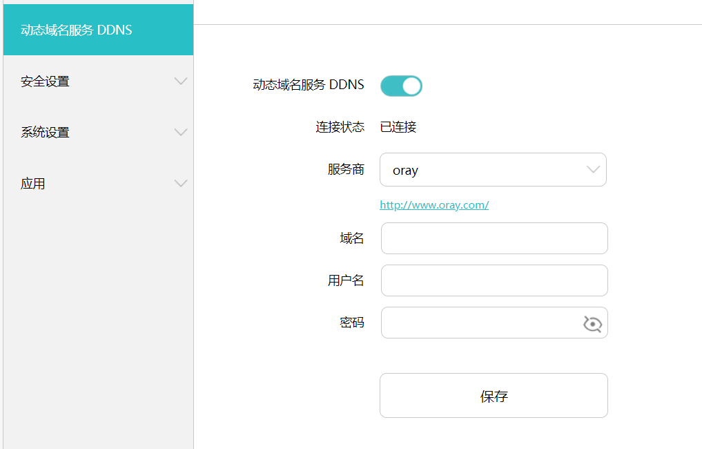
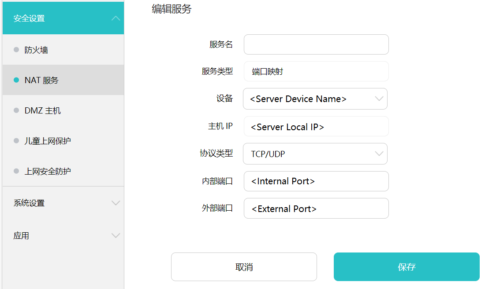

# SSH Through NAT

## Register NAT

Register a DDNS address on a DDNS provider (for example <https://hsk.oray.com>) and login DDNS in the server router.



Bind MAC and IP address of server in router settings. Then register NAT port mapping using the local IP address in the previous step.




## Configure OpenSSH Server/Client

Settings > Apps > Apps & Features > Optional Features > Add Feature > OpenSSH Server/Client > Install

Start SSH service (as Administrator):
```
Start-Service sshd
Set-Service -Name sshd -StartupType 'Automatic'
Get-NetFirewallRule -Name *ssh*
New-NetFirewallRule -Name sshd -DisplayName 'OpenSSH Server (sshd)' -Enabled True -Direction Inbound -Protocol TCP -Action Allow -LocalPort <Internal Port>
```

Settings also in Control Panel > System and Security > Windows Defender Firewall > Advanced Settings.

## Establish SSH

On server:
```
ssh <username>@<DDNS address> -p <External Port>
```
