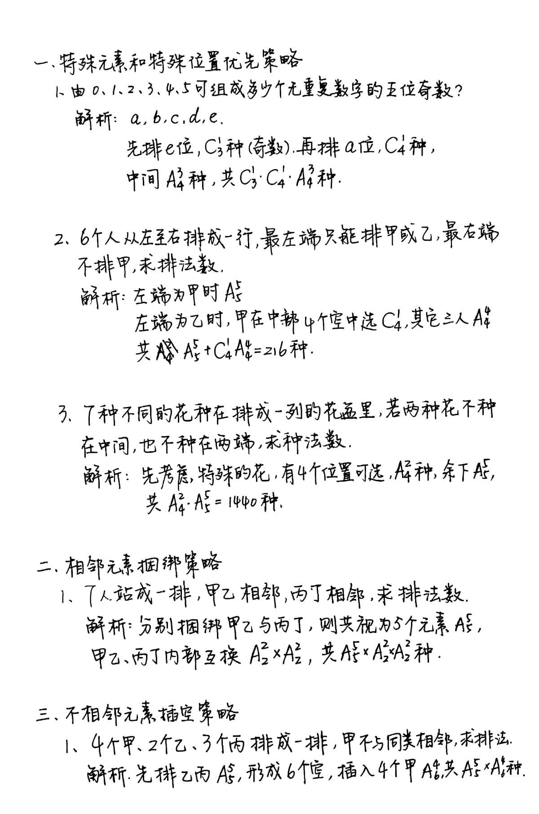
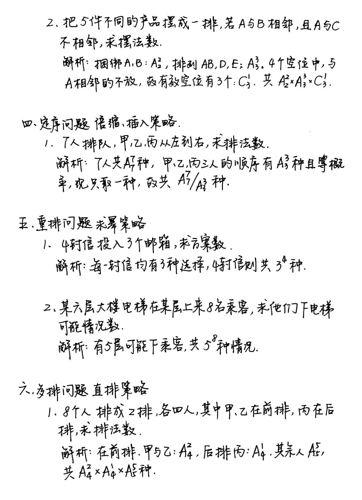
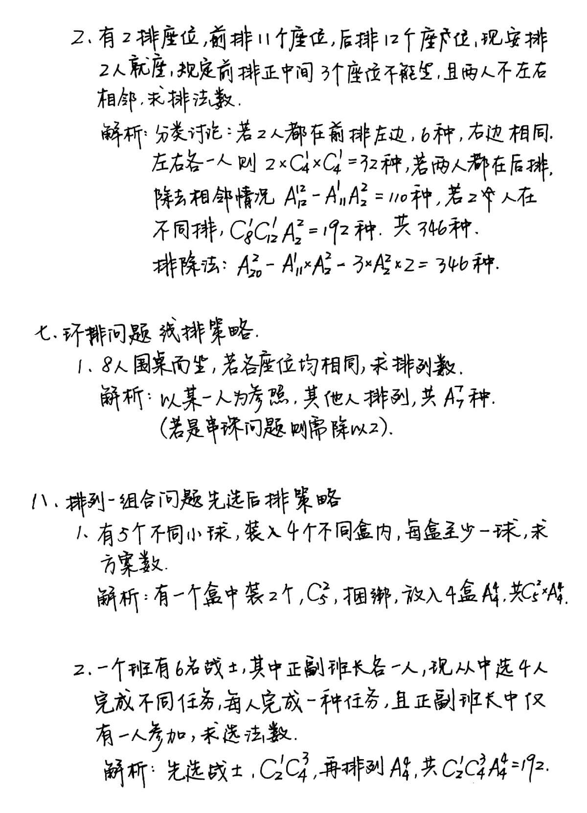
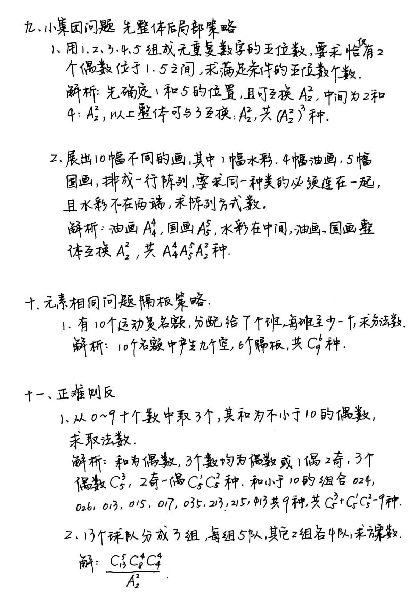
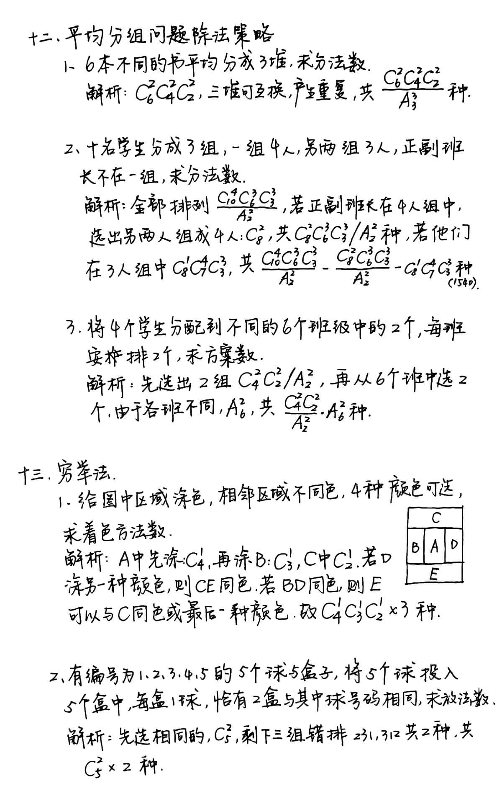
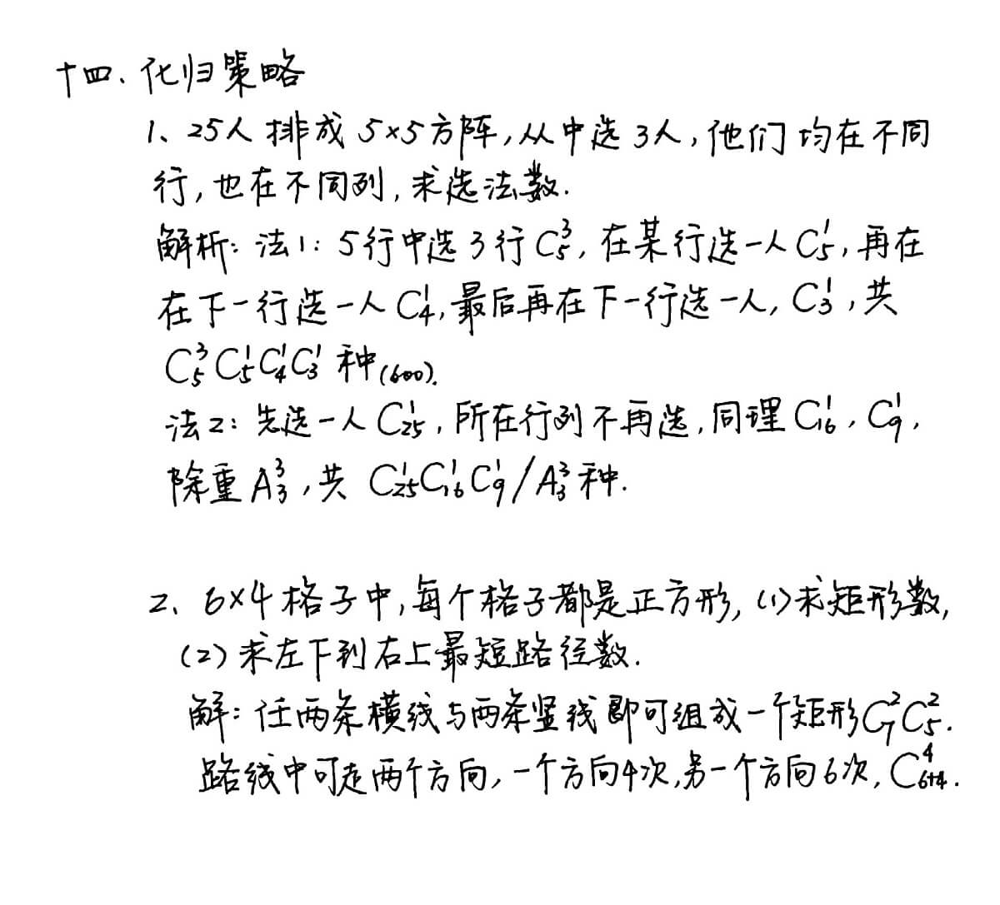
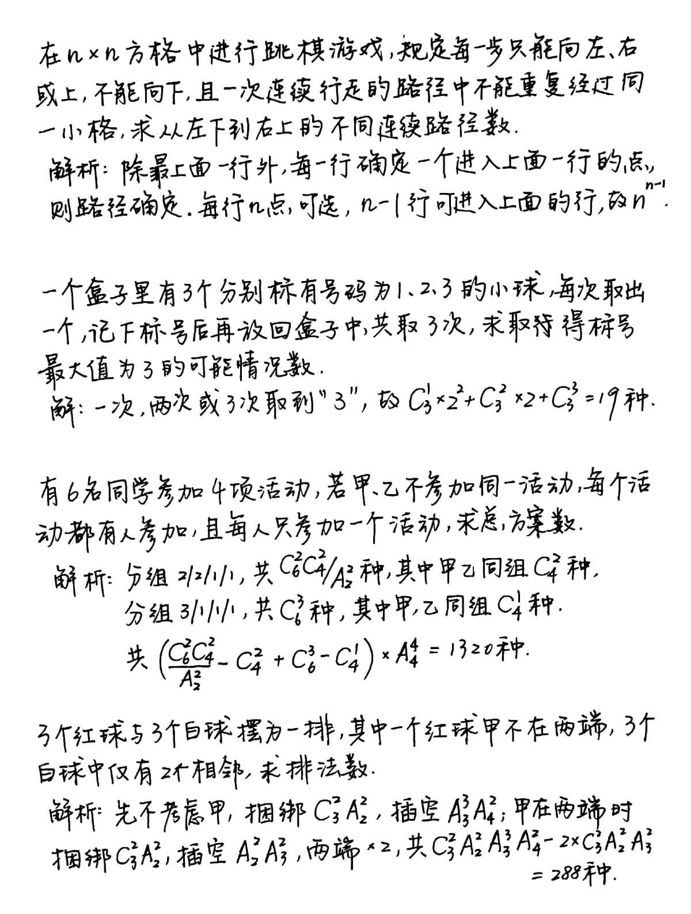
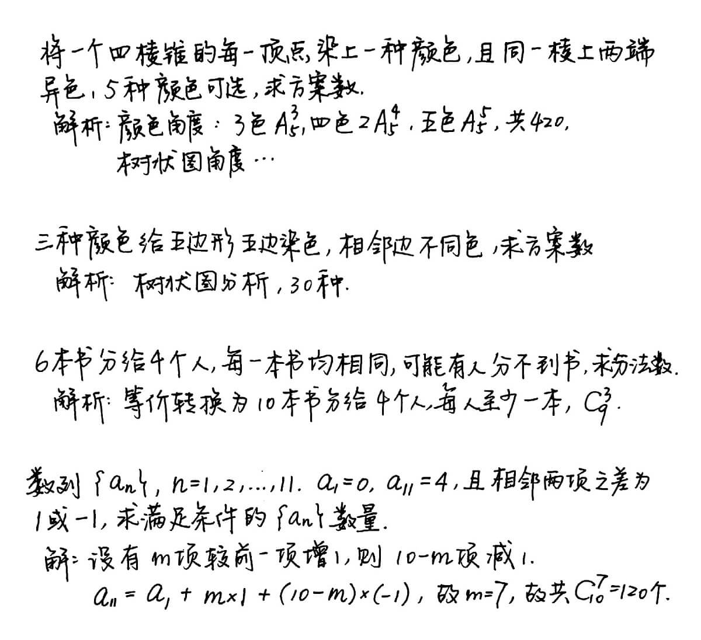

# Combinatorics

#### Permutation

$$
\begin{aligned}
\mathrm{A}_n^r &= \mathrm{P}_n^r\\
&=\underbrace{n\cdot(n-1)\cdot(n-2)\cdot\cdot\cdot (n-k+1)}_{k\text{ factors}}\\
&=\frac{n!}{(n-k)!}
\end{aligned}
$$

#### Combination

$$
\begin{aligned}
\mathrm{C}_n^k &= \binom{n}{k}\\
&=\frac{\overbrace{n\cdot (n-1)\cdot (n-2)\cdot \cdot \cdot (n-k+1)}^{k\text{ factors}}}{\underbrace{k\cdot (k-1)\cdot \cdot \cdot 1}_{k\text{ factors}}}\\
&=\frac{n!}{(n-k)!\cdot k!}
\end{aligned}
$$

### Examples

