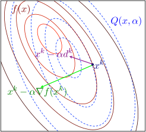

# Convex Optimization

## Convex Sets

The **affine combination** of $x_1$ and $x_2$ is $\theta_1 x_1 + \theta_2 x_2$, where $\sum \theta_i = 1$, and this idea can be generalized to more than two points.

An **affine set** $C$ is a set such that contains all the affine combinations of the points in $C$.

The **affine hull** of set $C$ is the set of all the affine combinations of all points in $C$, denoted by $\operatorname{\mathbf{aff}} C$.

For any affine set $C$, and $\forall x_0 \in C$, $C - x_0$ is a **subspace**.

The **relative interior** of a set $C$ is $\operatorname{\mathbf{relint}} C = \{x \in C \mid B(x, r) \cap \operatorname{\mathbf{aff}} C \subseteq C \text{ for some }r > 0\}$, where $B(x, r)$ is the ball of radius $r$ and center $x$ in any norm $\|\cdot\|$ (any norm defines the same relative interior).

The **relative boundary** of a set $C$ is $\operatorname{\mathbf{cl}}C\setminus\operatorname{\mathbf{relint}}C$, where $\operatorname{\mathbf{relint}}C$ is the closure of $C$.

The **convex combination** of $x_1$ and $x_2$ is $\theta_1 x_1 + \theta_2 + x_2$ where $\sum \theta_i = 1$, $\theta_i \ge 0$, and this idea can be generalized to more than two points.

A **convex set** $C$ is a set such that contains all the convex combinations of all points in $C$.

The **convex hull** of $C$ is the set of all the convex combinations of all points in $C$, denoted by $\operatorname{\mathbf{conv}} C$.

A **cone** $C$ is a set such that $\forall x \in C$ and $\forall \theta \ge 0$, $\theta x \in C$.

The **conic combination** of $x_1$ and $x_2$ is $\theta_1 x_1 + \theta_2 x_2$, where $\theta_i \ge 0$.

A **convex cone** $C$ is a set such that contains all the conic combinations of all the points in $C$.

A **hyperplane** is $\{x \mid a^\top x = b\}$.

A **norm cone** is $\{(x, t) \mid \|x\| \le t\}$.

A **polyhedron** is $\{x \mid a_i^\top x \le b_i, c_i^\top x = d_i\}$, including all affine sets, rays, segments, halfspaces, hyperplanes and all their intersections.

$k+1$ points $\{v_0, v_1, \cdots, v_k\}$ are **affinely independent** iff $\{v_1-v_0, v_2-v0, \cdots, v_k - v_0\}$ is linearly independent.

**Simplexes** are a family of polyhedra, and a $k$-dimentional simplex is the convex hull of $k+1$ affinely independent points.

Operations that perserve convexity of a set includes:

* intersection,
* affine function and its inverse,
* sum, $\big\{\sum x_i \mid x_i \in S_i\big\}$,
* Cartesian product,
* partial sum, $\{(x, y_1 + y_2) \mid (x, y_1) \in S_1, (x, y_2) \in S_2 \}$ ($x \in \mathbb{R}^n$, $y_1, y_2 \in \mathbb{R}^m$),
* perspective function, $P(z, t) = z/t$, and its inverse,
* linear-fractional, $f(x) = \dfrac{Ax + b}{c^\top x + d}$, $c^\top + d > 0$, and its inverse.

A **proper cone** is: convex, closed, solid, pointed ($x \in K \land -x \in K \Rightarrow x = 0$).

**Generalized inequalities**: $x \preccurlyeq_K y \Leftrightarrow y - x \in K$, $x \prec_K y \Leftrightarrow y - x \in \operatorname{\mathbf{int}} K$, where $K$ is a proper cone.

**Separating hyperplane theorem**: there exists a hyperplane separating two nonempty disjoint convex sets. Its converse does not always hold.

**Supporting hyperplane**: for $x_0 \in \operatorname{\mathbf{bd}} C = \operatorname{\mathbf{cl}} C \setminus \operatorname{\mathbf{int}} C$, if $\forall x \in C$, $a^\top x \le a^\top x_0$, one of the supporting hyperplane of $C$ is $\left\{x \mid a^\top x = a^\top x_0\right\}$.

**Supporting hyperplane theorem**: for any nonempty convex set $C$ and any $x_0 \in \operatorname{\mathbf{bd}} C$, there exists a supporting hyperplane that contains $x_0$. Its converse: a set is closed, has nonempty interior and supporting hyperplane on every boundary point is convex.

The **dual cone** of a cone $K$ is $K^* = \{y \mid x^\top y \ge 0, \forall x \in K\}$.

## Convex Functions

**Zeroth-order condition**: if $\operatorname{\mathbf{dom}}f$ is convex, $f$ is convex iff $\forall \theta\in [0, 1]$, $\forall x, y \in \operatorname{\mathbf{dom}}f$, $f(\theta x + (1 - \theta)y) \le \theta f(x) + (1-\theta)f(y)$.

**First-order condition**: if $\operatorname{\mathbf{dom}}f$ is convex and $f$ is differentiable, $f$ is convex iff $\forall x, y \in \operatorname{\mathbf{dom}}f$, $f(y) \ge f(x) + \nabla f(x)^\top (y-x)$.

**Second-order condition**: if $\operatorname{\mathbf{dom}}f$ is convex and $f$ is twice differentiable, $f$ is convex iff $\forall x \in \operatorname{\mathbf{dom}}f$, $\nabla^2 f(x) \succcurlyeq 0$. However, strictly convexity does not imply that $\nabla^2 f(x) \succ 0$ ($f(x) = x^4$).

The **$\alpha$-sublevel set** of $f$ is $C_\alpha = \{x \in \operatorname{\mathbf{dom}}f\mid f(x) \ge \alpha\}$, and the **$\alpha$-superlevel** set is defined likewise.

Any sublevel set of a convex function is convex, and any superlevel set of a concave function is convex.

The **epigraph** of $f$ is $\operatorname{\mathbf{epi}}f = \{(x, t) \mid t \ge f(x), x \in \operatorname{\mathbf{dom}}f\}$, and the **hypograph** is defined likewise.

$f$ is convex iff $\operatorname{\mathbf{epi}}f$ is convex.

Operations that preserve convexity of a function $f$ includes:

* nonnegative weighted sum,
* composition with an affine function, $f(Ax + b)$,
* $\max{f_i}$,
* scalar composition,
* perspective function, $tf(x/t)$.

The **conjugate function** of $f$ is $f^*(y) = \sup\limits_{x\in\operatorname{\mathbf{dom}}f} \big(y^\top x - f(x)\big)$.

If $f$ is convex and closed ($\operatorname{\mathbf{epi}}f$ is closed), $f^{**} = f$.

**Frenchel's inequality**: $f(x) + f^*(y) \ge x^\top y$.

A function is **quasiconvex** iff all its sublevel sets are convex. If a function is both quasiconvex and quasiconcave, it is quasilinear.

* $\log x$ is quasilinear.
* $\operatorname{ceil}(x)$ is quasilinear.
* $f(x_1, x_2) = x_1x_2$ is neither convex or concave, but it is quasiconcave.
* $\frac{a^\top x + b}{c^\top x + d}$ is quasilinear.

$f$ is quasiconvex iff $\operatorname{\mathbf{dom}}f$ is convex, and $\forall x, y \in \operatorname{\mathbf{dom}}f$, $\forall \theta \in [0, 1]$, $f(\theta x + (1 - \theta)y) \le \max\{f(x, f(y)\}$, this inequality is called **Jensen's inequality for quasiconvex functions**.

## Convex Optimization Problems

A **optimization problem** has the following form. Its domain $\mathcal{D} = \bigcap \operatorname{\mathbf{dom}}f_i \cap \bigcap \operatorname{\mathbf{dom}}h_i$. Its optimal value is denoted by $p^* = f_0(x^*)$.

$$
\begin{aligned}
\operatorname{minimize~~}& f_0(x)\\
\operatorname{s.t.~~}& f_i(x) \le 0, \quad i = 1, 2, \cdots, m\\
& h_i(x) = 0, \quad i = 1, 2, \cdots, p,
\end{aligned}\tag{op}
$$

where $x$ is called the optimization variable, $f_0$ is called the objective function or cost function, $f_i \le 0$ are called inequality constraints, $h_i(x) = 0$ are called equality constraints.

A **convex optimization problem** is a minimization problem with the objective function and inequality constraints are convex, and equality constraints are affine:

$$
\begin{aligned}
\operatorname{minimize~~}& f_0(x)\\
\operatorname{s.t.~~}& f_i(x) \le 0, \quad i = 1, 2, \cdots, m\\
& Ax = b.
\end{aligned}\tag{cop}
$$

**Optimality criterion** for differentiable objective functions: $x_0$ is optimal iff $\nabla f_0(x_0)^\top (y-x) \ge 0$ for all $y$ in feasible set.

## Duality

**Lagrange function** $L(x, \lambda, \nu) = f_0(x) + \sum \lambda_i f_i(x) + \sum \nu_i h_i(x)$.

**Lagrange dual function** $g(\lambda, \nu) = \inf\limits_{x\in \mathcal{D}} L(x, \lambda, \nu)$. It is the infimum of a set of affine function therefore it is concave. For any $\lambda \succeq 0$ and any $\nu$, it always holds that $g(\lambda, \nu) \le p^*$.

The **Lagrange dual problem** associated to the **primal problem** is shown as follows, and its optimal value is denoted by $d^* = g(\lambda^*, \nu^*)$.

$$
\begin{aligned}
\operatorname{maximize~~}& g(\lambda, \nu)\\
\operatorname{s.t.~~}& \lambda \succeq 0.
\end{aligned}
$$

**Weak duality** always holds, even if the problem is not convex: $d^* \le p^*$.

**Strong duality** usually holds: $d^* = p^*$ for convex optimization problems.

**Slater's condition**: For a convex optimization problem, i.e. the primal problem of the form in $\text{(cop)}$, strong duality hold, if there exists a strictly feasible point for the non-affine inequality constraints, that is, there exists an $x \in \operatorname{\mathbf{relint}}D$ that

$$
\begin{aligned}
&\begin{cases}
f_i(x) \le 0, & f_i(x) \text{ is affine},\\
f_i(x) < 0, & f_i(x) \text{ is not affine},\\
\end{cases} \quad i = 1, 2, \cdots, m, \\
&\quad Ax = b.
\end{aligned}
$$

Slater's condition reduces to feasibility (i.e., there exists an feasible point) when the constraints are all linear equalities and inequalities, and $\operatorname{\mathbf{dom}}f_0$ is open.

**KKT optimality conditions**: $L^*(x) = L(x,\lambda^*, \nu^*)$ has zero derivative at $x^*$, namely

$$
\begin{aligned}
\nabla f_0(x^*) + \sum \lambda_i^* \nabla f_i(x^*) + \sum \nu_i^* \nabla h(x^*) = 0& \text{ (zero derivative)},\\
f_i(x^*) \le 0& \text{ (primal problem constraints)},\\
h_i(x^*) = 0& \text{ (primal problem constraints)},\\
\lambda_i \ge 0& \text{ (dual problem constraints)},\\
\lambda_i f_i(x_i^*) = 0& \text{ (zero optimal duality gap)}.\\
\end{aligned}
$$

For any optimization problem with differentiable objective and constraint functions for which strong duality obtains, any primal optimal and dual optimal points must satisfy KKT conditions, that is, KKT conditions are necessary for optimality.

For any convex optimization problem, any pair of points that satisfy KKT conditions are primal optimal and dual optimal, that is, KKT conditions are sufficient for optimality.

## Convex Optimization - Mark Schmidt - 2015 MLSS

[Convex Optimization - Machine Learning Summer School](https://www.cs.ubc.ca/~schmidtm/Documents/2015_MLSS_ConvexOptimization.pdf)

[CPSC 540 - Machine Learning (January-April, 2019)](https://www.cs.ubc.ca/~schmidtm/Courses/540-W19/)

Optimization is hard. For a general function, solving $\displaystyle\min_{x\in\mathbb{R}^n} f(x)$ can be impossible. For example, $f(x)$ is arbitrarily small at some random points. Thus, assumptions need to be made, among which several important ones include:

* convexity
* Lipschitz continuity
    * Real function $f(x)$ is said to be Lipschitz-continuous if there exists a constant $L > 0$ such that $|f(x) - f(y)| \le L\|x-y\|$ holds for all $x$ and $y$
    * Ensures error of $\Omega(1/t^{1/n})$ after $t$ iterations (very slow)
* strong convexity
    * $f(x)$ is strongly convex iff there exists a constant $\mu > 0$ such that $\mu I \preceq \nabla^2f(x)$

#### Convergence Rates

Algorithm | Assumptions | Deterministic | Stochastic
:-: | :-: | :-: | :-:
Gradient | Convex | $O(1/t)$ | $O(1/\sqrt{t})$
Nesterov | Convex | $O(1/t^2)$
Subgradient | Convex | $O(1/\sqrt{t})$ | $O(1/\sqrt{t})$
Gradient | Strongly convex | $O((1-\mu/L)^t)$ | $O(1/t)$
Nestrov | Strongly convex | $O((1-\sqrt{\mu/L})^t)$
Subgradient | Strongly convex | $O(1/t)$ | $O(1/t)$
Newton | Strongly convex | $O(\prod \rho_t), \rho_t \to 0$
Gradient | Convex, smoothed to $1/\epsilon$ | $O(1/\sqrt{t})$
Nesterov | Convex, smoothed to $1/\epsilon$ | $O(1/t)$

### Smooth Optimization

#### L2-regularized logistic regression

$$
f(x) = \sum_i (\log(1 + \exp (x^\top a_i)) - b_ix^\top a_i) + \frac{\lambda}{2}\|x\|^2.
$$

Properties:

* $f(x)$ is convex and strongly convex;
* first term is Lipschitz continuous;
* second term is not Lipschitz continuous but its gradient is;
* $\mu I \preceq \nabla^2f(x) \preceq LI$.

From Taylor's theorem, for some $z$

$$
f(y) = f(x) + \nabla f(x)^\top (y-x) + \frac{1}{2}(y-x)^\top \nabla^2 f(x) (y-x).
$$

Use that $\nabla^2f(z) \preceq LI$,

$$
f(y) \le f(x) + \nabla f(x)^\top (y-x) + \frac{L}{2}\|y-x\|^2
$$

where the right-hand side is global quadratic upper bound. To minimize this bound by iterating gradient descent with step size of $1/L$

$$
x^+ = x - \frac{1}{L}\nabla f(x),
$$

which ensures decrease in each iteration (guaranteed progress)

$$
f(x^+) \le f(x) - \frac{1}{2L}\|\nabla f(x)\|^2.
$$

!!! Note "Why step size is $1/L$?"

    $$
    \min_y f(x) + \nabla f(x)^\top (y-x) + \frac{L}{2}\|y-x\|^2
    $$

    This is an unconstrained quadratic program (QP), rewrite the object function into a quadratic function

    $$
    \|Ay + b\|^2 + C,
    $$

    where $A = \sqrt{L/2}\ I$, $b = \displaystyle\frac{Lx + \nabla f(x)}{\sqrt{2L}}$, and the optimal is

    $$
    y^* = A^{-1}b = x - \frac{1}{L}f(x).
    $$

Similarly, from strong convexity we have a global lower bound,

$$
f(y) \ge f(x) + \nabla f(x)^\top(y-x) + \frac{\mu}{2} \|y-x\|^2.
$$

and minimizing both sides we get the Polyak-Łojasiewicz inequality

$$
f(x^*) \ge f(x) - \frac{1}{2\mu}\|\nabla f(x)\|^2.
$$

Iterating by gradient descent under guaranteed progress bound,

$$
f(x^{t+1}) \le f(x^t) - \frac{1}{2L}\|\nabla f(x^t)\|^2,
$$

and eliminate the norm using PL inequality,

$$
f(x^{t+1}) \le f(x^t) - \frac{\mu}{L}(f(x^t) - f(x^*)),
$$

subtracting $f(x^*)$ from both sides,

$$
f(x^{t+1}) - f(x^*) \le \left(1-\frac{\mu}{L}\right)(f(x^k) - f(x^*)).
$$

Applying this recursively gives

$$
f(x^t) - f(x^*) \le \left(1-\frac{\mu}{L}\right)^t(f(x^0) - f(x^*)).
$$

From PL inequality and guaranteed progress bound we have $\mu \le L$, so this optimization has a *linear convergence rate*:

$$
f(x^t) - f(x^*) = O(\rho^t), \quad 0 \le \rho < 1.
$$

#### Maximum likelihood logistic regression

$$
f(x) = \sum_i (\log(1 + \exp (x^\top a_i)) - b_ix^\top a_i).
$$

Instead of PL inequality, we only have a weaker constraint of convexity. From the same iteration with guaranteed progress bound:

$$
\|\nabla f(x^t)\|^2 \le 2L(f(x^t) - f(x^{t+1})).
$$

Summing each iteration up gives

$$
\sum_{k=1}^t \|\nabla f(x^{k-1})\|^2 \le 2L (f(x^0) - f(x^t))
$$

Therefore

$$
\min_{0 \le k < t} \|\nabla f(x^{k-1})\|^2 \le \frac{2L (f(x^0) - f(x^t))}{t},
$$

at least one time with $\|\nabla f(x^k)\|^2 = O(1/t)$ can be found in $t$ iterations, and to achieve the norm below $\epsilon$ requires $t = O(1/\epsilon)$ iterations. This is already much faster than $\Omega(1/t^{1/n})$ for generation Lipschitz functions.

#### Nesterov's accelerated gradient descent

$$
\begin{aligned}
x_{t+1} &= y_t - \alpha_t\nabla f(y_t),\\
y_{t+1} &= x_t + \beta_t (x_{t+1} - x_t).
\end{aligned}
$$

Convergence rate is $O(1/t^2)$ if convex, which is optimal.

#### Newton's method

$$
x^+ = x - \alpha d,
$$

where

$$
\nabla^2 f(x)d = \nabla f(x),
$$

assuming $\nabla^2 f(x) \succ 0$.

It is equivalent to minimizing

$$
f(y) \approx f(x) + \nabla f(x)^\top (y-x) + \frac{1}{2\alpha}(y-x)^\top \nabla^2f(x) (y-x),
$$

{:width=300px}

For a Lipschitz continuous and strongly convex $f(x)$, close to $x^*$ Newton's method has local superlinear convergence

$$
f(x^{t+1}) - f(x^*) \le \rho_t (f(x^t) - f(x^*)),
$$

with $\displaystyle\lim_{t\to\infty}\rho_t = 0$. This rate is very fast, but requires solving Hessian inverse.

To relieve this heavy computation cost, several methods are proposed:

* Modify the Hessian to be positive-definite;
* Compute the Hessian every few iterations;
* Quasi-Newton: approximate the Hessian using a diagonal and low-rank matrix (BFGS and L-BFGS);
* Estimate the Hessian using small perturbation;
* Barzilai-Borwein

### Non-smooth Optimization

The L1 regularization term $\lambda\|x\|_1$ is non-differentiable when any $x_i = 0$.

#### Subgradient

For a convex $f(x)$ the first order condition states that

$$
f(y) \ge f(x) + \nabla f(x)^\top (y-x),\quad \forall x, y.
$$

The subgradient is the generalization of gradient. $d$ is a subgradient for convex $f$ at $x$ if

$$
f(y) \ge f(x) + d^\top (y-x), \quad \forall y.
$$

A subgradient is the same as gradient at differentiable points, otherwise there are a set of subgradients, and this set is the subdifferential $\partial f(x)$.

For example, $\partial |x| = [-1, 1]$ at $x = 0$.

The subgradient descent is

$$
x^+ = x - \alpha d
$$

for some $d \in \partial f(x)$. The steepest step is given by the $d$ of the smallest norm, this is often hard to compute, but easy for L1 regularization. The non-steepest step may increase the objective and convergence requires $\alpha \to 0$.

Variants includes averaging the subgradients.

#### Smoothing

Replace the non-smooth $f$ with smooth $f_\epsilon$, for example

$$
|x| \approx \sqrt{x^2 + \nu},
$$

$$
\max(a, b) \approx \log(\exp(a) = \exp(b)).
$$

It is faster if using Nesterov's.

#### Convert to constrained optimization

For example, minimizing $f(x) + \lambda\|x\|_1$ is equivalent to

$$
\min_{x^+ \ge 0,\ x^- \ge 0} f(x^+ - x^-) + \lambda \sum_i (x^+_i + x^-_i).
$$

##### Gradient projection

Gradient projection chooses the step in the feasible region that is the nearest to unconstrained gradient descent.

$$
x^\mathrm{GD} = x - \alpha \nabla f(x),
$$

$$
x^+ = \argmin_y \|y - x^\mathrm{GD}\|.
$$

Projecting does not change the convergence rate.

#### Proximal gradient method

Proximal gradient is a generalization of projected gradient, utilizing structure of the object. For problem of the form

$$
\min_x f(x) + r(x),
$$

where $f$ is smooth but $r$ is a non-smooth convex function, apply proximity operator to the iteration

$$
x^\mathrm{GD} = x - \alpha \nabla f(x),
$$

$$
x^+ = \argmin_y \frac{1}{2}\|y - x^\mathrm{GD}\|^2 + \alpha r(y),
$$

which is equivalent to

$$
x^+ = \argmin_y f(x) + \nabla f(x)^\top (y-x) + \frac{1}{2\alpha }\|y-x\|^2 + r(y).
$$

The convergence rates are still the same as for minimizing $f$.

The proximal operator is

$$
\operatorname{prox}_r[y] = \argmin_{x\in\mathbb{R}^p} r(x) + \frac{1}{2}\|x - y\|^2.
$$

#### Inexact proximal Newton

$$
x^+ = \operatorname{prox}_{\alpha r}[x - \alpha H^{-1}\nabla f(x)]_H,
$$

with the non-Euclidian proximal operator

$$
\operatorname{prox}_r[y]_H = \argmin_{x\in\mathbb{R}^p} r(x) + \frac{1}{2}\|x - y\|^2_H,
$$

where $\|x\|_H^2 = x^\top Hx$.

#### Dual method

Strongly convex problems have smooth duals (e.g. SVM).

### Randomized Algorithms

#### Stochastic gradient descent

When minimizing $f(x) = \frac{1}{N}\sum_{i=1}^N f_i(x)$, deterministic gradient method by Cauchy in 1847 has $O(N)$ iteration cost

$$
x^{t+1} = x^t - \alpha_t \nabla f(x^t) = x^t - \frac{\alpha_t}{N}\sum_{i=1}^N\nabla f_i(x^t).
$$

The stochastic gradient descent proposed in 1951 randomly select a sample $i(t)$ from $\{1, 2, \cdots, N\}$

$$
x^{t+1} = x^t - \alpha_t \nabla f_{i(t)} (x^t),
$$

where the stochastic gradient gives unbiased estimate of true gradient. Its iteration cost is independent of $N$.

Stochastic is as fast as deterministic for non-smooth problems in convergence rate, which means $N$ times faster. However, smoothness does not help stochastic methods.

#### Stochastic average gradient

Randomly select $i(t)$ from $\{1, 2, \cdots, N\}$ and compute $\nabla f_{i(t)}(x^t)$,

$$
x^{t+1} = x^t - \alpha \sum_{i=1}^N y_i^t,
$$

where $y_i^t = \nabla f_i(x^t)$ from the last $t$ where $i$ was selected.

It only computes 1 gradient per iteration, while have a $O(\rho^t)$ convergence rate.

### Coordinate descent

Update one variable at a time

$$
x_j^+ = x_j - \alpha \nabla_j f(x).
$$

For strongly convex and $L_j$-Lipschitz continuous functions, the convergence rate is $O((1-\mu/L_jD)^t)$, meaning that it is faster if $D$ coordinate descent step has same cost as one gradient step.

### Parallel/Distributed Optimization

#### Asynchronous computation

SGD without waiting the slowest workers improves efficiency

$$
x^{t+1} = x^t - \alpha \nabla f_k(x^{k-m}).
$$

Step size should decrease in proportion to asynchrony.

#### Parallel coordinate descent

Each worker only update a coordinate, thus only need to communicate single coordinates

$$
x_j^+ = x_j - \alpha_j \nabla_j f(x).
$$

#### Decentralized gradient descent

Each worker has its own data and parameter vector $x$, without updating a centralized $x$. Each worker $c$ only communicates with a limited number of neighbours $\operatorname{nei}(c)$

$$
x_c = \frac{1}{|\operatorname{nei}(c)|}\sum_{\operatorname{nei}(c)} x_j - \frac{\alpha_c}{M}\sum_{i=1}^M \nabla f_i(x_c).
$$

When all neighbours communicate, it reduces to gradient descent. As the graph becomes sparse, convergence rate decays.
