# Elements of Information Theory

>*Second Edition*  
*Thomas M. Cover, Joy A. Thomas*  
*2006, John Wiley & Sons*  

---

## Ch. 2: Entropy, relative entropy, mutual information

**Entropy** measures uncertainty of a discrete random variable. Let $X$ be a discrete r.v. with alphabet $\mathcal{X} = \{x: \Pr(X=x)>0\}$ and probability mass function $p(x) = \Pr(X=x)$. The entropy of $X$ is

$$
H(X) = \sum_{x \in \mathcal{X}} p(x)\log\frac{1}{p(x)} = \operatorname{E}_{p}\left[\log\frac{1}{p(X)}\right],
$$

where $\log$ denotes logarithm base 2 unless specified, thus the entropy value is in bits. Also, if the base of the logarithm is $\mathrm{e}$, the entropy is measured in nats, and entropy of any base can convert to another according to the change of base rule.

**Joint entropy**:

$$
H(X, Y) = \sum_{x\in \mathcal{X}}\sum_{y\in \mathcal{Y}} p(x, y)\log\frac{1}{p(x, y)} = \mathrm{E}_{p(X, Y)}\left[\frac{1}{p(X, Y)}\right].
$$

**Conditional entropy**:

$$
\begin{aligned}
H(Y|X) &= \sum_{x\in\mathcal{X}} p(x)H(Y|X = x) \\
&= \sum_{x\in \mathcal{X}}p(x)\sum_{y\in \mathcal{Y}}p(y|x)\log\frac{1}{p(y|x)}\\
&= \sum_{x\in \mathcal{X}}\sum_{y\in \mathcal{Y}}p(x, y)\log\frac{1}{p(y|x)}\\
&= \mathrm{E}\left[\frac{1}{\log p(Y|X)}\right].
\end{aligned}
$$

**Chain rules**:

$H(X, Y) = H(X) + H(Y|X)$.

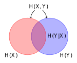{style="transform: scale(1.2);"}

$H(X, Y | Z) = H(X | Z) + H(Y | X, Z)$.

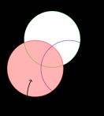{style="transform: scale(1.2); padding: 1em;"}

Commas have higher priority than conditionings.

**Relative entropy (KL Distance)**:

$$
D(p\|q) = \sum_{x\in \mathcal{X}}p(x)\log\frac{p(x)}{q(x)} = \mathrm{E}_p\left[\log\frac{p(X)}{q(X)}\right].
$$

**Mutual information**:

$$
I(X;Y) = D(p(x, y) \| p(x)p(y)) = \mathrm{E}_{p(X, Y)}\left[\log\frac{p(X, Y)}{p(X)p(Y)}\right].
$$

$$
\begin{aligned}
I(X; Y) &= H(X) - H(X|Y) \\
&= H(Y) - H(Y|X)\\
&= H(X) + H(Y) - H(X, Y).
\end{aligned}
$$

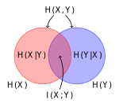{style="transform: scale(1.2);"}

$$
I(X; X) = H(X),\quad H(X|X) = 0.
$$

**Chain rule for entropy**:

$$
\begin{aligned}
H(X_1, X_2, \cdots, X_n) &= \sum_{i=1}^n H(X_i | X_{i-1}, \cdots, X_1) \\
&= H(X_1) + H(X_2|X_1) + H(X_3|X_2, X_1), \cdots.
\end{aligned}
$$

It is very obvious graphically.

**Conditional mutual information**:

$$
I(X; Y | Z) = H(X | Z) - H(X | Y, Z) = \mathrm{E}\left[\log\frac{p(X, Y | Z)}{p(X|Z)p(Y| Z)}\right].
$$

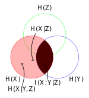{style="transform: scale(1.2);"}

Semicolons have higher priority than conditionings.

**Chain rule for information**:

$$
\begin{aligned}
I(X_1, X_2, \cdots, X_n ; Y) &= \sum_{i=1}^n I(X_i; Y | X_{i-1}, X_{i-2}, X_1) \\
&= I(X_1; Y) + I(X_2; Y | X_1) + I(X_3; Y | X_2, X_1), \cdots.
\end{aligned}
$$

It is obvious graphically.

**Conditional relative entropy**:

$$
D(p(y|x)\|q(y|x)) = \mathrm{E}_{p(X, Y)}\left[\log\frac{p(Y|X)}{q(Y|X)}\right].
$$

**Chain rule for relative entropy**:

$$
D(p(x, y)\|q(x, y)) = D(p(x)\|q(x)) + D(p(y|x) \| q(y|x)).
$$

**Independence bound on entropy**: $H(X_1, X_2, \cdots, X_n)\le \sum H(X_i)$, with equality iff all $X_i$ are independent.

**Log sum inequality**:

$$
\sum a_i \log\frac{a_i}{b_i} \ge \sum a_i \log \frac{\sum a_i}{\sum b_i}.
$$

**Relative entropy** $D(p\| q)$ is **convex** in the pair $(p, q)$.

**Entropy** is **concave**, as $H(p) = \log|\mathcal{X}| - D(p \| u)$, where $u$ is the uniform distribution on $\mathcal{X}$ and $\log|\mathcal{X}| = \mathrm{E}\left[\log\frac{1}{u(x)}\right]$.

**Mutual information** $I(X; Y)$ is **concave** with respect to $p(x)$ for fixed $p(y|x)$; **convex** with respect to $p(y|x)$ for fixed $p(x)$.

A **Markov chain** $X\rightarrow Y \rightarrow Z$ has the following properties:

* $p(x, y, z) = p(x)p(y|x)p(z|y)$ (definition),
* $p(z|y) = p(z|x, y)$,
* $p(x, z | y) = p(x|y)p(z|y)$,
* $Z \rightarrow Y \rightarrow X$ ($X\leftrightarrow Y \leftrightarrow Z$),
* if $Z = f(Y)$, $X \rightarrow Y \rightarrow Z$,
* $I(X; Z|Y) = 0$.

**Data processing inequality**: in a Markov chain $X\rightarrow Y \rightarrow Z$, $I(X; Y) \ge I(X; Z)$. Also, observation of $Z$ reduces dependence between $X$ and $Y$: $I(X; Y | Z) \le I(X; Y)$, which might be the opposite when they do not form a Markov chain: $X$ and $Y$ independently observes Bernoulli distribution with $p=0.5$, and $Z = X + Y$.

**Fano's inequality**: $Y$ is related to $X$ by $p(y|x)$, and an estimator of $Y$ is $g(Y) = X$. Therefore, $X \rightarrow Y \rightarrow \hat{X}$. The probability of error is defined as $P_e = \Pr\{X\neq \hat{X}\}$. Fano's inequality is

$$
H(P_e) + P_e \log |\mathcal{X}| \ge H(X|\hat{X}) \ge H(X|Y).
$$

!!! Info "Notation $H(p)$"
    Since a random variable is essentially a probability distribution. Entropy of a r.v. is the entropy of this distribution. That is, $H(p_1, p_2, \cdots, p_k) = -\sum_{i=1}^k p_i\log p_i$. Furthermore, $H(p)$ denotes the entropy of an r.v. that follows the distribution $\{p, 1-p\}$.

!!! Abstract "Proof"

    $$
    \begin{aligned}
    H(E, X|\hat{X})
    &= H(X|\hat{X}) + H(E|X, \hat{X}) \\
    &= H(X|\hat{X}) \\
    &= H(E|\hat{X}) + H(X | E, \hat{X}) \\
    &\le H(E) + H(X | E, \hat{X}),
    \end{aligned}
    $$

    where

    $$
    \begin{aligned}
    H(X|E, \hat{X})
    &= H((X | \hat{X}) | E) \\
    &= P(E=1)H(X|\hat{X}) + P(E=0)H(X|\hat{X}) \\
    &= P(E=1)H(X|\hat{X}) \\
    &= P_eH(X|\hat{X}) \\
    &\le P_e H(X) \\
    &\le P_e \log |\mathcal{X}|.
    \end{aligned}
    $$

    If $\hat{X}\in \mathcal{X}$, since $X \neq \hat{X}$ in the $E=1$ case, $H(X|E, \hat{X}) \le P_e \log (|\mathcal{X}|-1)$, and Fano's inequality changes accordingly.

If $X$ and $X'$ are i.i.d. with entropy $H(X)$,

$$
\Pr(X = X') \ge 2^{-H(X)},
$$

with equality iff uniformly distributed.

!!! Abstract "Proof"
    $$
    \Pr(X = X') = \sum p^2(x) = \sum p(x)2^{\log p(x)} = \operatorname{E}2^{\log p(x)} \overset{\text{convex}}{\ge} 2^{\operatorname{E}\log p(x)} = 2^{-H(x)}.
    $$

If $X \sim p(x)$, $X' \sim r(x)$ independently,

$$
\Pr(X = X') \ge 2^{-H(p) - D(p \| r)}, \\
\Pr(X = X') \ge 2^{-H(r) - D(r \| p)}. \\
$$

## Ch. 3: Asymptotic equipartition property

**Convergence of random variables**: $\{X_n\} \rightarrow X$ is said to be

* in probability, if $\forall \epsilon > 0$, $\Pr\{|X_n - X| > \epsilon\}$,
* in mean square, if $\operatorname{E}(X_n - X)^2 \rightarrow 0$,
* with probability 1, if $\Pr\left\{\lim\limits_{n\rightarrow \infty} X_n = X\right\} = 1$.

**Asymptotic equipartition property**: if $X_1, X_2, \cdots, X_n$ are i.i.d. $\sim p(x)$,

$$
-\frac{1}{n} \log p(X_1, X_2, \cdots, X_n) \rightarrow H(X) \quad \text{in probability.}
$$

!!! Abstract "Proof"
    A few derivations lead to

    $$
    -\frac{1}{n}\sum\log p(X_i) \rightarrow -\operatorname{E}\log p(X),
    $$

    and the law of large numbers finishes the proof.

$A_\epsilon^{(n)}$ is the **typical set** with respect to $p(x)$ iff every element $(x_1, x_2, \cdots, x_n)\in \mathcal{X}^n$, and

$$
2^{-n(H(X) + \epsilon)} \le p(x_1, x_2, \cdots, x_n) \le 2^{-n(H(X) - \epsilon)}.
$$

The equation above is equivalent to

$$
\left|-\frac{1}{n}\log p(x_1, x_2, \cdots, x_n) - H(X)\right| \le \epsilon.
$$

According to AEP, $\forall\delta > 0$, $\exists n_0\in\mathbb{R}$, $\forall n \ge n_0$, $\Pr\left\{\left|-\frac{1}{n}\log p(x_1, x_2, \cdots, x_n) - H(X)\right|< \epsilon\right\} > 1 - \delta$. We can set $\delta$ to $\epsilon$.

$$
2^{-n(H(X) + \epsilon)}\left|A_\epsilon^{(n)}\right| \le \sum_{A_\epsilon^{(n)}} p(x_1, x_2, \cdots, x_n) \le \sum_{\mathcal{X}^n} p(x_1, x_2, \cdots, x_n) = 1.
$$

For $n$ sufficiently large,

$$
2^{-n(H(X) - \epsilon)}\left|A_\epsilon^{(n)}\right| \ge \sum_{A_\epsilon^{(n)}} p(x_1, x_2, \cdots, x_n) \ge \Pr\{A_\epsilon^{(n)}\} > 1 - \epsilon.
$$

Therefore, indexing elements in the typical set $A_\epsilon^{(n)}$ requires no more than $n(H + \epsilon) + 1$ bits, and indexing elements in $A_\epsilon^{(n)\mathrm{C}}$ requires no more than $n\log |\mathcal{X}| + 1$ bits. To index all the elements in $\mathcal{X}^n$, there is an additional bit to indicate whether in the typical set.

$$
\begin{aligned}
\operatorname{E}l(X^n)
&= \sum_{A_\epsilon^{(n)}}p(x^n)l(x^n) + \sum_{A_\epsilon^{(n)\mathrm{C}}}p(x^n)l(x^n) \\
&\le \Pr\{A_\epsilon^{(n)}\}(n(H + \epsilon) + 2) + \Pr\{A_\epsilon^{(n)\mathrm{C}}\}(n\log|\mathcal{X}| + 2) \\
&\le n(H+\epsilon) + 2 + \delta(n\log|\mathcal{X}| + 2) \\
&= n\left(H + \epsilon + \frac{2}{n} + \delta\log|\mathcal{X}| + \frac{2}{n}\right) \\
&= n(H + \epsilon').
\end{aligned}
$$

For $X^n$ i.i.d. $\sim p(x)$, $\operatorname{E}\left[\frac{1}{n}l(x^n)\right] \le H(X) + \epsilon$. We can encode $X^n$ using $nH(X)$ bits on average.

A **high probability set** $B_\delta^{(n)} \subset \mathcal{X}^n$ is the smallest set with $\Pr(B_\delta^{(n)}) \ge 1 - \delta$. $B_\delta^{(n)}$ must have at least $2^{nH}$ elements.

## Ch. 4: Entropy rates of a stochastic process

A stochastic process $\{X_i\}$ is said to be **stationary** if

$$
\begin{aligned}
&\Pr(X_1 = x_1, X_2 = x_2, \cdots, X_n = x_n) \\
= &\Pr(X_{1+l} = x_1, X_{2+l} = x_2, \cdots, X_{n+l} = x_n).
\end{aligned}
$$

A discrete stationary process is said to be a **Markov process** (**Markov chain**) if

$$
\begin{aligned}
&\Pr(X_{n+1} = x_{n+1} \mid X_n = x_n, \cdots, X_1 = x_1) \\
= &\Pr(X_{n+1} = x_{n+1} \mid X_n = x_n).
\end{aligned}
$$

And the joint distribution for a Markov process

$$
p(x_1, x_2, \cdots, x_n) = p(x_1)p(x_2|x_1)p(x_3|x_2)\cdots p(x_n|x_{n-1}).
$$

A Markov process is said to be **time invariant** if for any $n$,

$$
\Pr(X_{n+1}=b \mid X_n = a) = \Pr(X_2 = b \mid X_1 = a).
$$

We always assume a Markov process is time invariant unless otherwise stated.

A Markov process that can go from any state to any other state with positive probability in a finite number of steps is said to be **irreducible**.

A Markov process that for every state, lengths of all loops it sits on has the greatest common divisor 1, is said to be **aperiodic**.

A Markov process at time $n+1$ has distribution $p(x_{n+1}) = \sum\limits_{x_n}p(x_n)P_{x_n x_{n+1}}$. The distribution such that at time $n$ and $n+1$ are equal is called a **stationary distribution**. If the initial state of a Markov process is drawn from a stationary distribution, the Markov process forms a stationary process.

!!! Note "Example"

    Derive the stationary distribution for a Markov process with transition matrix

    $$
    P = \begin{bmatrix} 1-\alpha & \alpha \\ \beta & 1-\beta \end{bmatrix}.
    $$

    Solution: Let the stationary distribution be $(\mu_1, \mu_2)$. The distribution at time 1 and 2 are

    $$
    \begin{cases}
    \Pr(X_1 = 1) = \mu_1, \\
    \Pr(X_1 = 1) = \mu_2,
    \end{cases}\quad
    \begin{cases}
    \Pr(X_2 = 1) = \mu_1(1-\alpha) + \mu_2\beta, \\
    \Pr(X_2 = 1) = \mu_1\alpha + \mu_2(1-\beta),
    \end{cases}
    $$

    Let those 2 distributions be equal, we obtain $\alpha \mu_1 = \beta \mu_2$. Since $\mu_1 + \mu_2 = 1$, the stationary distribution is

    $$
    \mu_1 = \frac{\beta}{\alpha + \beta}, \quad \mu_2 = \frac{\alpha}{\alpha + \beta}.
    $$

For an irreducible and aperiodic finite-state Markov chain, its stationary distribution is unique, and from any starting distribution, the distribution at time $t$ tends to be stationary as $t \rightarrow \infty$.

**Entropy rate**, as per symbol entropy on average:

$$
H(\mathcal{X}) = \lim_{n\rightarrow\infty} \frac{1}{n}H(X_1, X_2, \cdots, X_n).
$$

If $X_1, X_2, \cdots, X_n$ are i.i.d., $H(\mathcal{X}) = H(X_i)$.

If $X_1, X_2, \cdots, X_n$ are independent, $H(X_1, X_2, \cdots, X_n) = \sum H(X_i)$, but the existence of limit need to be confirmed.

!!! Abstract "Proof"

    For simplicity, $x_1, x_2, \cdots, x_n$ is denoted by $x^n$, and $\sum\limits_{x_i \in \mathcal{X}_i}$ is denoted by $\sum\limits_{x_i}$.

    $$
    \begin{aligned}
    H(X_1, X_2, \cdots, X_{n+1}) &= \sum_{x^{n+1}}p(x^{n+1})\log\frac{1}{p(x^{n+1})} \\
    \text{\footnotesize(seperate $x_{n+1}$, independence)} &= \sum_{x_{n+1}} \sum_{x^n} p(x^n)p(x_{n+1})\log\frac{1}{p(x^n)p(x_{n+1})} \\
    &= \sum_{x_{n+1}}p(x_{n+1})\sum_{x^n}p(x^n)\log\frac{1}{p(x^n)} + \sum_{x_{n+1}}p(x_{n+1})\sum_{x^n}p(x^n)\log\frac{1}{p(x_{n+1})} \\
    &= \sum_{x^n}p(x^n)\log\frac{1}{p(x^n)} + \sum_{x_{n+1}}p(x_{n+1})\log\frac{1}{p(x_{n+1})} \\
    &= H(X_1, X_2, \cdots, X_n) + H(X_{n+1}).
    \end{aligned}
    $$

**Entropy rate**, as conditional entropy of the last symbol given history:

$$
H'(\mathcal{X}) = \lim_{n\rightarrow\infty} H(X_n \mid X_{n-1}, X_{n-2}, \cdots, X_1).
$$

For a stationary process, $H(\mathcal{X}) = H'(\mathcal{X})$, and $H'(X)$ is non-increasing as $H(X_{n+1} \mid X_n, \cdots, X_1) \le H(X_{n+1} \mid X_n, \cdots, X_2) = H(X_n \mid X_{n-1}, \cdots, X_1)$.

**Cesaro mean**: If $a_n \rightarrow a$ and $b_n = \dfrac{1}{n}\sum\limits_{i=1}^n a_i$, $b_n \rightarrow a$.

For a stationary Markov process, $H'(\mathcal{X}) = H'(\mathcal{X}) = \lim H(X_n | X_{n-1}) = H(X_2 | X_1)$.

The entropy rate of a stationary Markov chain with transition matrix $P$, and stationary distribution $\mu$, the entropy rate is

$$
H(\mathcal{X}) = H(X_2|X_1) = \sum_i \mu_i H(X_2 | X_1 = x_i) = \sum_i \mu_i\left(\sum_j P_{ij} \log\frac{1}{P_{ij}}\right).
$$

## Ch. 5: Data compression

A **nonsingular code** is a code of which every element maps to a different code. $x \neq x' \Rightarrow C(x) \neq C(x')$.

The extension of a code $C$ is the concatenation of codewords: $C(x_1x_2\cdots x_n) = C(x_1)C(x_2)\cdots C(x_n)$.

A **uniquely decodable code** is a code that has nonsingular extension.

A **prefix code** or an **instantaneous code** is a code of which no codeword is a prefix of any other prefix of any other codeword (can be decoded without reference to future codewords, self-punctuating).

All $\supset$ nonsingular $\supset$ uniquely decodable $\supset$ instantaneous.

**Kraft inequality**: for any instantaneous code over an alphabet of size $D$, the codeword lengths $l_1, l_2, \cdots$ satisfies

$$
\sum_i D^{-l_i} \le 1.
$$

Conversely, from a set of codewords lengths that satisfy Kraft inequality, one can construct an instantaneous code.

**Extended Kraft inequality**: for any prefix code that has countably infinite codewords with length $l_1, l_2, \cdots$,

$$
\sum_{i=1}^\infty D^{-l_i} \le 1.
$$

To find the **optimal code lengths**, that is

$$
\begin{aligned}
\operatorname{minimize~~}& L = \sum p_i l_i \\
\operatorname{s.t.~~}& \sum_i D^{-l_i} \le 1, \\
& l_i \in \mathbb{Z}^+.
\end{aligned}
$$

Removing the integer constraint leads to results

$$
l_i^* = \log_D p_i, \quad L^* = H_D(X).
$$

The **expected length** $L$ of any prefix $D$-ary code

$$
L \ge H_D(X),
$$

with equality iff $D^{-l_i} = p_i$ for every symbol, that is, each of the probability equals to $D^{-n}$ for some integer $n$, and in this case the distribution is said to be **$D$-adic**.

When the distribution is not $D$-adic, we choose $l_i = \left\lceil\log_D \dfrac{1}{p_i}\right\rceil$, and that means $\log_D \dfrac{1}{p_i} \le l_i < \log_D \dfrac{1}{p_i}+1$, finally

$$
H_D(X) \le L < H_D(X) + 1.
$$

For a sequence of symbols $(x_1, x_2, \cdots, x_n) \in \mathcal{X}^n$,

$$
H(X_1, X_2, \cdots, X_n) \le \operatorname{E}l(X_1, X_2, \cdots, X_n) < H(X_1, X_2, \cdots, X_n) + 1.
$$

therefore **the expected per symbol length** $L_n$ satisfies

$$
\frac{H(X_1, X_2, \cdots, X_n)}{n} \le L_n^* < \frac{H(X_1, X_2, \cdots, X_n)}{n} + \frac{1}{n}.
$$

If $X_1, X_2, \cdots X_n$ is a stationary stochastic process, $L_n^* \rightarrow H(\mathcal{X})$. The expected number of bits required per symbol to describe the process is the entropy rate.

If $X_i$ are i.i.d., $H(\mathcal{X}) \le L_n < H(\mathcal{X}) + \dfrac{1}{n}$.

If we estimate the distribution of $X$ to be $q(x)$, but the true distribution is $p(x)$, the code assignment $l(x) = \left\lceil\log\frac{1}{q(x)}\right\rceil$, the penalty for expected length is the relative entropy:

$$
H(p) + D(p\|q) \le \operatorname{E}_p l(X) < H(p) + D(p\|q) + 1.
$$

**McMillan theorem**: any uniquely decodable $D$-ary code also satisfies Kraft inequality, and the converse holds too.

**Shannon code** assigns a symbol of probability $p_i$ with codeword length $\left\lceil\log\frac{1}{p_i}\right\rceil$, but it is not necessarily optimal.

!!! Note "Example"

    Two symbols with probabilities $\{0.0001, 0.9999\}$, an optimal code requires 1 codeword of length 1, but Shannon code obviously does not.

An optimal code does not necessarily always have codeword lengths less than $\left\lceil\log\frac{1}{p_i}\right\rceil$.

!!! Note "Example"

    Huffman code for distribution $\{\frac{1}{3}, \frac{1}{3}, \frac{1}{4}, \frac{1}{12}\}$ has codeword lengths (2, 2, 2, 2) or (1, 2, 3, 3) (yes, not unique), while $3 > \log\left(\frac{1}{4}\right)^{-1}$.

**Fano code** orders symbols in decreasing order of probabilities, and each time divide the set into almost equal parts. It is suboptimal.

$F(x)$ denotes the cumulative distribution function, and a modified one $\bar{F}(x) = \sum_{a<x}p(a) + \frac{1}{2}p(x)$, is the probability of less than middle of $x$. Write $\bar{F}(x)$ in binary and truncate to $\left\lceil\log\frac{1}{p(x)}\right\rceil + 1$ after decimal. This prefix code is called **Shannon-Fano-Elias code** and has expected length $L < H(X) + 2$

**Competitive optimality of Shannon code** ($l(x) = \left\lceil\log\frac{1}{p(x)}\right\rceil$): for any uniquely decodable code with codeword lengths $l'(x)$,

$$
\Pr(l(x) \ge l'(x) + c) \le \frac{1}{2^{c-1}},
$$

$$
\Pr(l(x) < l'(x)) \ge \Pr(l(x) > l'(x)).
$$

!!! Abstract "Proof"

    For the first inequality, extend then use McMillan ineq.

    $$
    \text{LHS} \le \sum_{x:p(x)\le 2^{-l'(x) - c + 1}} p(x) \le 2^{-(c-1)}.
    $$

    For the second inequality, prove

    $$
    \operatorname{E}\operatorname{sgn}(l(x) - l'(x)) \le 0,
    $$

    where $\operatorname{sgn}(x) \le 2^x - 1$ for $x\in\mathbb{Z}$.

    Also, for any $f(x) \le 2^x - 1$ for $x\in\mathbb{Z}$, $\operatorname{E}\operatorname{sgn}f(l(x) < l'(x)) \le 0$.

!!! Note "Example: generation of discrete distributions $X$ from fair coins:"

    Algorithm: generate a tree, of which each leaf is assigned to a symbol $y$. This tree should be binary complete. Leaf $y$ at depth $t$ has probability $2^{-t}$, and the path from root to it represents its codeword. This tree has expected depth of each leaf

    $$
    \operatorname{E}T = \sum_{y\in\mathcal{Y}}t(y)2^{-t(y)} = H(Y).
    $$

    Now, map $Y$ to $X$ by aggregating groups of proper $y$ and assign each group/single symbol to $X$. This is a many-to-one mapping.

    This is equivalent to expanding each $p(x) = \sum_i2^{-k}$.

    $H(X) \le H(Y)$, therefore $H(X) \le \operatorname{E}T$.

    This tree can be infinite, for example $p(x=a) = 2/3$ and $p(x=b) = 1/3$.

    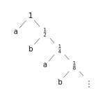{style="transform: scale(1.3);"}

    When $X$ is dyadic, $\operatorname{E}T = H(X)$.

    Finally, the expected number of bits required $\operatorname{E}T$ satisfies

    $$
    H(X) \le \operatorname{E}T < H(X)+2.
    $$

## Ch. 7: Channel capacity

A **communication system**:

$$
\underset{\text{message}} W \xrightarrow{\text{encoder}} X^n \xrightarrow[p(y|x)]{\text{channel}}Y^n \xrightarrow{\text{decoder}} \underset{\text{estimate of } W} W
$$

A channel is said to be **memoryless** if its probability distribution of output depends only on the input at that time, that is, conditionally independent of previous input/output.

The "information" **channel capacity** of a discrete memoryless channel is defined as

$$
C = \max_{p(x)} I(X;Y),
$$

that is the maximum number of distinguishable signals can be transmitted per use of this channel.

By this we have that the noiseless binary channel has capacity of 1 bit, which is achieved by $p = \{0.5, 0.5\}$

A **noiseless binary channel** has capacity of 1 bit, which is achieved by $p = \{0.5, 0.5\}$. In this channel $H(Y|X) = 0$ since the knowledge of $X$ completely eliminates uncertainty of $Y$, and it also holds for noisy channel with nonoverlapping outputs.

**Binary symmetric channel**:

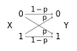{style="transform: scale(1.4);"}

$$
\begin{aligned}
C &= \max_{p(x)} H(Y) - H(Y|X) \\
&= 1 - H(p).
\end{aligned}
$$

**Binary erasure channel**:

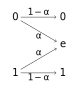{style="transform: scale(1.4);"}

$$
C = \max_{p(x)} H(Y) - H(\alpha).
$$

The distribution of $Y$ is $\{(1-\pi)(1-\alpha), \alpha, \pi(1-\alpha)\}$, assuming $\Pr(X = 1) = \pi$, thus maximum is reached at $\pi = 1/2$, $C = 1-\alpha$. That is, a proportion of $\alpha$ bits are lost per transmit.

In a **transition matrix**, item on $x$-th row and $y$-th col is $p(y|x)$.

$$
p(y|x) = \begin{bmatrix}
.3 & .2 & .5 \\
.5 & .3 & .2 \\
.2 & .5 & .3
\end{bmatrix}
$$

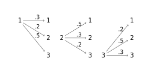{style="transform: scale(1.4);"}

$x$-th row is the conditional distribution $P(Y|X = x)$.

$$
\begin{aligned}
p(Y = y_0)
&= \sum_x p(Y = y_0, X = x) \\
&= \sum_x p(Y = y_0 \mid X = x)p(X = x) \\
&= \sum_{r \in \mathrm{rows}} p(r) p(Y = y_0, r) \\
&= \text{weighted sum along the column of } y_0.
\end{aligned}
$$

In a **symmetric channel**, transition matrix rows are permutations of each other and cols are permutations of each other.

In a **weakly symmetric channel**, transition matrix rows are permutations of each other and all col sums are equal. It achieves uniform $Y$ when $X$ is uniformly distributed. Therefore $C = \log|\mathcal{Y}| - H(r)$, $r$ in any row.

Properties of channel capacity:

* $C \ge 0$, ($I(X;Y) \ge 0$).
* $C \le \log|\mathcal{X}|$, $C \le \log|\mathcal{Y}|$.
* $I(X; Y)$ is continuous and concave on $p(x)$.

A **discrete channel** is denoted by $(\mathcal{X}, p(y|x), \mathcal{Y})$, where $\forall x \forall y, p(y|x) \in [0, 1]$, and $\forall x \sum\limits_y p(y|x) = 1$.

A **discrete memoryless channel** (DMC) has its $n$-th extension $(\mathcal{X}^n, p(y^n|x^n), \mathcal{Y}^n)$. Memorylessness is

$$
p(y_k \mid x^k, y^{k-1}) = p(y_k \mid x_k),
$$

where subscript $\cdot_k$ denotes the $k$-th element, and superscript $\cdot^k$ denotes the sequence of the first $k$ elements.

A DMC is said to be **without feedback**, when its inputs do not depend on past outputs:

$$
p(x_k \mid x^{k-1}, y^{k-1}) = p(x_k \mid x^{k-1}).
$$

It satisfies

$$
p(y^n | x^n) = \prod_{i=1}^n p(y_i | x_i).
$$

An $(M, n)$ code has the codebook (the set of codewords) $\{x^n(1), x^n(2), \cdots, x^n(M)\}$. Its decoding function $g:\mathcal{Y}^n\rightarrow\{1, 2, \cdots, M\}$ is deterministic.

Given message index $i$, the **conditional probability of error** of a channel is defined by

$$
\lambda_i = \Pr(g(Y^n) \neq i \mid X^n = x^n(i)).
$$

The **maximal probability of error** of a channel is defined by

$$
\lambda^{(n)} = \max_{i \in \{1, 2, \cdots, M\}} \lambda_i.
$$

The **average probability of error** of a channel is defined by

$$
P_e^{(n)} = \frac{1}{M}\sum_{i=1}^M\lambda_i.
$$

The rate of a $(M, n)$ code is defined by

$$
R = \frac{\log M}{n}
$$

in bits per transmission, and it is said to be **achievable** if there exists a sequence of $(\lceil2^{nR}\rceil, n)$ codes (to specify among $M$ messages, $\log M$ bits are required), such that $\lim\limits_{n\rightarrow \infty} \lambda^{(n)} = 0$.

The **capacity** of a channel is the supremum of all achievable rates.

The set of **joint typical sequences** is

$$
\begin{aligned}
A_\epsilon^{(n)} = \{ &(x^n, y^n) \in \mathcal{X}^n \times \mathcal{Y}^n: \\
&\left|-\frac{1}{n}\log p(x^n) - H(X)\right| < \epsilon, \\
&\left|-\frac{1}{n}\log p(y^n) - H(Y)\right| < \epsilon, \\
&\left|-\frac{1}{n}\log p(x^n, y^n) - H(X, Y)\right| < \epsilon
\},
\end{aligned}
$$

where $p(x^n, y^n) = \prod\limits_{i=1}^n p(x_i, y_i)$.

**Joint AEP**: if $(X^n, Y^n)$ are i.i.d. drawn from $p(x^n, y^n) = \prod\limits_{i=1}^n p(x_i, y_i)$:

$$
\Pr\left((X^n, Y^n) \in A_\epsilon^{(n)}\right) \rightarrow 1,
$$

$$
\left|A_\epsilon^{(n)}\right| \le 2^{n(H(X, Y) + \epsilon)},
$$

and if $(\tilde{X}^n, \tilde{Y}^n) \sim p(x^n)p(y^n)$,

$$
\Pr\left((\tilde{X}^n, \tilde{Y}^n)\in A_\epsilon^{(n)}\right) \le 2^{-n(I(X;Y) - 3\epsilon)},
$$

and for sufficiently large $n$,

$$
\Pr\left((\tilde{X}^n, \tilde{Y}^n)\in A_\epsilon^{(n)}\right) \ge (1-\epsilon)2^{-n(I(X;Y) + 3\epsilon)}.
$$

**Channel coding theorem**: for a DMC, and rate $R < C$ is achievable. That is, there exists a sequence of $(2^{nR}, n)$ codes, for $\forall R < C$, $\lambda^{(n)} \rightarrow 0$.

Conversely, any sequence of $(2^{nR}, n)$ codes with $\lambda^{(n)} \rightarrow 0$ must have $R \le C$.

!!! Abstract "Proof"

    Generate $(2^{nR}, n)$ codes according to $p(x^n) = \prod\limits_{i=1}^np(x_i)$, and the $2^{nR}$ codewords are

    $$
    \mathcal{C} = \begin{bmatrix}
    x_1(1), x_2(1), \cdots, x_n(1) \\
    x_1(2), x_2(2), \cdots, x_n(2) \\
    \vdots \\
    x_1(2^{nR}), x_2(2^{nR}), \cdots, x_n(2^{nR})
    \end{bmatrix},
    $$

    where $w$-th row is the codeword for message $w$. Therefore $\Pr(\mathcal{C}) = \prod\limits_{w=1}^{2^{nR}}\prod\limits_{i=1}^{n} p(x_i(w))$,

    In this channel, both sender and receiver knows $\mathcal{C}$ and $p(y|x)$.

    Choose a message $W$ uniformly, that is $\Pr(W = w) = 2^{-nR}$, and send over the channel.

    $Y^n$ is received and $p(y^n | x^n(w)) = \prod\limits_{i=1}^{n} p(y_i | x_i(w))$

    Receiver guesses $W$ by joint typical decoding: a unique $(X^n(\hat{W}), Y^n)$ is joint typical. If not, error.

    Let $\mathcal{E}$ be the event $\hat{W} \neq W$, and $E_i$ be the event $(X^n(i), Y^n) \in A_\epsilon^{(n)}$. Since error spread equally on all messages, without loss of generality,

    $$
    \begin{aligned}
    P(\mathcal{E})
    &= \sum_\mathcal{C} \Pr(\mathcal{C})\overline{\lambda_w(\mathcal{C})} \\
    &= \frac{1}{2^{nR}}\sum_{w=1}^{2^{nR}}\sum_{\mathcal{C}}\Pr(\mathcal{C})\lambda_w(\mathcal{C}) \\
    &= \sum_\mathcal{C} \Pr(\mathcal{C})\lambda_1(\mathcal{C}) \\
    &= \Pr(\mathcal{E} \mid w=1) \\
    &= \Pr\left(E_i^C \cup \bigcup_{i=2}^{2^{nR}} E_i \mid w = 1\right) \\
    &\le \Pr(E_1^C \mid w=1) + \sum_{i=2}^{2^{nR}}\Pr(E_i \mid w=1)
    \end{aligned}
    $$

    By joint AEP, for sufficiently large $n$,

    $$
    \Pr(E_1^C \mid w=1) = \Pr((X_1^n, Y^n) \not\in A_\epsilon^{(n)} \mid w=1) \le \epsilon,
    $$

    $$
    \sum_{i=2}^{2^{nR}}\Pr(E_i \mid w=1) \le \sum_{i=2}^{2^{nR}}2^{-n(I(X;Y) - 2\epsilon)}\le 2^{3n\epsilon}2^{-n(I(X;Y) - R)} \le \epsilon.
    $$

    therefore $\Pr(\mathcal{E} \mid w=1) = 2\epsilon$, that is, average error probability can be arbitrarily small.

    Choose the best codebook $\mathcal{C}^*$ such that $\Pr(\mathcal{E} \mid \mathcal{C}^*) \le 2\epsilon$, and that implies at least half codewords $i$ in $\mathcal{C}^*$ have $\lambda_i < 4\epsilon$. Reindex these $2^{nR-1}$ codewords have rate $R-\frac{1}{n}$. This new code of rate arbitrarily close to capacity, has its maximum error probability $\lambda^{(n)} < 4\epsilon$.

**Zero error codes**: $P_e^{(n)} = 0 \Rightarrow R \le C$.

!!! Abstract "Proof"

    $$
    \begin{aligned}
    nR &\le H(W) \\
    &= H(W|Y^n) + I(W;Y^n) \\
    \text{\footnotesize(zero error)} &= I(W;Y^n) \\
    {\footnotesize(W\rightarrow X^n(W) \rightarrow Y^n)} &\le I(X^n; Y^n) \\
    &= \sum_{i=1}^n I(X_i; Y_i) \\
    \text{\footnotesize(see below)} &\le nC
    \end{aligned}
    $$

**Converse to the coding theorem**: any sequence of $(2^{nR}, n)$ codes with $\lambda^{(n)} \rightarrow 0$ must have $R \le C$.

!!! Abstract "Proof"

    $\lambda^{(n)} \rightarrow 0$ implies $P_e^{(n)} \rightarrow 0$. By Fano's inequality, $H(W|\hat{W}) \le 1 + P_e^{(n)}nR$.

    $$
    \begin{aligned}
    I(X^n; Y^n) &= H(Y^n) - H(Y^n | X^n) \\
    &= H(Y^n) - \sum_{i=1}^n H(Y_i \mid Y_1, Y_2, \cdots, Y_i-1, X^n) \\
    &= H(Y^n) - \sum_{i=1}^n H(Y_i \mid X_i) \\
    &\le \sum_{i=1}^n H(Y_i) - \sum_{i=1}^n H(Y_i \mid X_i) \\
    &\le \sum_{i=1}^n I(X_i ; Y_i) \\
    &\le nC.
    \end{aligned}
    $$

    That is, capacity per transmission do not increase when channel used multiple times.

    Hence,

    $$
    \begin{aligned}
    nR &= H(W) \\
    &= H(W|\hat{W}) + I(W;\hat{W}) \\
    &\le 1 + P_e^{(n)}nR + I(W;\hat{W}) \\
    &\le 1 + P_e^{(n)}nR + I(X^n;Y^n) \\
    &\le 1 + P_e^{(n)}nR + nC.
    \end{aligned}
    $$

    That leads to $R \le P_e^{(n)}R + \dfrac{1}{n} + C$ then $R \le C$.

    At $R \le C$, $P_e^{(n)} \rightarrow 0$ exponentially; at $R > C$, $P_e^{(n)} \rightarrow 1$ exponentially.

The feedback capacity is the capacity when all received symbols are immediately sent back noiselessly, and used to determine what to send next:

$$
C_{\mathrm{FB}} = C.
$$

!!! Abstract "Proof"

    Let $R$ be the rate with feedback.

    $$
    \begin{aligned}
    nR &\le 1 + P_e^{(n)}nR + I(W;\hat{W}) \\
    &\le 1 + P_e^{(n)}nR + I(W;Y^n).
    \end{aligned}
    $$

    $$
    \begin{aligned}
    I(W;Y^n)
    &= H(Y^n) - H(Y^n \mid W) \\
    &= H(Y^n) - \sum_{i=1}^n H(Y_i \mid Y_1, Y_2, \cdots, Y_{i-1}, W) \\
    {\footnotesize (X_i \text{ determines }Y_1, \cdots, Y_{i-1}, W)}&= H(Y^n) - \sum_{i=1}^n H(Y_i \mid Y_1, Y_2, \cdots, Y_{i-1}, W) \\
    &\le \sum_{i=1}^n H(Y_i) - \sum_{i=1}^n H(Y_i | X_i) \\
    &= \sum_{i=1}^nI(X_i; Y_i) \\
    &\le nC,
    \end{aligned}
    $$

    therefore $R \le C$. And because any rate achieved by non-feedback code is achievable by feedback code, $C_{\mathrm{FB}} \ge C$, thus $C_{\mathrm{FB}} = C$.

## Ch. 8: Differential entropy

The **differential entropy** of a continuous variable $X$ is

$$
h(X) = -\int_S f(x)\log f(x) \mathrm{d}x.
$$

where $f(x)$ is the probability density function of $X$ and $S$ is the support set of $X$, $S = \{x: f(x) > 0\}$.

* Uniform distribution: $X \sim U(a, b)$, $\displaystyle h(X) = -\int_a^b \frac{1}{b-a}\log\frac{1}{b-a}\mathrm{d}x = \log (b-a)$.
* Gaussian distribution: $X \sim N(0, \sigma^2)$, $\displaystyle h(X) = \frac{1}{2}\ln 2\pi \mathrm{e}\sigma^2$ nats, or $\displaystyle \frac{1}{2}\log 2\pi \mathrm{e}\sigma^2$ bits.
* Multivariate Gaussian distribution: $X \sim N_n(\mu, K)$, $\displaystyle f(X) = \frac{1}{(2\pi)^{n/2} |K|^{1/2}} \exp\left(-\frac{1}{2}(x-\mu)^\top K^{-1} (x - \mu)\right)$, $\displaystyle h(X) = \frac{1}{2}\log (2\pi\mathrm{e})^n|K|$.

!!! Note

    $$
    \operatorname{E}g(x) = \int g(x)p(x)\mathrm{d}x.
    $$

    $$
    \int_{-\infty}^{+\infty} N(x; 0, \sigma^2)\, x^2\mathrm{d}x = \sigma^2.
    $$

**AEP**: for i.i.d. $X_i$,

$$
-\frac{1}{n}\log f(X_1, X_2, \cdots, X_n) \rightarrow \operatorname{E}[-\log f(X)] = h(X) \quad \text{in probability}.
$$

The **volume** of a set $A \in \mathbb{R}^n$

$$
\operatorname{Vol}(A) = \int_A \mathrm{d}x_1 \mathrm{d}x_2 \cdots \mathrm{d}x_n.
$$

**Typical set**:

$$
A_\epsilon^{(n)} = \left\{(x_1, x_2, \cdots, x_n) \in S^n: \left|-\frac{1}{n}\log f(x_1, x_2, \cdots, x_n) - h(X)\right| \le \epsilon \right\},
$$

where $f(x_1, x_2, \cdots, x_n) = \prod_i f(x_i)$.

For $n$ sufficiently large,

$$
\Pr\left(A_\epsilon^{(n)}\right) > 1 - \epsilon.
$$

For all $n$,

$$
\operatorname{Vol}\left(A_\epsilon^{(n)}\right) \le 2^{n(h(X)+\epsilon)}.
$$

For $n$ sufficiently large,

$$
\operatorname{Vol}\left(A_\epsilon^{(n)}\right) \ge (1 - \epsilon)2^{n(h(X)-\epsilon)}.
$$

$A_\epsilon^{(n)}$ is the smallest volume set with probability $\ge 1 - \epsilon$, to the first order in exponential.

**Relation to discrete entropy**: quantize $X$ into equal bins with length $\varDelta$. According to mean value theorem, $p_i = \int_{i\varDelta}^{(i+1)\varDelta}f(x)\mathrm{d}x = f(x_i)\varDelta$. Entropy of the quantized version

$$
h(X^\varDelta) = \sum_i \varDelta f(x_i)\log\frac{1}{f(x_i)} - \log\varDelta.
$$

Therefore, $H(X^\varDelta) + \log\varDelta \rightarrow h(X)$ as $\varDelta \rightarrow 0$. Quantize $X$ into 2^n equal sections, the entropy is approximately $h(X) + n$.

!!! Note "Example"
    $X \sim U(0, 1)$, $h(X) = 0$. If quantization bin length $\varDelta = 2^n$, $H(X^\varDelta) = n$. It requires $n$ bits to describe $X$ to $n$ bits ($2^{-n}$) accuracy.

    In general, $h(X) + n$ is the number of bits required on average to describe an continuous random variable to $n$ bits accuracy.

**Joint differential entropy**:

$$
\begin{aligned}
h(X_1, X_2, \cdots, X_n)
&= -\int f(x_1, x_2, \cdots, x_n)\log f(x_1, x_2, \cdots, x_n)\mathrm{d}x_1\mathrm{d}x_2\cdots\mathrm{d}x_n \\
&= -\operatorname{E} \log f(x_1, x_2, \cdots, x_n).
\end{aligned}
$$

$h(X_1, X_2, \cdots, X_n) \le \sum h(X_i)$, with equality iff all $X_i$ are independent.

**Conditional differential entropy**:

$$
\begin{aligned}
h(X|Y) &= - \int f(x, y)\log f(x | y)\mathrm{d}x\mathrm{d}y \\
&= -\operatornamewithlimits{E}_{f(x,y)}\log f(x|y) \\
&= h(X, Y) - h(Y).
\end{aligned}
$$

The last equality holds if both items are finite.

$h(X | Y) \le h(X)$, with equality iff $X$ and $Y$ are independent.

**Relative entropy**:

$$
D(f \| g) = \int_{S_f} f \log \frac{f}{g},
$$

$S_f \subseteq S_g$ if the relative entropy is finite.

$D(f\|g) \ge 0$, with equality iff $f = g$ almost everywhere.

**Mutual information**:

$$
\begin{aligned}
I(X;Y) &= D(f(x, y) \| f(x)f(y)) \\
&= \int f(x, y)\log\frac{f(x, y)}{f(x)f(y)} \mathrm{d}x\mathrm{d}y.
\end{aligned}
$$

If there are two finite partitions $P$ and $Q$ that quantize $X$ into discrete random variables $[X]_P$ and $[X]_Q$ respectively,

$$
I(X;Y) = \sup_{P, Q} I([X]_P, [X]_Q).
$$

This applies to even distributions with singular density parts.

$I(X; Y) \ge 0$, with equality iff $X$ and $Y$ are independent.

!!! Note "Example: correlated Gaussian random variables"

    $$
    (X, Y) \sim N(\boldsymbol{0}, K), \quad K =
    \begin{bmatrix}
    \sigma^2 & \rho\sigma^2 \\
    \rho\sigma^2 & \sigma^2
    \end{bmatrix}.
    $$

    $$
    h(X, Y) = \frac{1}{2}\log(2\pi\mathrm{e})^2(1-\rho^2)\sigma^4.
    $$

    $$
    I(X; Y) = h(X) + h(Y) - h(X, Y) = -\frac{1}{2}\log(1 - \rho^2).
    $$

    When $\rho = 0$, $X$ and $Y$ are independent, $I = 0$.

    When $\rho = \pm 1$, $X$ and $Y$ are perfectly correlated, $I = +\infty$. While in discrete cases, $I(X; Y) = H(X) = H(Y)$.

!!! Note "Joint differential entropy of fully dependent r.v.s: $X \sim U(0, 1), Y = X, H(X, Y) = \ ?$"

    First we derive the joint probability density of $X$ and $Y$ step by step. The probability density of $X$ is

    $$
    p(x) = \begin{cases}
    1, & x \in (0, 1), \\
    0, & \text{otherwise}.
    \end{cases}
    $$

    And the conditional probability density $p(y|x) = \delta(y-x)$, where $\delta$ is the Dirac delta function. Therefore,

    $$
    p(x, y) = p(y|x)p(x) = \delta(y-x)p(x).
    $$

    Check unit measure property: $\int_0^1 \delta(y-x)\mathrm{d}x = p(y) = p(x)$, or, $\forall y\in (0, 1), 0 \in \{y - x: x\in (0, 1)\}$, thus $\int_0^1 \delta(y-x)\mathrm{d}x = 1$. Then $\int_\mathbb{R} p(x, y) \mathrm{d}x\mathrm{d}y = \int_0^1\int_0^1 \delta(y-x)p(x) \mathrm{d}x\mathrm{d}y = 1$.

    $$
    \begin{aligned}
    h(X, Y) &= -\int_0^1\int_0^1 \delta(y-x)p(x)\log(\delta(y-x)p(x))\mathrm{d}x\mathrm{d}y\\
    &= -\int_0^1\int_0^1 \delta(y-x)\log\delta(y-x)\mathrm{d}x\mathrm{d}y.\\
    \end{aligned}
    $$

    Let $u(y) = \int_0^1 \delta(y-x)\log\delta(y-x)\mathrm{d}x$ for $x \in (0, 1)$, with domain $y \in (0, 1)$.

    Dirac delta function can be represented by $\displaystyle\delta(x) = \lim_{a\rightarrow 0} \delta_a(x)$, where

    $$
    \delta_a(x) = \begin{cases}
    \dfrac{1}{2a}, & x\in (-a, a) \\
    0, &\text{otherwise}.
    \end{cases}
    $$

    Thus, for any $x_0 \in (0, 1)$,

    $$
    \begin{aligned}
    u(y) &= \lim_{a\rightarrow 0} \int_0^1 \delta_a(y-x_0)\log\delta_a(y-x_0)\mathrm{d}y \\
    &= \lim_{a\rightarrow 0} \int_{x_0 - a}^{x_0 + a} \frac{1}{2a}\log\frac{1}{2a}\mathrm{d}y \\
    &= \lim_{a\rightarrow 0} \log\frac{1}{2a} \\
    &= +\infty.
    \end{aligned}
    $$

    The joint differential entropy $h(X, Y) = -\int_0^1 u(y) \mathrm{d}y = -\infty$, and mutual information $I(X, Y) = h(X) + h(Y) - h(X, Y) = +\infty$. In general, if probability distribution occupies manifold of less dimension than the space, its differential entropy is $-\infty$.

**Chain rule for differential entropy**: same as that in the discrete scenarios,

$$
h(X_1, X_2, \cdots, X_n) = \sum_{i=1}^n h(X_i \mid X_1, X_2, \cdots, X_{i-1}).
$$

**Hadamard's inequality**:

$$
|K| \le \prod K_{ii}.
$$

**Entropy of linear function of $X$**:

$$
h(X + c) = h(X).
$$

$$
h(aX) = h(X) + \log |a|.
$$

$$
h(AX) = h(X) + \log \left|\det A \right|.
$$

For $X\in \mathbb{R}^n$ that have mean $\boldsymbol{0}_n$ and covariance $\operatorname{E}XX^\top = K$,

$$
h(X) \le \frac{1}{2}\log(2\pi\mathrm{e})^n |K|,
$$

with equality iff $X \sim N(\boldsymbol{0}, K)$. That is, **Gaussian maximizes entropy** over all distributions with the same variance.

Let $\hat{X}$ be any estimator of $X\in\mathbb{R}$, ($X$ is estimated to be some known value $\hat{X}$),

$$
\operatorname{E}(X - \hat{X})^2 \ge \frac{1}{2\pi\mathrm{e}} \mathrm{e}^{2h(X)},
$$

with equality iff $X \sim N(\hat{X}, \sigma^2)$.

!!! Abstract "Proof"

    $$
    \begin{aligned}
    \operatorname{E}(X - \hat{X})^2 &\ge \min_{\hat{X}} \operatorname{E}(X - \hat{X})^2, \\
    &= \operatorname{E}(X - \operatorname{E}(X))^2 \\
    &= \operatorname{Var}(X) \\
    &\ge \frac{1}{2\pi\mathrm{e}} \mathrm{e}^{2h(X)}.
    \end{aligned}
    $$

Generally, given side information $Y$, estimator $\hat{X}(Y)$ satisfies

$$
\operatorname{E}(X - \hat{X}(Y))^2 \ge \frac{1}{2\pi\mathrm{e}}\mathrm{e}^{2h(X|Y)}.
$$

## Ch. 9: Gaussian channel

A **Gaussian channel** is a time-discrete channel with output $Y_i$, input $X_i$ and Gaussian noise $Z_i$ at time $i$

$$
Y_i = X_i + Z_i,\quad Z \sim N(0, N).
$$

With power constraint $P$, the information capacity is

$$
C = \max_{f(x):\ \operatorname{E}X^2 \le P} I(X; Y) = \frac{1}{2}\log\left(1 + \frac{P}{N}\right).
$$

!!! Abstract "Proof"

    $$
    \begin{aligned}
    I(X;Y) &= h(Y) - h(X + Z \mid X) \\
    &= h(Y) - h(Z \mid X) \\
    \text{\footnotesize(independence)} &= h(Y) - h(Z).
    \end{aligned}
    $$

    $$
    \operatorname{E}Y^2 = \operatorname{E}X^2 + 2\operatorname{E}X\operatorname{E}Z + \operatorname{E}Z^2 \le P + N.
    $$

    Note that $\dfrac{Z}{\sqrt{n}} \sim \chi^2(1)$ therefore $\operatorname{E}\dfrac{Z}{\sqrt{n}} = 1$.

    $$
    \begin{aligned}
    I(X;Y)
    &\le \frac{1}{2}\log 2\pi\mathrm{e}(P+N) - \frac{1}{2}\log 2\pi\mathrm{e}N \\
    &= \frac{1}{2}\log \left(1 + \frac{P}{N}\right)
    \end{aligned}
    $$

An **$(M, n)$ code** for a Gaussian channel consists of

* index set $\{1, 2, \cdots, M\}$,
* encoding function $x: \{1, 2, \cdots M\}\mapsto \mathcal{X}^n$, yielding codewords $x^n(\cdot)$, and constraint on power for each message $\sum_{i=1}^n x_i^2(w) \le nP$ for $w = 1, 2, \cdots M$,
* decoding function $g: \mathcal{Y} \mapsto \{1, 2, \cdots M\}$.

**The capacity of Gaussian channel** with power constraint $P$ and noise variance $N$ achievable is

$$
C = \frac{1}{2}\log\left(1 + \frac{P}{N}\right).
$$

!!! Abstract "Proof"

    Generate a codebook $X_i(w)$ i.i.d. $\sim N(0, P-\epsilon)$, $i = 1, 2, \cdots n$, $w = 1, 2, \cdots, 2^{nR}$ and encode into codewords $X^n(w)$. These codewords are decoded to $\hat{W} = w$, or error. Without loss of generality, $w = 1$ was sent, thus $Y^n = X^n(1) + Z^n$.

    Define $E_0 = \left\{\frac{1}{n}\sum X_i^2(1) > P\right\}$, $E_i = (X^n(i), Y^n) \in A_\epsilon^{(n)}$. Error occurs if $E_0$ or $E_1^C$ or $E_2 \cup E_3 \cup \cdots \cup E_{2^{nR}}$, denoted by $\mathcal{E}$.

    $$
    \Pr(\mathcal{E} \mid W = 1) \le P(E_0) + P(E_1^C) + \sum_{i=2}^{2^{nR}} P(E_i).
    $$

    Law of large numbers indicates that $P(E_0) \rightarrow 0$ as $n \rightarrow 0$. And $P(E_1^C) \le \epsilon$ for $n$ sufficiently large by joint AEP.

    $$
    P_e^{(n)} = \Pr(\mathcal{E}\mid W = 1) \le \epsilon + \epsilon + \sum_{i=2}^{2^{nR}} 2^{-n(I(X;Y)-3\epsilon)} \le 3\epsilon
    $$

    for $n$ sufficiently large. Thus, $R < I(X;Y) -3\epsilon$.

**Converse to the coding theorem for Gaussian channels**: if $P_e^{(n)} \rightarrow 0$ for a sequence of $(2^{nR}, n)$ codes, then

$$
R\le C = \frac{1}{2}\log \left(1 + \frac{P}{N}\right)
$$

!!! Abstract "Proof"

    By Fano's inequality, $H(W|\hat{W}) \le 1 + nRP_e^{(n)}$.

    $$
    \begin{aligned}
    nR &= H(W) \\
    &= I(W; \hat{W}) + H(W | \hat{W}) \\
    &\le I(X^n; Y^n) + 1 + nRP_e^{(n)} \\
    &= h(Y^n) - h(Y^n | X^n) + 1 + nRP_e^{(n)} \\
    &\le \sum h(Y_i) - \sum h(Z_i) + 1 + nRP_e^{(n)} \\
    &= \sum I(X_i; Y_i) + 1 + nRP_e^{(n)}.
    \end{aligned}
    $$

    Let $P_i$ be the average power of $i$th column in the codebook, thus $h(Y_i) \le \frac{1}{2}\log 2\pi\mathrm{e}(P_i+N)$.

    $$
    \begin{aligned}
    R &\le \frac{1}{n} \sum \frac{1}{2} \log \left(1 + \frac{P_{i}}{N}\right) + 1 + nRP_{e}^{(n)} \\
    \text{\footnotesize(Jensen)} &\le \frac{1}{2} \log \left(1 + \frac{1}{n} \sum \frac{P_{i}}{N}\right) + 1 + nRP_{e}^{(n)}\\
    {\footnotesize (\bar{P}_{i} \le P)}  &\le \frac{1}{2}\log \left(1 + \frac{P}{N}\right) + 1 + nRP_{e}^{(n)}.
    \end{aligned}
    $$

    Therefore $R \le \frac{1}{2} \log \left(1 + \frac{P}{N}\right) + \frac{1}{n} + RP_{e}^{(n)}$, $R \le C$.

**Parallel Gaussian channels**: distribute the total power among the $k$ independent channels to maximize capacity. For channel $j = 1, 2, \cdots, k$,

$$
Y_j = X_j + Z_j, \quad Z_j \sim N(0, N_j) \text{ independently}.
$$

The total power constraint is $\operatorname{E}\sum X_j^2 \le P$. The optimal distribution of powers is identical to water-filling powers into channels.

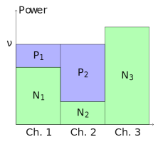

!!! Abstract "Proof"

    The information capacity

    $$
    C = \max_{f(x_1, \cdots, x_k)} I(X_1, X_2, \cdots, X_k; Y_1, Y_2, \cdots Y_k).
    $$

    $$
    \begin{aligned}
    I\left(X_{1}, \ldots, X_{k}; Y_{1}, \ldots, Y_{k}\right)
    &= h\left(Y_{1}, \ldots, Y_{k}\right)-h\left(Z_{1}, \ldots, Z_{k}\right) \\
    &= h\left(Y_{1}, \ldots, Y_{k}\right)-\sum h\left(Z_{i}\right) \\
    &\le \sum h\left(Y_{i}\right)-h\left(Z_{i}\right) \\
    &\le \sum \frac{1}{2} \log \left(1+\frac{P_{i}}{N_{i}}\right),
    \end{aligned}
    $$

    where $P_i = \operatorname{E}X_i^2$, $\sum P_i = P$, with equality when $(X_1, X_2, \cdots, X_k) \sim N\left(\boldsymbol{0}, \left[\begin{smallmatrix}
    P_1 & & & \\ & P_2 & & \\ & & \ddots & \\ & & & P_k
    \end{smallmatrix}\right]\right)$.

    With constraint on $P_i$ that $\sum P_i = P$, allot those powers to maximize capacity, using Lagrange multipliers

    $$
    J(P_1, P_2, \cdots, P_k) = \sum_{i=1}^k\frac{1}{2}\log\left(1+\frac{P_{i}}{N_{i}}\right) + \lambda \sum_{i=1}^k P_i,
    $$

    and with the additional nonnegative constraint $P_i \ge 0$, results in

    $$
    P_i = \max(0, \nu - N_i),
    $$

    where $\nu$ is chosen so that $\sum P_i = P$.

## Ch. 10: Rate distortion theory

A source produces a sequence $X_1, X_2, \cdots, X_n$ i.i.d. $\sim p(x)$, $x \in \mathcal{X}$. The encoder describes each $X^n$ by an index $f_n(X^n) \in \{1, 2, \cdots, 2^{nR}\}$. The decoder estimates $X^n$ by $\hat{X}^n \in \hat{\mathcal{X}}$.

A **distortion function/measure** is a measure of the cost (nonnegative) representing symbol $x$ by symbol $\hat{x}$:

$$
d: \mathcal{X} \times \hat{\mathcal{X}} \mapsto \mathbb{R}^+.
$$

It is said to be bounded if $\displaystyle d_{\max} = \max_{\mathcal{X} \times \hat{\mathcal{X}}} d < \infty$.

**Hamming distortion**:

$$
d(x, \hat{x}) = I(x \neq \hat{x}),
$$

thus $\operatorname{E}d = \Pr\{X \neq \hat{X}\}$.

**Squared-error distortion**:

$$
d(x, \hat{x}) = (x - \hat{x})^2.
$$

**Distortion between sequences**:

$$
d(x^n, \hat{x}^n) = \frac{1}{n}\sum d(x_i, \hat{x}_i).
$$

A **$(2^{nR}, n)$-rate distortion code** consists of

* encoding function $f_n: \mathcal{X}^n \mapsto \{1, 2, \cdots, 2^{nR}\}$,
* decoding function $g_n: \{1, 2, \cdots, 2^{nR}\} \mapsto \hat{\mathcal{X}}^n$.

The distortion is

$$
D = \operatorname{E}d(X^n, g_nf_n(X^n)) = \sum_{x^n}p(x^n)d(X^n, g_nf_n(X^n)).
$$

$g_n(1) = \hat{X}_n(1), g_n(2) = \hat{X}_n(2), \cdots$ constitute the codebook, and $f_n^{-1}(1), f_n^{-1}(2)$ constitute the assignment region.

A rate distortion pair is **achievable** if there exists a sequence of $(2^{nR}, n)$-rate distortion codes $(f_n, g_n)$, with $\displaystyle \lim_{n\rightarrow \infty}\operatorname{E}d \le D$.

The **rate distortion region** is the closure of the achievable $(R, D)$.

The **rate distortion function** $R(D)$ is the infimum of $R$ such that $(R, D)$ is in the rate distortion region given $D$.

The **distortion rate function** $D(R)$ is the infimum of $D$ such that $(R, D)$ is in the rate distortion region given $R$.

The information rate distortion function $R^{(I)}(D)$ is

$$
R^{(I)}(D) = \min_{p(\hat{x}|x):\ \sum\limits_{(x, \hat{x})}p(x)p(\hat{x}|x)d(x,\hat{x}) \le D } I(X; \hat{X}),
$$

that is the minimum $I$ over all $p(\hat{x}|x)$, for which the distortion expected on the joint distribution satisfies constraint.

For an i.i.d. source $X$ and a bounded distortion,

$$
R(D) = R^{(I)}(D),
$$

and it is the minimum achievable rate at distortion $D$.

!!! Note "Example"

    The rate distortion function for $\operatorname{Bernoulli}(p)$ with Hamming distortion

    $$
    R(D) = \begin{cases}
    H(p) - H(D), & 0 \le D \le \min(p, 1-p), \\
    0, & D \ge \min(p, 1-p).
    \end{cases}
    $$

    Proof: Assume $p < \frac{1}{2}$,

    $$
    \begin{aligned}
    I(X; \hat{X})
    &= H(X) - H(X\mid\hat{X}) \\
    &= H(p) - H(X\oplus\hat{X}\mid\hat{X}) \\
    &\ge H(p) - H(X\oplus\hat{X}) \\
    &\ge H(p) - H(D),
    \end{aligned}
    $$

    since $\Pr(X\neq\hat{X}) = \Pr(X\oplus\hat{X} = 1) \le D$, and $H(D)$ decreases on $D \le \frac{1}{2}$.

    Next we prove $H(p) - H(D)$ is achievable. For the decoding shown in the graph, $r(1-D) + (1-r)D = p$, therefore $r = \frac{p-D}{1-2D}$.

    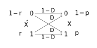{style="transform: scale(1.4);"}

    * If $D \le p \le \frac{1}{2}$, $\Pr(\hat{X} = 1) \ge 0$, $\Pr(\hat{X} = 0) \ge 0$, and $I(X; \hat{X}) = H(p) - H(D)$ is reached.
    * If $D \ge p$, $R(D) = 0$ when $\Pr(\hat{X} = 0) = 1$.
    * If $D \ge 1 - p$, $R(D) = 0$ when $\Pr(\hat{X} = 1)$.

!!! Note "Example"

    The rate distortion function for a $N(0, \sigma^2)$ source with squared error distortion is

    $$
    R(D) = \begin{cases}
    \displaystyle \frac{1}{2}\log\frac{\sigma^2}{D}, & 0 \le D \le \sigma^2, \\
    0, & D > \sigma^2.
    \end{cases}
    $$

    Proof:

    $$
    R(D) = \min_{f(\hat{x}|x):\ \operatorname{E}(\hat{x}-x)^2\le D} I(X; Y)
    $$

    $$
    \begin{aligned}
    I(X; \hat{X})
    &= h(X) - h(X\mid \hat{X}) \\
    &= h(X) - h(X - \hat{X} \mid \hat{X}) \\
    &\ge h(X) - h(X - \hat{X}) \\
    {\footnotesize (\operatorname{E}(X - \hat{X})^2 \le D)}&\ge h(X) - h(N(0, \operatorname{E}(X - \hat{X})^2)) \\
    &= h(X) - \frac{1}{2}\log (2\pi\mathrm{e})\operatorname{E}(X - \hat{X})^2 \\
    &\ge \frac{1}{2}\log 2\pi\mathrm{e}\sigma^2 - \frac{1}{2}\log 2\pi\mathrm{e}D \\
    &= \frac{1}{2}\log\frac{\sigma^2}{D}.
    \end{aligned}
    $$

    To achieve this lower bound, construct test channel $f(\hat{x}|x)$,

    $$
    X = \hat{X} + Z,
    $$

    where $\hat{X}\sim N(0, \sigma^2 - D)$ and $Z \sim N(0, D)$ independently. Note that $N(\mu_1, \sigma_1^2) + N(\mu_2, \sigma_2^2) = N(\mu_1 + \mu_2, \sigma_1^2 + \sigma_2^2)$. In this scenario, $I(X; \hat{X}) = \frac{1}{2}\log\frac{\sigma^2}{D}$.

    If $D > \sigma^2$, choose $\Pr(\hat{X} = 0) = 1$, thus $R(D) = 0$.

    The distortion rate function $D(R) = \sigma^2 2^{-2R}$.

**Parallel Gaussian sources** of independent Gaussian random variables

$$
X_i \sim N(0, \sigma_i^2), \quad i = 1, 2, \cdots, m.
$$

$$
\begin{aligned}
R(D)
&= \min_{f(\hat{x}^m | x^m):\ \operatorname{E}d(\hat{X}^m | X^m) \le D} I(X^m; \hat{X}^m) \\
&= \sum_{i=1}^m \frac{1}{2}\log\frac{\sigma_i^2}{D_i},
\end{aligned}
$$

where $D_i = \min(\lambda, \sigma_i^2)$, and $\lambda$ is chosen so that $\sum D_i = D$. This is similar to a reverse water-filling, choosing a constant $\lambda$ and only describe random variables with variance less than $\lambda$.

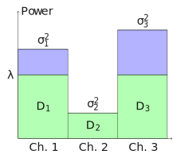

$R(D)$ is a convex function of $D$ and it is nonincreasing.

For any source drawn i.i.d. from $p(x)$ with distortion $d(x, \hat{x})$ and any $(2^{nR}, n)$ rate distortion code, as long as $f_n$ takes on at most $2^{nR}$ values and the distortion is less than $D$, the rate is bound to satisfy $R \ge R(D)$.

A pair of sequences $(x^n, \hat{x}^n)$ is said to be **distortion $\epsilon$-typical** if

$$
\begin{aligned}
\left|-\frac{1}{n}\log p(x^n) - H(X) \right| < \epsilon, \\
\left|-\frac{1}{n}\log p(\hat{x}^n) - H(\hat{X}) \right| < \epsilon, \\
\left|-\frac{1}{n}\log p(x^n, \hat{x}^n) - H(X, \hat{X}) \right| < \epsilon, \\
\left|d(x^n, \hat{x}^n) - \operatorname{E}d(X, \hat{X})\right| < \epsilon.
\end{aligned}
$$

The set of distortion typical sequences is called **distortion typical set** $A_{d, \epsilon}^{(n)}$.

For $(X_i, \hat{X}_i)$ drawn i.i.d. $\sim p(x, \hat{x})$, $\Pr(A_{d, \epsilon}^{(n)}) \rightarrow 1$ as $n \rightarrow \infty$.

For $(x^n, \hat{x}^n)\in A_{d, \epsilon}^{(n)}$, $p(\hat{x}^n) \ge p(\hat{x}^n|x^n)2^{-n(I(X; \hat{X})+3\epsilon)}$.

!!! Abstract "Proof"

    $$
    \begin{aligned}
    p(\hat{x}^n|x^n)
    &= \frac{p(x^n, \hat{x}^n)}{p(x^n)} \\
    &= p(\hat{x}^n)\frac{p(x^n, \hat{x}^n)}{p(x^n)p(\hat{x}^n)} \\
    &\le p(\hat{x}^n) \frac{2^{-n(H(X, \hat{X}) - \epsilon)}}{2^{-n(H(X) + \epsilon)}2^{-n(H(\hat{X}) + \epsilon)}} \\
    &= p(\hat{x}^n) 2^{n(I(X;\hat{X})+3\epsilon)}.
    \end{aligned}
    $$

## Ch. 11: Information theory and statistics

The **type** of a sequence $x^n$ is an empirical probability distribution,

$$
P_{x^n}(x) = \frac{N(x \text{ in } x^n)}{n}.
$$

The **probability simplex** in $\mathbb{R}^m$ is an $(m-1)$-dim manifold,

$$
\left\{x^m \in \mathbb{R}^m: x_i \ge 0, \sum x_i = 1\right\}.
$$

$\mathcal{P}_n$ denotes the set of types with denominator $n$.

The **type class** $T(P) = \{x^n \in \mathcal{X}^n: P_{x^n} = P \in \mathcal{P}_n\}$ is the set of sequence of length $n$ and type $P$.

!!! Note "Example"

    $\mathcal{X} = \{1, 2, 3\}$, $x^n = 11321$.

    The type $P_{x^n}$: $P_{x^n}(1) = \dfrac{3}{5}$, $P_{x^n}(2) = \dfrac{1}{5}$, $P_{x^n}(3) = \dfrac{1}{5}$.

    The type class $T(P_{x^n}) = \{11123, 11132, \cdots \}$.

    $|T(P_{x^n})| = \dfrac{5!}{3!} = 20$.

!!! Note "Example"

    $\mathcal{X} = \{0, 1\}$.

    $\displaystyle \mathcal{P}_n = \left\{(P(0), P(1)): \left(\frac{0}{n}, \frac{n}{n}\right), \left(\frac{1}{n}, \frac{n-1}{n}\right), \cdots, \left(\frac{n}{n}, \frac{0}{n}\right)\right\}$

$$
|\mathcal{P}_n| \le (n+1)^{|\mathcal{X}|},
$$

where the right hand side of the inequality is the scenario where the items in the tuple $(P(a_1), P(a_2), \cdots, P(a_{|\mathcal{X}|}))$ each takes $n+1$ values.

If $X_1, X_2, \cdots, X_n$ are drawn i.i.d. from $Q(x)$,

$$
Q(x^n) = 2^{-n(H(P_{x^n}) + D(P_{x^n} \| Q))}
$$

!!! Abstract "Proof"

    $$
    \begin{aligned}
    Q(x^n)
    &= \prod_{a\in\mathcal{X}}Q(a)^{N(a\text{ in }x^n)} \\
    &= \prod_{a\in\mathcal{X}}Q(a)^{nP_{x^n}(a)} \\
    &= \prod_{a\in\mathcal{X}}2^{nP_{x^n}(a)\log Q(a)} \\
    &= 2^{n(-H(P_{x^n}) + D(P_{x^n} || Q))}
    \end{aligned}
    $$

If $x^n \in T(Q)$, $P_{x^n} = Q \Rightarrow Q^n(x^n) = 2^{-nH(Q)}$.

**Size of type class**: for any $P \in \mathcal{P}_n$, $T(P) = \dbinom{n}{nP(a_1), \cdots, nP(a_{|\mathcal{X}|})} = \dfrac{n!}{(nP(a_1))!\cdots(nP(a_{|\mathcal{X}|}))!}$, its bound

$$
\frac{1}{(n+1)^{|\mathcal{X}|}}2^{nH(P)} \le |T(P)| \le 2^{nH(P)}.
$$

If the alphabet is binary, the type is defined by number of 1's in the sequence, $|T(P)| = \dbinom{n}{k, n-k} = \dbinom{n}{k}$, $P_{x^n} = \left(\dfrac{n-k}{n}, \dfrac{k}{n}\right)$. In this case, a stronger bound for $|T(P)|$ is

$$
\frac{1}{n+1}2^{nH\left(\frac{k}{n}\right)} \le \binom{n}{k} \le 2^{nH\left(\frac{k}{n}\right)},
$$

that is, set $|\mathcal{X}|$ to 1.

**Stirling's approximation**: for all $n \ge 1$,

$$
\sqrt{2\pi n}\left(\frac{n}{\mathrm{e}}\right)^n < \sqrt{2\pi n}\left(\frac{n}{\mathrm{e}}\right)^n \mathrm{e}^{\frac{1}{12n + 1}} < n! < \sqrt{2\pi n}\left(\frac{n}{\mathrm{e}}\right)^n \mathrm{e}^{\frac{1}{12n}}.
$$

**Probability of type class**: for $P \in \mathcal{P}_n$:

$$
\frac{1}{(n+1)^{|\mathcal{X}|}}2^{-nD(P||Q)} \le Q^n(T(P)) \le 2^{-nD(P||Q)}.
$$

Given distribution $Q$, the **typical set** is

$$
T_Q^\epsilon = \{x^n: D(P_{x^n} \| Q) \le \epsilon \}.
$$

$$
\Pr(D(P_{x^n} \| Q) \ge \epsilon) \le 2^{-n\left(\epsilon - |\mathcal{X}|\frac{\log(n+1)}{n}\right)}.
$$

The **strongly typical set** $A^{*(n)}_\epsilon$ is the set of sequences in $\mathcal{X}^n$ for which the sample frequencies are close to true values:

$$
A^{*(n)}_\epsilon =
\left\{ x^n \in \mathcal{X}^n:
\begin{aligned}
&\left| \frac{1}{n}N(a \text{ in } x^n) - P(a) \right| < \frac{\epsilon}{|\mathcal{X}|}, & P(a) > 0 \\
&N(a \text{ in } x^n) = 0, & P(a) = 0
\end{aligned}
\right\}
$$

A **fixed-rate block code** of rate $R$ for source $X_i$ of unknown distribution $Q$, has

* encoder $f_n: \mathcal{X}^n \mapsto \{1, 2, \cdots, 2^{nR}\}$,
* decoder $\phi_n: \{1, 2, \cdots, 2^{nR}\} \mapsto \mathcal{X}^n$.

Its probability of error

$$
P_e^{(n)} = Q^n(X^n: \phi_n f_n(X^n) \neq X^n)
$$

A rate $R$ block code is called **universal** if $f_n$ and $\phi_n$ do not depend on $Q$, and if $P_e^{(n)} \rightarrow 0$ as $n \rightarrow 0$ if $R > H(Q)$.

**Universal source coding**: for any distribution $Q$ with $H(Q) < R$, let $R_n = R - |\mathcal{X}|\frac{\log(n+1)}{n}$, $A = \{x^n\in \mathcal{X}^n: H(P_{x^n}) \le R_n\}$, then $|A| \le 2^{nR}$. Encode and decode codewords/messages in $A$ only, then

$$
P_e^{(n)} = 1 - Q^n(A) \le (n+1)^{|\mathcal{X}|}2^{-n\min\limits_{P: H(P) > R_n}D(P\|Q)}.
$$

Since $R_n \rightarrow R$ as $n \rightarrow \infty$, and $H(Q) < R$ thus $R_n > H(Q)$ for $n$ sufficiently large.

**Sanov's theorem**: $X_1, X_2, \cdots, X_n$ i.i.d. drawn $\sim Q(x)$, $E\subseteq \mathcal{P}$ is a set of probability distributions,

$$
Q^n(E) = Q^n(E \cap P_n) \le (n+1)^{|\mathcal{X}|}2^{-nD(P^*\|Q)},
$$

where $P^* = \argmin\limits_{P\in E} D(P \| Q)$. If $E$ is the closure of its interior,

$$
Q^n(E) \rightarrow 2^{-nD(P^*\|Q)}.
$$

!!! Note "Example: Dice"

    Toss a die $n$ times, derive the probability of the average points $\ge 4$.

    $$
    \sum_{i=1}^6 iP(i) \ge 4,
    $$

    $$
    P^*(x) = \frac{2^{\lambda x}}{\sum\limits_{i=1}^6 2^{\lambda i}}.
    $$

!!! Note "Example: Coin"

    Toss a coin $n$ times, derive the probability of resulting in more than 7 heads.

    $$
    P(\bar{X}_n \ge 0.7) \approx 2^{-nD(P^*\|Q)},
    $$

    $P^* = (0.7, 0.3)$, $Q = (0.5, 0.5)$.

For a closed convex set $E\subset \mathcal{P}$ and distribution $Q \not\in E$, if $D(P^*\| Q) = \min\limits_{P \in E} D(P \| Q)$,

$$
D(P \| Q) \ge D(P \| P^*) + D(P^* \| Q), \quad P \in E.
$$

Suppose $P_n \in E$ yields $D(P_n \| Q) \rightarrow D(P^* \| Q)$ then $D(P_n \| P) \rightarrow 0$.

$L_i$ **distance** between two distributions

$$
\|P_1 - P_2\|_1 = \sum_{a\in\mathcal{X}} |P_1(a) - P_2(a)|.
$$

$D(P_1 \| P_2) \ge \dfrac{1}{2\ln 2}\|P_1 - P_2\|_1^2$.

**Conditional limit theorem**: by definitions above,

$$
\Pr(X_1 = a \mid P_{x^n} \in E)\rightarrow P^*(a) \quad \text{in probability, as } n\rightarrow \infty.
$$

!!! Note "Sanov's th. and conditional limit th."

    Sanov's th.: probability of $E$ is essentially the same as that of the closest type $P^*$ in $E$ to $Q$.

    Conditional limit th.: and other types far away from $P^*$ is negligible.

**Hypothesis testing**: $X_1, X_2, \cdots, X_n$ i.i.d. drawn $\sim Q(x)$.

* Hypotheses:
    * $H_1: Q = P_1$,
    * $H_2: Q = P_2$.
* The decision function $g(X_1, X_2, \cdots, X_n) = i \in \{1, 2\}$ indicates which hypothesis is accepted.

$A = \{x^n\in \mathcal{X}^n: g(x^n) = 1\}$, the two probabilities of error:

$$
\alpha = \Pr(g(X^n) = 2 \mid H_1) = P_1^n(A^C),
$$

$$
\beta = \Pr(g(X^n) = 1 \mid H_2) = P_2^n(A).
$$

**Neyman-Pearson lemma**: for $T\ge 0$, decision region

$$
A_n(T) = \left\{x^n: \frac{P_1(x^n)}{P_2(x^n)} > T \right\}
$$

has corresponding probability of error $\alpha^*$ and $\beta^*$, and $B_n$ be any other decision region with associated $\alpha$ and $\beta$. If $\alpha \le \alpha^*$, $\beta \ge \beta^*$.

Therefore, the optimum test for two hypotheses is of the form

$$
\frac{P_1(x^n)}{P_2(x^n)} > T,
$$

where the left hand side is called the likelihood ratio.

**AEP for relative entropy**: $X^n$ i.i.d. drawn from $P_1$ and $P_2$ is any other distribution,

$$
\frac{1}{n}\log \frac{P_1(x^n)}{P_2(x^n)} \rightarrow D(P_1 \| P_2) \quad \text{in probability}.
$$

A **relative entropy typical set** $A_\epsilon^{(n)}(P_1 \| P_2)$ consists of $x^n \in \mathcal{X}^n$ such that

$$
D(P_1 \| P_2) - \epsilon \le \frac{1}{n}\log \frac{P_1(x^n)}{P_2(x^n)} \le D(P_1 \| P_2) + \epsilon.
$$

* $P_1(x^n)2^{-n(D(P_1\|P_2) + \epsilon)} \le P_2(x^n) \le P_1(x^n)2^{-n(D(P_1\|P_2) - \epsilon)}$, for all $x^n \in A_\epsilon^{(n)}(P_1 \| P_2)$.
* $P_1(A_\epsilon^{(n)}(P_1 \| P_2)) > 1 - \epsilon$, for $n$ sufficiently large.
* $P_2(A_\epsilon^{(n)}(P_1 \| P_2)) < 2^{-n(D(P_1\|P_2) - \epsilon)}$.
* $P_2(A_\epsilon^{(n)}(P_1 \| P_2)) > (1 - \epsilon)2^{-n(D(P_1\|P_2) + \epsilon)}$, for $n$ sufficiently large.

**Chernoff-Stein lemma**: let $X^n$ be i.i.d. $\sim Q$, hypotheses $Q = P_1$ and $Q = P_2$, where $D(P_1 \| P_2) < \infty$. Let $A_n \subseteq \mathcal{X}^n$ be an acceptance region for $H_1$. For $0 < \epsilon < 1/2$, define $\beta_n^\epsilon = \min\limits_{A_n \subseteq \mathcal{X}^n,\ \alpha_n \le \epsilon} \beta_n$, then

$$
\lim_{n\rightarrow \infty} \frac{1}{n}\log \beta_n^\epsilon = -D(P_1 \| P_2).
$$

An estimator for $\theta$ for sample size $n$ is a function $T: \mathcal{X}^n \mapsto \varTheta$. Denote true distribution of $X$ by $f(x; \theta)$.

* The bias is $\operatornamewithlimits{E}\limits_{f(\cdot; \theta)}(T(X^n) - \theta)$. The estimator is **unbiased** if bias is zero for all $\theta$.
* The estimator is **consistent** in probability if $T(X^n) \rightarrow \theta$ as $n \rightarrow \infty$.
* $T_1$ **dominates** $T_2$ if $\operatorname{E}(T_1(X^n) - \theta)^2 \le \operatorname{E}(T_2(X^n) - \theta)^2$.

The **score/informant**

$$
V = \frac{\partial}{\partial \theta}\ln f(X; \theta) = \frac{\dfrac{\partial}{\partial \theta} f(X; \theta)}{f(X; \theta)}.
$$

$\operatorname{E}V = 0$, and $\operatorname{E}V^2 = \operatorname{Var}(V)$.

The **Fisher information**

$$
J(\theta) = \operatorname{E}_\theta V^2 = \operatorname{E}_\theta\left[\frac{\partial}{\partial \theta}\ln f(X; \theta)\right]^2.
$$

If $X_1, X_2, \cdots, X_n$ are i.i.d. drawn from $f(x; \theta)$,

$$
V(X^n) = \sum_{i=1}^n V(X_i), \quad J_n(\theta) = nJ(\theta).
$$

**Cramer-Rao inequality**: the mean-squared error of any unbiased estimator $T$ of parameter $\theta$ satisfies

$$
\operatorname{Var}(T) \ge \frac{1}{J(\theta)}.
$$

An unbiased estimator $T$ is said to be **efficient** if $\operatorname{Var}(T) = \dfrac{1}{J(\theta)}$.

!!! Note "Example"

    Let $X_1, X_2, \cdots, X_n$ be i.i.d. $\sim N(\theta, \sigma^2)$, $\sigma^2$ known.

    The score

    $$
    \begin{aligned}
    V
    &= \frac{\partial}{\partial \theta}\ln N(x; \theta, \sigma^2) \\
    &= \frac{\partial}{\partial \theta}\ln \left( \frac{1}{\sigma\sqrt{2\pi\mathrm{e}}}\mathrm{e}^{-\frac{1}{2}\left(\frac{x - \theta}{\sigma}\right)^2}\right) \\
    &= \frac{x - \theta}{\sigma^2}.
    \end{aligned}
    $$

    Fisher information

    $$
    \begin{aligned}
    J(\theta)
    &= \operatorname{E}V^2 \\
    &= \frac{1}{\sigma^4}\left(\operatorname{E}X^2 - 2\operatorname{E}(\theta X) + \operatorname{E}\theta^2 \right) \\
    &= \frac{1}{\sigma^2}.
    \end{aligned}
    $$

    $$
    J_n(\theta) = nJ(\theta) = \dfrac{n}{\theta^2}.
    $$

    One estimator for $\theta$ is $T = \sum\limits_{i=1}^n X_i$.

    $$
    \begin{aligned}
    \operatorname{Var}(T)
    &= \operatorname{E}\left(\bar{X}_n\right)^2 - \left(\operatorname{E}\bar{X}_n\right)^2 \\
    &= \frac{1}{n^2}\operatorname{E}\textstyle\sum X_i - \theta^2 \\
    &= \frac{1}{n^2}\left(\operatorname{Var}(\textstyle\sum X_i) + \left(\operatorname{E}\textstyle\sum X\right)^2\right) - \theta^2 \\
    &= \frac{n\sigma^2 + (n\theta)^2}{n^2} - \theta^2 \\
    &= \frac{\sigma^2}{n}.
    \end{aligned}
    $$

    Therefore, $\operatorname{Var}(T) = \dfrac{1}{J_n(\theta)}$, $T$ is the minimum variance unbiased (efficient) estimator of $\theta$.

    !!! Info ""

        Note that $\operatorname{E}X^2 = \operatorname{Var}(X) + (\operatorname{E}X)^2$, and for $X \sim N(\mu, \sigma^2)$, $\operatorname{E}X^2 = \mu^2 + \sigma^2$.
