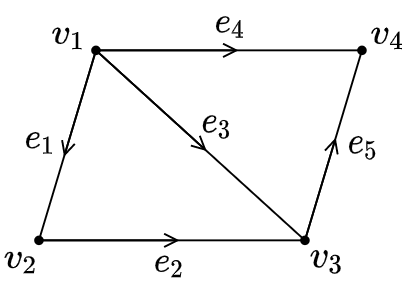
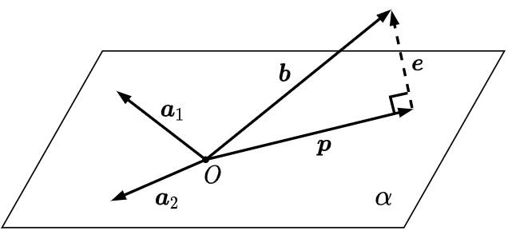

# Linear Algebra

[^strang1999]: [18.06 Linear Algebra Video Lectures of Prof. Gilbert Strang in Fall 1999 - MIT OpenCourseWare](https://ocw.mit.edu/courses/mathematics/18-06-linear-algebra-spring-2010/video-lectures/){: target=_blank}

[^resourses]: [Resource Index of 18.06 Linear Algebra - MIT OpenCourseWare](https://ocw.mit.edu/courses/mathematics/18-06sc-linear-algebra-fall-2011/resource-index/){: target=_blank}

## 矩阵与行列式

### Basics

$$
\left(A^\top\right)^{-1} = \left(A^{-1}\right)^\top
$$

$$
(AB)^{-1} = B^{-1}A^{-1}
$$

$$
(AB)^\top = B^\top A^\top
$$

$$
\det A = \prod_i \lambda_i
$$

$$
\det AB = \det A\cdot \det B
$$

$$
\operatorname{Tr}(A) = \sum_i \lambda_i
$$

$$
\operatorname{Tr}(AB) = \operatorname{Tr}(BA)
$$

$$
\operatorname{Tr}(ABC) = \operatorname{Tr}(BCA) =  \operatorname{Tr}(CAB)
$$

$$
A_{2\times 2}^{-1} =
\begin{bmatrix}
a & b\\
c & d
\end{bmatrix}^{-1} =
\frac{1}{\det(A)}
\begin{bmatrix}
d & -b\\
-c & a
\end{bmatrix}
$$

### Derivatives

设 $a$ 为标量，$\boldsymbol{b}$ 与 $\boldsymbol{x}$ 均为列向量，$A$ 为矩阵，且维数使得运算合法，则

$f(\boldsymbol{x})$ | $\partial f/\partial\boldsymbol{x}$
:---|:---
$a\boldsymbol{x}$ | $a$
$\boldsymbol{b}^\top\boldsymbol{x}$ | $\boldsymbol{b}$
$\boldsymbol{x}^\top\boldsymbol{b}$ | $\boldsymbol{b}^\top$
$\boldsymbol{x}^\top\boldsymbol{x}$ | $2\boldsymbol{x}$
$\boldsymbol{x}\boldsymbol{x}^\top$ | $2\boldsymbol{x}^\top$
$\boldsymbol{b}^\top A\boldsymbol{x}$ | $A^\top\boldsymbol{b}$
$\boldsymbol{x}^\top A\boldsymbol{b}$ | $\boldsymbol{b}^\top A$
$\boldsymbol{x}^\top A\boldsymbol{x}$ | $\left(A+A^\top\right)\boldsymbol{x}$
$\exp\left(-\frac{1}{2}\boldsymbol{x}^\top A\boldsymbol{x}\right)$ | $-\exp\left(-\frac{1}{2}\boldsymbol{x}^\top A\boldsymbol{x}\right)A\boldsymbol{x}$
$\|\boldsymbol{x}\|_2^2$ | $2\boldsymbol{x}$

### 矩阵乘法的计算

$M_{m\times n}$ 代表矩阵 $M$ 有 $m$ 行、$n$ 列. 设 $A_{m\times n}B_{n\times p}=C_{m\times p}$：

#### 点积

$$
c_{ij} = \sum_k a_{ik}b_{kj} = A_{i,:}\cdot B_{:,j}.
$$

即 $C$ 中第 $i$ 行，第 $j$ 列的元素恰好是 $A$ 的第 $i$ 行与 $B$ 的第 $j$ 列之内积.

#### 矩阵乘以列向量

$C$ 的第 $j$ 列是 $A$ 各列的线性组合，其系数为 $B$ 的第 $j$ 列. 这一列与 $B$ 的其它列无关. 这样看来，$C$ 的每一列都是 $A$ 与 $B$ 中对应列的乘积.

#### 行向量乘以矩阵

$C$ 的第 $i$ 行是 $B$ 各行的线性组合，其系数为 $A$ 的第 $i$ 行. 这一行与 $A$ 的其它行无关. 这样看来，$C$ 的每一行都是 $A$ 中对应行与 $B$ 的乘积.

换一种说法，左乘一个矩阵相当于对右矩阵的各行进行线性组合. 积矩阵和左矩阵的行数相同，且积矩阵中每一行都是左矩阵中对应位置的行中各元素作为系数，将右矩阵每一行组合相加得到的结果，即左矩阵对应行与右矩阵的乘积. 相应地，右乘对应的是列变换.

$$
\begin{bmatrix}
\\
-----\\
\\
\end{bmatrix}
\begin{bmatrix}
---\\
---\\
---\\
---\\
---\\
\end{bmatrix}
=
\begin{bmatrix}
\\
---\\
\\
\end{bmatrix}
$$

#### 列向量乘以行向量

将 $A$ 中各列和 $B$ 中各行对应相乘，得到的矩阵全部相加即得 $C$. 值得一提的是，列向量乘以行向量得到的矩阵中，每一列都是列向量的倍数，每一行都是行向量的倍数.

### 关于行列式的变换

* 交换两行/列，行列式变号；
* 用 $k$ 乘以某行/列，行列式的值亦变为其 $k$ 倍；
* 将某行/列视为两数之和，则行列式可根据该行/列拆分：

$$
\begin{vmatrix}
a + a' & b + b' \\
c & d
\end{vmatrix}
=
\begin{vmatrix}
a & b \\
c & d
\end{vmatrix}
+
\begin{vmatrix}
a' & b' \\
c & d
\end{vmatrix};
$$

* 某行/列的 $k$ 倍加至另一行/列，行列式的值不变.

### 逆矩阵

#### 不可逆的方阵

* 行列式为零.

* 存在某些行或列线性相关.

方阵左乘或右乘某矩阵，一定得到其行或列的线性组合所组成的矩阵. 这些列不可能通过线性组合得到一组完整的单位正交基. 以二阶矩阵为例，所得积矩阵各列一定均与原矩阵的列成比例.

* 存在某非零向量 $\boldsymbol{x}$ 满足 $A\boldsymbol{x} = \boldsymbol{0}$.

若 $A$ 的逆存在，则 $A^{-1}A\boldsymbol{x} = A^{-1}\boldsymbol{0}$ 将意味着 $\boldsymbol{x}=\boldsymbol{0}$，矛盾.

#### Gauss-Jordan 法求逆

$$
\big[A ~~ I\big] \xRightarrow{\mathrm{r}} \big[I ~~ A^{-1}\big]
$$

本质是求解 $n$ 个 $n$ 元线性方程组，其中第 $k$ 个方程组的常数项向量是 $I$ 的第 $k$ 列，将得到的解向量依次排列即得到逆. 如第一个方程组是 $A\boldsymbol{x}_1=\big[1, 0, 0, \cdots\big]^\top$. 将这些方程组直接合成一个矩阵，进行 Gauss-Jordan 消元就成为了上面的式子所表示的过程.

宏观地来看，G-J 消元所使用的是初等行变换，相当于左乘一个矩阵. 左乘某矩阵使得 $A$ 变为 $I$，那么该矩阵就是 $A^{-1}$，它左乘 $I$ 得到自身. 这一步即右矩阵的每一列决定了左矩阵各列的线性组合，并得到积矩阵中对应位置的列.

#### 初等变换矩阵的逆

对于将某一行/列乘以 $k$ 倍，加至另一行/列的情况，对应的矩阵的形式为单位矩阵中的某一个零换为 $k$. 如矩阵

$$
\begin{bmatrix}
1 & 0 & 0 \\
2 & 1 & 0 \\
0 & 0 & 1
\end{bmatrix}
$$

代表的是将第一行的 2 倍加至第二行，或第二列的 2 倍加至第一列. 按照这个思想，它的逆就是将 2 反号.

对于交换行/列的情况，这样的矩阵形式为相应地重新排列单位矩阵的行/列所得结果，称为置换矩阵. 置换矩阵的逆是它的转置（正交矩阵），并且任意同阶的所有置换矩阵，在乘法上具有封闭性，且构成一个乘法群.

### LU 分解

$$
A = LU
$$

对可逆矩阵 $A$ 进行 Gauss 消元，可以得到上三角矩阵 $U$，消元的过程相当于将一系列初等行变换矩阵左乘至 $A$，将它们作为整体求逆即得到下三角矩阵 $L$.

若消元中会出现主元为零的情况，则需要进行行交换，此时 LU 分解的形式变为 $PA=LU$.

## 向量空间与线性方程组

### 初等变换

初等行变换有以下三种操作：

* 非零实数 $k$ 乘至某行；
* 某行 $k$ 倍加至另一行；
* 互换两行.

初等列变换同理.

初等行变换相当于左乘一个满秩矩阵，初等列变化相当于右乘一个满秩矩阵.

初等变换得到的矩阵和原矩阵等价. $A$ 与 $B$ 等价记作 $A\sim B$. 初等变换不会改变秩.

### 列空间

矩阵 $A$ 的各列所张成的空间称为其列空间 $C(A)$. 线性方程组有解的充要条件就是常数项向量属于系数矩阵的列空间. 相同地可以定义行空间 $C(A^\top)$.

列空间和行空间的维数均等于矩阵的秩.

列初等变换不会改变列空间，行初等变换不会改变行空间.

### 零空间 | Null Space

线性方程组 $A\boldsymbol{x} = \boldsymbol{0}$ 的所有解所组成的空间为矩阵 $A$ 的零空间 $N(A)$. 即其中向量均由将 $A$ 所含列向量进行线性组合得到零向量的系数所组成. 这些向量显然对线性组合是封闭的，所以这是一个向量空间. 几何上来看，零空间表示的是一个经过原点的超平面. 如果上述方程组的常数项向量非零，那么解集合表示的超平面不经过原点，无法组成向量空间.

零空间的维数等于矩阵列数减去秩 $n-r$，即自由变量的数量.

$A^\top$ 的零空间即为 $A$ 的左零空间 $N(A^\top)$. 相同地，左零空间中的向量各分量作为系数，将 $A$ 各行进行线性组合，得到零向量. 求取左零空间不一定要将矩阵转置求解. 将 $A$ G-J 消元相当于左乘某初等矩阵，而得到的最简行阶梯式若含有全零行，这些行对应到左矩阵的各行即为左零空间的基.

左零空间的维数等于矩阵行数减去秩 $m-r$，即冗余方程的数量.

### 解线性方程组

对于齐次线性方程组 $A\boldsymbol{x} = \boldsymbol{0}$，首先进行 Gauss-Jordan 消元，将系数矩阵 $A$ 变换为上三角矩阵（行阶梯形矩阵，row echelon form）$U$、最简行阶梯形矩阵（reduced row echelon form，rref）$R$.

此时每次选出一个自由变量，设其值为 1，其余自由变量为 0，解出主元. 对每一个自由变量均进行这样的处理，得到的解的集合即为解空间的一组基. 这个方法经过整理后可以得到以下的矩阵方法.

$R$ 中主元所在的行列交集会正好组成一个单位矩阵. 可以通过列交换将这部分移动到矩阵左上方. 此时的系数矩阵的形式表现为

$$
R' = \begin{bmatrix}
I & F \\
0 & 0
\end{bmatrix},
$$

其中 $F$ 是由自由变量的系数组成的矩阵. 经过这样的列交换，解的各分量就按照主元和自由变量分开为 $\boldsymbol{x} = \begin{bmatrix}\boldsymbol{x}_{\mathrm{pivot}} \\ \boldsymbol{x}_{\mathrm{free}}\end{bmatrix}$ 的形式. 每次选出一个自由变量设为 1，其余为 0 的步骤可以合为一步：将 $\boldsymbol{x}_{\mathrm{free}}$ 替换为 $I$. 观察也可以得到，以上得到的每一组解中主元正好是 $F$ 中某一列反号的结果，合起来就是将 $\boldsymbol{x}_{\mathrm{pivot}}$ 替换为 $-F$. 由此得到的矩阵

$$
N' = \begin{bmatrix}
-F \\ I
\end{bmatrix}
$$

称为零空间矩阵，其各列为零空间的一组基. 容易验证，

$$
R'N' =
\begin{bmatrix}
I & F \\
0 & 0
\end{bmatrix}
\begin{bmatrix}
-F \\ I
\end{bmatrix}
= O.
$$

??? Abstract "E.g."

    解线性方程组

    $$
    \begin{bmatrix}
    1 & 2 & 2 & 2 \\
    2 & 4 & 6 & 8 \\
    3 & 6 & 8 & 10
    \end{bmatrix}
    \boldsymbol{x} = \boldsymbol{0}.
    $$

    系数矩阵

    $$
    A = \begin{bmatrix}
    1 & 2 & 2 & 2 \\
    2 & 4 & 6 & 8 \\
    3 & 6 & 8 & 10
    \end{bmatrix},
    $$

    进行 Gauss-Jordan 消元，得

    $$
    U = \begin{bmatrix}
    1 & 2 & 2 & 2 \\
    0 & 0 & 2 & 4 \\
    0 & 0 & 0 & 0
    \end{bmatrix},
    $$

    $$
    R = \begin{bmatrix}
    1 & 2 & 0 & -2 \\
    0 & 0 & 1 & 2 \\
    0 & 0 & 0 & 0
    \end{bmatrix} = \operatorname{rref}(A).
    $$

    列交换，得

    $$
    R' = \begin{bmatrix}
    1 & 0 & 2 & -2 \\
    0 & 1 & 0 & 2 \\
    0 & 0 & 0 & 0
    \end{bmatrix},~
    I = \begin{bmatrix}
    1 & 0 \\
    0 & 1
    \end{bmatrix},~
    F = \begin{bmatrix}
    2 & -2 \\
    0 & 2
    \end{bmatrix},
    $$

    列交换后的零空间矩阵

    $$
    N' = \begin{bmatrix}
    -2 & 2 \\
    0 & -2 \\
    1 & 0 \\
    0 & 1
    \end{bmatrix},
    $$

    恢复到原来的变元顺序，得

    $$
    N = \begin{bmatrix}
    -2 & 2 \\
    1 & 0 \\
    0 & -2 \\
    0 & 1
    \end{bmatrix},
    $$

    故解为

    $$
    \boldsymbol{x} = c_1
    \begin{bmatrix}
    -2 \\
    1 \\
    0 \\
    0
    \end{bmatrix} + c_2
    \begin{bmatrix}
    2 \\
    0 \\
    -2 \\
    1
    \end{bmatrix}, \quad
    c_1, c_2 \in \mathbb{R}.
    $$

对于非齐次方程组 $A\boldsymbol{x} = \boldsymbol{b}$，G-J 消元后将所有自由变量设为零，解出特解. 特解与零空间之和即为通解.

### 秩

矩阵 $A$ 的秩即为 $A$ 的行阶梯式中非全零行数.

乘以一个矩阵不可能使得结果的秩更大，

$$
R(AB) \le \min\{(R(A), R(B)\}.
$$

若 $A$ 是 $n\times n$ 的方阵，且 $B$ 是任意可以与之相乘的矩阵，则有

$$
R(AB) \ge R(A) + R(B) - n.
$$

对于两矩阵之和的秩，有

$$
|R(A) - R(B)| \le R(A+B) \le R(A) + R(B).
$$

???+ Note "Circuit in Matrix Form"

    电路拓扑结构与参考方向如图所示.

    {: width=200px}

    使用矩阵表示此结构. 矩阵第 $k$ 行表示边 $e_k$，始点序号对应的列上为 -1，终点序号对应的列上为 1，得到矩阵

    $$
    A = \begin{bmatrix}
    -1 & 1 & 0 & 0 \\
    0 & -1 & 1 & 0 \\
    -1 & 0 & 1 & 0 \\
    -1 & 0 & 0 & 1 \\
    0 & 0 & -1 & 1
    \end{bmatrix}.
    $$

    #### 电势、零空间

    设结点 $v_k$ 电势为 $u_k$，则

    $$
    A\boldsymbol{u} =
    \begin{bmatrix}
    u_2 - u_1 \\
    u_3 - u_2 \\
    u_3 - u_1 \\
    u_4 - u_1 \\
    u_4 - u_3 \\
    \end{bmatrix},
    $$

    各分量对应各边上的电势差. $A$ 的零空间为 $N(A) = \left\{\big[k~~k~~k~~k\big]^\top\right\}, k\in\mathbb{R}$，说明各边电势差为零时，各结点必然等电势.

    #### 电流、左零空间

    设 $e_k$ 上的电流为 $i_k$，则

    $$
    A\boldsymbol{i} =
    \begin{bmatrix}
    -i_1 - i_3 - i_4 \\
    i_1 - i_2 \\
    i_2 + i_3 - i_5 \\
    i_4 + i_5 \\
    \end{bmatrix}
    $$

    各分量对应各点流入的净电流. 此外，欧姆定律可表示为 $\boldsymbol{v} = R\boldsymbol{i}$，其中 $\boldsymbol{v} = A\boldsymbol{u}$ 为电势差向量，$R$ 为电阻矩阵.

    基尔霍夫（Кирхгоф，Kirchhoff）电流定律：

    $$
    A^\top\boldsymbol{i} = \boldsymbol{0}.
    $$

    $A$ 的左零空间 $N(A^\top)$ 维数为 2，这说明满足 KCL 的电流取值空间是 2 个基底的线性组合. 这也和电路中有 2 个独立回路相符合. 如使用回路 $\big\{e_1, e_2, -e_3\big\}$ 和 $\big\{e_3, e_5, -e_4\big\}$ 可表示任意合法电流取值

    $$
    \boldsymbol{i} =
    c_1\begin{bmatrix}1 \\ 1 \\ -1 \\ 0 \\ 0\end{bmatrix} +
    c_2\begin{bmatrix}0 \\ 0 \\ 1 \\ -1 \\ 1\end{bmatrix},
    \quad c_1, c_2 \in \mathbb{R}.
    $$

    #### 行、回路、线性相关

    $A$ 中某行向量组线性相关的充要条件是该向量组所表示的边包含回路. 即回路是产生线性相关性的原因.

    #### 列、秩

    显然，当 $n-1$ 个结点的出入情况确定后，最后一个点的出入情况也随之确定. 这在矩阵 $A$ 中表现为所有列之和为 $\boldsymbol{0}$，并且 $A$ 的秩比结点数少 1，即 $r = n-1$. 零空间的维数为 1，与此结果相符合.

    #### 欧拉公式

    根据之前的讨论

    $$
    \begin{aligned}
    \dim N(A^\top) &= m - r \\
    N_\mathrm{indep.\ loop} &= N_\mathrm{edge} - (N_\mathrm{node} - 1),
    \end{aligned}
    $$

    由此得到

    $$
    N_\mathrm{node} - N_\mathrm{edge} + N_\mathrm{indep.\ loop} = 1.
    $$

    这是欧拉公式的更一般的形式，且在连通非平面图上也成立. 从另一角度看，任意连通图中，考虑某生成树，任一非树边都对应一个独立回路，即 $L = E - (V - 1)$，和上面的公式是一致的.

### 线性方程组的解

#### 系数矩阵和增广矩阵的秩判据

对于 $n$ 元线性方程组 $A\boldsymbol{x} = \boldsymbol{b}$，系数矩阵为 $A$，增广矩阵为 $(A, \boldsymbol{b})$：

* $R(A) < R(A, \boldsymbol{b})$ 时，零系数得到非零和，无解（称该系统为 consistent system）；
* $R(A) = R(A, \boldsymbol{b})$ 时，$[A~|~\boldsymbol{b}]$ 与 $A$ 张成的空间相同，有解（称该系统为 inconsistent system）；
    * $R(A) = R(A, \boldsymbol{b}) = n$ 时，有唯一解；
    * $R(A) = R(A, \boldsymbol{b}) < n$ 时，有无穷多解.

另外，$A\boldsymbol{x} = \boldsymbol{0}$ 有解的充要条件是 $R(A) < n$.

#### 行秩与列秩判据

对于含有 $m$ 个方程的 $n$ 元线性方程组 $A\boldsymbol{x} = \boldsymbol{b}$，系数矩阵 $A_{m\times n}$ 的秩有以下情况：

* $r = n$（列满秩）且 $r < m$ 时，
    * $R = \begin{bmatrix}I \\ 0\end{bmatrix}$；
    * 不含自由变量；
    * 方程组有 0 或 1 组解；
    * 当行阶梯式末尾零行对应常数项为零时有唯一解 $\boldsymbol{x} = \boldsymbol{x}_{\mathrm{particular}}$，否则无解.

* $r = m$（行满秩）且 $r < n$ 时，
    * $R' = \begin{bmatrix}I ~~ F\end{bmatrix}$；
    * 含有 $n-r$ 个自由变量；
    * 解一定存在，且有无穷多组；
    * $\boldsymbol{x} = \boldsymbol{x}_{\mathrm{particular}} + \boldsymbol{x}_{\mathrm{null}}$.

* $r = m = n$（满秩）时，
    * $R = I$；
    * 解一定存在，且唯一.

* $r < m$ 且 $r < n$ 时，
    * $R' = \begin{bmatrix}I & F \\ 0 & 0\end{bmatrix}$；
    * 含有 $n-r$ 个自由变量；
    * 方程组有 0 或无穷组解.

## 正交性

### 正交空间

若两向量空间 $S$，$T$ 满足 $\forall u \in S$，$\forall v \in T$，$u\perp v$，则称 $S$ 与 $T$ 正交.

对于秩为 $r$ 的矩阵 $A_{m\times n}$，

* 其行空间 $C(A^\top)$ 与零空间 $N(A)$ 正交，且均在 $\mathbb{R}^n$ 中，两空间维数分别为 $r$ 与 $n-r$；
* 其列空间 $C(A)$ 与左零空间 $N(A^\top)$ 正交，且均在 $\mathbb{R}^m$ 中，两空间维数分别为 $r$ 与 $m-r$.

以上两组子空间正交均是互为正交补（orthogonal complement）的情况，即一向量空间包含了所在空间中所有与另一向量空间垂直的向量.

### 投影矩阵

{: width=320px}

设 $\mathbb{R}^m$ 中一向量空间（过原点的超平面）$\alpha$ 的一组基底为 $\{\boldsymbol{a}_1, \boldsymbol{a}_2,\cdots, \boldsymbol{a}_n\}$，向量 $\boldsymbol{b}$ 在 $\alpha$ 上的投影为 $\boldsymbol{p}$，差值为 $\boldsymbol{e} = \boldsymbol{b} - \boldsymbol{p}$. 下面讨论投影矩阵 $P$，该矩阵满足 $\boldsymbol{p} = P\boldsymbol{b}$.

设矩阵 $A = \big[\boldsymbol{a}_1, \boldsymbol{a}_2,\cdots, \boldsymbol{a}_n\big]$，则其列空间即为 $\alpha$. 由于投影 $\boldsymbol{p}$ 必然位于 $\alpha$ 上，故 $\boldsymbol{p}$ 可表达为 $\boldsymbol{a}$ 的线性组合

$$
\boldsymbol{p} = \sum_{i=1}^n x_i\boldsymbol{a}_i,\quad x_i\in \mathbb{R},
$$

写成矩阵的形式为

$$
\boldsymbol{p} = A\boldsymbol{x}.
$$

由投影的性质有 $\alpha\perp\boldsymbol{e}$，即 $\boldsymbol{a}_i\cdot\boldsymbol{e} = 0$，$i = 1, 2, \cdots, n$. 写成矩阵形式，得

$$
A^\top\boldsymbol{e} = \boldsymbol{0}.
$$

???+ Note

    以上方程表明 $\boldsymbol{e}$ 在 $A$ 的左零空间 $N(A^\top)$ 当中，而 $\boldsymbol{e}$ 与 $A$ 的列空间 $C(A) = \alpha$ 垂直，这也表明了左零空间和列空间的正交关系.

继续化简，有

$$
\begin{aligned}
A^\top(\boldsymbol{b}-\boldsymbol{p}) &= \boldsymbol{0} \\
A^\top(\boldsymbol{b}-A\boldsymbol{x}) &= \boldsymbol{0} \\
A^\top A\boldsymbol{x} &= A^\top\boldsymbol{b},
\end{aligned}
$$

最后得到

$$
\boldsymbol{x} = \left(A^\top A\right)^{-1}A^\top\boldsymbol{b},
$$

投影

$$
\boldsymbol{p} = A\left(A^\top A\right)^{-1}A^\top\boldsymbol{b},
$$

投影矩阵

$$
P = A\left(A^\top A\right)^{-1}A^\top.
$$

这个投影矩阵必然是对称的 ($P^\top = P$)，并且满足幂等律 ($P^2 = P$). 幂等律的几何解释是：无论将 $\boldsymbol{b}$ 向 $\alpha$ 投影多少次，得到的结果都相同.

特别地，当 $\alpha$ 为一维时，$P$ 与 $\boldsymbol{p}$ 退化为

$$
P = \frac{\boldsymbol{a}\boldsymbol{a}^\top}{\boldsymbol{a}^\top\boldsymbol{a}},
$$

$$
\boldsymbol{p} = \boldsymbol{a}~\frac{\boldsymbol{a}^\top\boldsymbol{b}}{\boldsymbol{a}^\top\boldsymbol{a}} = \frac{|\boldsymbol{b}|}{|\boldsymbol{a}|}\cos\langle\boldsymbol{a}, \boldsymbol{b}\rangle~\boldsymbol{a}.
$$

当 $A$ 为可逆矩阵时，这意味着张成 $\alpha$ 的一组基底包含 $m$ 个 $\mathbb{R}^m$ 中的向量，故 $\alpha = \mathbb{R}^m$，此时 $\boldsymbol{b}$ 必然已经在 $\alpha$ 上，投影后还在原来的位置. 相应地，投影矩阵退化为 $R = I$.

当 $\boldsymbol{b}\perp\alpha$ 时，即 $\boldsymbol{b}\perp C(A)$，故 $\boldsymbol{b}\in N(A^\top)$，此时 $\boldsymbol{p} = A\left(A^\top A\right)^{-1}\left(A^\top\boldsymbol{b}\right) = \boldsymbol{0}$.

### 最小二乘法

当线性方程组 $A\boldsymbol{x} = \boldsymbol{b}$ 无解时，$\boldsymbol{b}$ 不在 $A$ 的列空间内. 为了找到一个尽可能近似满足方程的解 $\hat{\boldsymbol{x}}$，需要在 $A$ 的列空间内找到一个与 $\boldsymbol{b}$ 最接近的向量 $\boldsymbol{p}$，将原方程变为 $A\hat{\boldsymbol{x}} = \boldsymbol{p}$.

所谓“最接近”，即为最小化 $\|A\boldsymbol{x}-\boldsymbol{b}\|$，使方程两边的向量间距最小. 根据几何性质，$\boldsymbol{p}$ 即为 $\boldsymbol{b}$ 在 $A$ 的列空间上的投影. 根据前面讨论的投影矩阵，投影后的方程为

$$
A^\top A\hat{\boldsymbol{x}} = A^\top\boldsymbol{b}.
$$

在统计学当中，这个方法正是最小二乘法. 原方程组中的每一个方程均代表一个样本点，$\boldsymbol{b}$ 中的每一个分量是样本点的因变量值，$\boldsymbol{p}$ 的每一个分量是各样本点拟合后的值，$\boldsymbol{x}$ 是拟合直线的系数向量.

当 $A$ 的各列线性无关时，$A^\top A$ 一定是可逆的. 这也是上面的方程应用的条件. 要证明这个结论，只需要证方程 $A^\top A\boldsymbol{x} = \boldsymbol{0}$ 只有零解. 方程左乘 $\boldsymbol{x}^\top$ 得 $\boldsymbol{x}^\top A^\top A\boldsymbol{x}=\boldsymbol{0}$，等价于 $A\boldsymbol{x} = \boldsymbol{0}$，从而 $\boldsymbol{x}$ 必然为零. 事实上 $A^\top A$ 和 $A$ 的零空间和秩都是相同的.

以上方法的实质是使用左逆解方程. 当左逆不存在时，可使用伪逆.

### 正交矩阵

An orthogonal matrix is a square matrix whose rows and columns are respectively mutually orthonormal.

设正交矩阵 $Q = \big[\boldsymbol{q}_1, \boldsymbol{q}_2, \cdots, \boldsymbol{q}_n\big]$，由于其各列互相正交，

$$
\boldsymbol{q}_i^\top\boldsymbol{q}_j =
\begin{cases}
0, & i \neq j,\\
1, & i = j,
\end{cases}
$$

故

$$
Q^\top Q = I.
$$

同理，由于其各行互相正交，有

$$
QQ^\top = I.
$$

综上，

$$
Q^\top = Q^{-1}.
$$

正交矩阵所对应的线性变换不会改变空间中向量的长度，即 $|\lambda| = 1$.

若 $Q$ 为方阵，则 $|Q| = \pm 1$.

$Q_{m\times n}\cdot Q_{m\times n} = n$.

$Q_1 \otimes Q_2$ 仍为正交矩阵.

### Gram-Schmidt Orthonormalization

逐个处理需要正交化的向量 $\boldsymbol{v}$. 将向量 $\boldsymbol{v}_k$ 分别减去其在已正交化的向量 $\boldsymbol{u}_i$ 上的投影，

$$
\boldsymbol{u}_k = \boldsymbol{v}_k - \sum_{i < k} |\boldsymbol{v}_k| \cos(\boldsymbol{v}_k, \boldsymbol{u}_i),
$$

最后将所有向量归一化.

过程演示如下[^gramschmidt].

[^gramschmidt]: <https://en.wikipedia.org/wiki/File:Gram-Schmidt_orthonormalization_process.gif>{: target="_blank"}

将 $A$ 各列向量的 G-S 正交化写为矩阵形式，可以将其分解为一个正交矩阵 $Q$ 和一个上三角矩阵 $R$，即 QR 分解

$$
\begin{bmatrix}
| & | &  & | \\
\boldsymbol{a}_1 & \boldsymbol{a}_2 & \cdots & \boldsymbol{a_n} \\
| & | &  & | \\
\end{bmatrix} =
\begin{bmatrix}
| & | &  & | \\
\boldsymbol{q}_1 & \boldsymbol{q}_2 & \cdots & \boldsymbol{q_n} \\
| & | &  & | \\
\end{bmatrix}
\begin{bmatrix}
r_{11} & r_{12} & \cdots & r_{1n} \\
& r_{22} & \cdots & r_{2n} \\
& & \ddots & \vdots \\
& & & r_{mn} \\
\end{bmatrix}.
$$

## 特征值与特征向量

### 对角化

$n$ 阶方阵 $A$ 的各特征向量 $\boldsymbol{v}$ 作为列，组成特征向量矩阵 $V$. 若特征向量有 $n$ 个且线性无关，则 $V$ 是可逆的. 此时

$$
AV = \big[ \lambda_1\boldsymbol{v}_1 ~~ \lambda_2\boldsymbol{v}_2 ~~ \cdots ~~ \lambda_n\boldsymbol{v}_n \big] = V\Lambda,
$$

即

$$
A = V\Lambda V^{-1}.
$$

若 $A$ 的各特征值均不同，则可以保证有 $n$ 个特征向量，且线性无关.

将矩阵对角化后，可以计算其幂

$$
A^k = V\Lambda^k V^{-1}.
$$

???+ Note "Fibonacci Sequence"

    递推方程 $F_{k+2} = F_{k+1} + F_k$ 构造了斐波那契数列，其初始条件为 $F_0 = 0$，$F_1 = 1$. 现求其通项公式.

    由于以上递推方程是二阶的，故构造二维向量 $u_k = \big[F_{k+1} ~~ F_k\big]^\top$，并将递推方程根据 $u_k$ 的形式补充为（这种方法也可以用于二阶微分方程）

    $$
    \begin{aligned}
    & F_{k+2} = F_{k+1} + F_k, \\
    & F_{k+1} = F_{k+1}.
    \end{aligned}
    $$

    这个方程可以写成矩阵形式

    $$
    \begin{bmatrix}
    F_{k+2} \\ F_{k+1}
    \end{bmatrix} =
    \begin{bmatrix}
    1 & 1\\
    1 & 0
    \end{bmatrix}
    \begin{bmatrix}
    F_{k+1} \\ F_k
    \end{bmatrix},
    $$

    将上面的变换矩阵记为 $A$，则可以写为

    $$
    u_{k+1} = Au_k,
    $$

    于是有

    $$
    u_k = A^ku_0.
    $$

    将 $A$ 特征值分解，得到特征值 $\lambda_1 = \frac{1+\sqrt{5}}{2}$，$\lambda_2 = \frac{1-\sqrt{5}}{2}$ 以及对应的特征向量矩阵 $V$，则

    $$
    \begin{bmatrix}
    F_{k+1} \\ F_{k}
    \end{bmatrix} =
    V^{-1}
    \begin{bmatrix}
    \lambda_1^k & 0 \\
    0 & \lambda_2^k
    \end{bmatrix}
    V
    \begin{bmatrix}
    1 \\ 0
    \end{bmatrix}.
    $$

???+ Note "Differential Equation"

    解微分方程

    $$
    \frac{\mathrm{d}\boldsymbol{u}}{\mathrm{d}t} = A\boldsymbol{u},
    $$

    其中 $\boldsymbol{u}$ 为 $n$ 维向量，$A$ 为 $n$ 阶方阵.

    将 $A$ 特征分解得到特征值 $\lambda_i$ 和对应的特征向量 $\boldsymbol{v}_i$，$i = 1, 2, \cdots, n$. 则方程通解为

    $$
    \boldsymbol{y} = \sum_{i=0}^n c_i\mathrm{e}^{\lambda_i}.
    $$

### 解耦

以一微分方程演示解耦的作用. 沿用上例中的微分方程

$$
\frac{\mathrm{d}\boldsymbol{u}}{\mathrm{d}t} = A\boldsymbol{u},
$$

其中 $A$ 的特征向量矩阵记为 $V$. 设 $\boldsymbol{u} = V\boldsymbol{x}$，代入换元得

$$
\frac{\mathrm{d}\boldsymbol{x}}{\mathrm{d}t} = V^{-1}AV\boldsymbol{x} = \Lambda V.
$$

这样，方程就被解耦为

$$
\begin{cases}
\mathrm{d}x_1 / \mathrm{d}t = \lambda_1 x_1, \\
\mathrm{d}x_2 / \mathrm{d}t = \lambda_2 x_2, \\
\qquad \quad \vdots \\
\mathrm{d}x_n / \mathrm{d}t = \lambda_n x_n.
\end{cases}
$$

### 实对称矩阵与 Hermite 矩阵 | Hermitian Matrix

Hermite 矩阵指的是满足下列条件的矩阵

$$
A = A^\mathrm{H} = \overline{A}^\top,
$$

在实矩阵中 $A^\mathrm{H} = A^\top$ 该条件退化，仅表现为对称 $A = A^\top$.

实对称矩阵的特征值均为实数，且特征向量矩阵可以选取为正交矩阵，即

$$
A = Q\Lambda Q^{-1} = Q\Lambda Q^\top.
$$

复向量 $\boldsymbol{x}$ 与 $\boldsymbol{y}$ 的内积为 $\boldsymbol{x}^\mathrm{H}\boldsymbol{y}$.

故以上实对称性质扩展到复域时表述为 Hermite 矩阵特征值均为实数，且特征向量矩阵可以选为酉矩阵（幺正矩阵，unitary matrix），即

$$
A = Q\Lambda Q^{-1} = Q\Lambda Q^\mathrm{H}.
$$

Hermite 矩阵的主元和特征值在符号上保持一致，即正主元数和正特征值数量相等.

???+ Note "Fast Fourier Transform"

    $n$ 阶 Fourier 矩阵定义为

    $$
    F_n = \begin{bmatrix}
    1 & 1 & 1 & \cdots & 1 \\
    1 & \omega & \omega ^2 & \cdots & \omega^{n-1} \\
    1 & \omega^2 & \omega^4 & \cdots & \omega^{2(n-1)}\\
    \vdots & \vdots & \vdots & \ddots & \vdots \\
    1 & \omega^{n-1} & \omega^{2(n-1)} & \cdots & \omega^{(n-1)^2}\\
    \end{bmatrix},
    $$

    其中 $\omega$ 为第 1 个 $n$ 次单位根 $\mathrm{e}^{2\pi i/n}$. 等价地有

    $$
    (F_n)_{ij} = \omega^{(i-1)(j-1)}.
    $$

    Fourier 矩阵的各列互相正交，即 $\frac{1}{\sqrt{n}}F_n$ 为幺正矩阵.

    FFT 给出了递归关系

    $$
    F_{2n} = \begin{bmatrix}
    I & D \\
    I & -D
    \end{bmatrix}
    \begin{bmatrix}
    F_n & \\
    & F_n
    \end{bmatrix}P,
    $$

    其中 $D = \operatorname{diag}(1, \omega, \omega^2, \cdots, \omega^{n-1})$，$P$ 为将奇序号向量和偶序号向量分开的置换矩阵

    $$
    P = \begin{bmatrix}
    1 &   &   &   & \cdots &   &   \\
    &   & 1 &   & \cdots &   &   \\
    &   &   &   & \vdots &   &   \\
    &   &   &   & \cdots & 1 &   \\
    & 1 &   &   & \cdots &   &   \\
    &   &   & 1 & \cdots &   &   \\
    &   &   &   & \vdots &   &   \\
    &   &   &   & \cdots &   & 1 \\
    \end{bmatrix}.
    $$

### 正定矩阵

实对称矩阵 $A$ 正定的充要条件主要有：

* 特征值均为正；
* 主元均为正；
* 左上子方阵 $\begin{bmatrix}a_{11}\end{bmatrix}, \begin{bmatrix}a_{11}&a_{12}\\a_{21}&a_{22}\end{bmatrix}, \cdots$ 的行列式均为正；
* 对于任意非零向量 $\boldsymbol{x}$，$\boldsymbol{x}^\top A\boldsymbol{x}$ 恒为正.

若可逆矩阵 $A$ 正定，则 $A^{-1}$ 也是正定的（可由特征值证明）.

若 $A$ 和 $B$ 均正定，则 $A+B$ 也正定（可由 $\boldsymbol{x}^\top(A+B)\boldsymbol{x}$ 证明）.

$A^\top A$ 半正定（可由 $\boldsymbol{x}^\top A^\top A\boldsymbol{x}$ 证明）. 特别地，当 $A$ 各列线性无关时，$A^\top A$ 正定.

### 相似矩阵

若存在矩阵 $P$ 使得

$$
P^{-1}AP = B,
$$

则称 $A$ 与 $B$ 相似.

相似矩阵具有相同的特征值. 实际上，相似矩阵和[基变换](../essence-of-linear-algebra/#9-change-of-basis)的形式是完全一致的，即相似矩阵是在不同基底下，对相同的线性变换的描述.

### Jordan 标准型

任意方阵 $A$ 均相似于一个 Jordan 矩阵 $J$，称为 $A$ 的 Jordan 标准型：

$$
J = \begin{bmatrix}
\boxed{J_1}\phantom{\boxed{J_2}}\phantom{\ddots}\phantom{\boxed{J_d}} \\
\phantom{\boxed{J_1}}\boxed{J_2}\phantom{\ddots}\phantom{\boxed{J_d}} \\
\phantom{\boxed{J_1}}\phantom{\boxed{J_2}}\ddots\phantom{\boxed{J_d}} \\
\phantom{\boxed{J_1}}\phantom{\boxed{J_2}}\phantom{\ddots}\boxed{J_d}
\end{bmatrix}.
$$

$J$ 的对角线上为各 Jordan 块，每一 Jordan 块的对角线上分布着 $A$ 的某一特征值，对角线上方的斜线均为 1：

$$
J_i = \begin{bmatrix}
\lambda_i & 1 & & & \\
& \lambda_i & 1 & & \\
& & \ddots & & \\
& & & \lambda_i & 1 \\
& & & & \lambda_i \\
\end{bmatrix}.
$$

Jordan 块和特征向量是对应的. 特别地，当特征值各异时，各 Jordan 块均退化为对应的特征值，这样 $J$ 退化为特征值组成的对角阵，即对角化.

### 奇异值分解

对任意实矩阵 $A_{m\times n}$，其 SVD 为

$$
A = U\Sigma V^\top,
$$

$U_{m\times m}$ 为左奇异向量 $\boldsymbol{u}_i$ 组成的正交矩阵，$\Sigma_{m\times n}$ 为各奇异值 $\sigma_i$ 组成的对角阵，$V_{n\times n}$ 为右奇异向量 $\boldsymbol{v}_i$ 组成的正交矩阵.

考虑

$$
A^\top A = V\Sigma^\top\Sigma V^\top = V\Lambda V^\top,
$$

故将 $A^\top A$ 特征分解，得到各个特征值的算术平方根 $\sqrt{\lambda_i}$ 即为各奇异值 $\sigma_i$（$A^\top A$ 必然是半正定的，$\lambda_i \ge 0$），对应的特征向量组成 $V$.

设 $A$ 的秩为 $r$，则 $\boldsymbol{v}_1, \boldsymbol{v}_2, \cdots, \boldsymbol{v}_r$ 为行空间中的一组正交基，$\boldsymbol{u}_1, \boldsymbol{u}_2, \cdots, \boldsymbol{u}_r$ 为列空间中的一组正交基. $A$ 作为线性变换，将行空间的正交基变换到列空间中，且保持其正交性：

$$
A\boldsymbol{v}_i = \sigma_i\boldsymbol{u}_i.
$$

$\boldsymbol{v}_{r+1}, \cdots, \boldsymbol{v}_n$ 和 $\boldsymbol{u}_{r+1}, \cdots, \boldsymbol{u}_m$ 分别是零空间和左零空间的正交基，显然它们所对应的奇异值均为 0. 它们补全了之前的两组正交基，使其张成整个空间.

### 左右逆

各列线性无关的矩阵 $A_{m\times n}$（列满秩，$r = n$）存在左逆

$$
A^{-1}_{\mathrm{left}} = (A^\top A)^{-1}A^\top
$$

使得 $A^{-1}_{\mathrm{left}}A = I_n$.

同样地，当 $A$ 行满秩时，有右逆

$$
A^{-1}_{\mathrm{right}} = A^\top(AA^\top)^{-1}
$$

使得 $AA^{-1}_{\mathrm{right}} = I_m$.

### Moore-Penrose 伪逆

$A$ 的伪逆 $A^+$ 满足

$$
\begin{cases}
AA^+A = A,\\
A^+AA^+ = A^+,
\end{cases}
$$

且 $AA^+$ 与 $A^+A$ 均对称. $A^+$ 有且仅有一个. Moore-Penrose 伪逆定义为

$$
\boldsymbol{A}^+=\lim_{\alpha\rightarrow0}(\boldsymbol{A}^\top\boldsymbol{A}+\alpha\boldsymbol{I})^{-1}\boldsymbol{A}^\top.
$$

实际计算中，将 $A$ 奇异值分解，

$$
A = U\Sigma V^\top,
$$

则

$$
A^+ = V\Sigma^+U^\top,
$$

其中 $\Sigma^+$ 是将 $\Sigma$ 各非零元素取倒数，然后转置而得到的，即

$$
\Sigma^+ =
\begin{bmatrix}
\sigma_1\!\! & & & & \\
& \!\!\sigma_2 & & & \\
& & \!\!\!\ddots & & \\
& & & \!\!\!\sigma_r& \\
& & & & \!\! O \\
\end{bmatrix}^+
=
\begin{bmatrix}
1/\sigma_1\!\! & & & & \\
& \!\!1/\sigma_2 & & & \\
& & \!\!\!\ddots & & \\
& & & \!\!\!1/\sigma_r& \\
& & & & \!\! O \\
\end{bmatrix}
$$

若 $\boldsymbol{Ax}=\boldsymbol{y}$ 有多解，则由 $\boldsymbol{x}=\boldsymbol{A}^+\boldsymbol{y}$ 得到的解是使得 $\Vert\boldsymbol{x}\Vert_2$ 最小的那一个；若无解，则得到的解使得 $\Vert\boldsymbol{Ax}-\boldsymbol{y}\Vert_2$ 最小.
