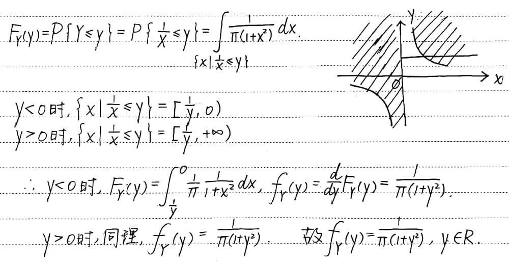

# Random Variables

#### Deriving the p.d.f. of $X^2$ When $X$ Has an Uniform Distribution (Example 3.8.1[^1])

[^1]: DeGroot, Schervish, *Probability and Statistics*, Fourth Edition.

Suppose that $X$ has a uniform distribution on the interval $[-1, 1]$, so

$$
f(x) = \begin{cases}
    1/2 & -1\le x \le 1,\\
    0 & \text{otherwise}.
\end{cases}
$$

We shall determine the p.d.f of the random variable $Y = X^2$.

Since $Y = X^2$, then $Y$ must belong to the interval $0\le Y \le 1$. Thus, for each value of $Y$ such that $0 \le y \le 1$, the d.f. $G(y)$ of $Y$ is

$$
\begin{aligned}
    G(y) =& \Pr(Y \le y) = \Pr(X^2 \le y) \\
    =& \Pr\big(-y^{1/2}\le X \le y^{1/2}\big) \\
    =& \int_{-y^{1/2}}^{y^{1/2}}f(x)\mathrm{d}x = y^{1/2}.
\end{aligned}
$$

For $0 < y < 1$, it follows that the p.d.f. $g(y)$ of $Y$ is

$$
g(y) = \frac{\mathrm{d}G(y)}{\mathrm{d}y} = \frac{1}{2y^{1/2}}.
$$

#### Choosing Points from Uniform Distributions (Example 3.6.5[^1])

Suppose that a point $X$ is chosen from a uniform distribution on the interval $[0, 1]$; and that after the value $X = x$ has been observed ($0 < x < 1$), a point $Y$ is then chosen from a uniform distribution on the interval $[x, 1]$. We shall derive the marginal p.d.f. of $Y$.

Since $X$ has a uniform distribution, the marginal p.d.f. of $X$ is as follows:

$$
f_1(x) = \begin{cases}
1, & 0 < x < 1, \\
0, & \mathrm{otherwise}.
\end{cases}
$$

Similarly, for each value $X = x$ ($0 < a < 1$), the conditional distribution of $Y$ is a uniform distribution on the interval $[x, 1]$. Since the length of this interval is $1 - x$, the conditional p.d.f. of $Y$ given that $X = x$ will be

$$
g_2(y|x) = \begin{cases}
\cfrac{1}{1-x}, & x < y < 1, \\
0, & \mathrm{otherwise}.
\end{cases}
$$

It follows that the joint p.d.f. of $X$ and $Y$ will be

$$
f(x, y) = \begin{cases}
\cfrac{1}{1-x}, & 0 < x < y < 1, \\
0, & \mathrm{otherwise}.
\end{cases}
$$

Thus, for $0 < y < 1$, the value of the marginal p.d.f. $f_2(y)$ of $Y$ will be

$$
f_2(y) = \int_{-\infty}^{\infty} f(x, y) \mathrm{d}x = \int_0^y \frac{1}{1-x} \mathrm{d}x = -\log(1-y).
$$

Furthermore, since $Y$ cannot be outside the interval $0 < y < 1$, then $f_2(y) = 0$ for $y \le 0$ or $y \ge 1$. This marginal p.d.f. $f_2$ is sketched in the figure below. It is interesting to note that in this example the function $f_2$ is unbounded.

{:width=190px}

#### Cauchy-Schwarz Inequality[^1]

For all random variables $U$ and $V$,

$$
\big[E(UV)\big]^2 \le E(U^2)E(V^2). \tag{1}
$$

If, in addition, the right-hand side of Eq. (1) is finite, then the two sides of Eq. (1) equal the same value if and only if there are constants $a$ and $b$ such that $aU+bV=0$ with probability 1.

**Proof.** If $E(U^2)=0$, then $\Pr(U=0)=1$. Therefore, it must also be true that $\Pr(UV=0)=1$. Hence, $E(UV)=0$, and the relation (1) is satisfied. Similarly, if $E(V^2)=0$, then the relation (1) will be satisfied. We can assume, therefore, that $E(U^2)>0$ and $E(V^2)>0$. Moreover, if either $E(U^2)$ or $E(V^2)$ is infinite, then the right side of the relation (1) will be infinite. In this case, the relation (1) will surely be satisfied.

For the rest of the proof, assume that $0<E(U^2)<\infty$ and $0<E(V^2)<\infty$. For all numbers $a$ and $b$,

$$
0 \le E\big[(aU+bV)^2\big] = a^2E(U^2) + b^2E(V^2) + 2abE(UV)\tag{2}
$$

and

$$
0 \le E\big[(aU-bV)^2\big] = a^2E(U^2) + b^2E(V^2) - 2abE(UV).\tag{3}
$$

If we let $a = \big[E(V^2)\big]^{1/2}$ and $b = \big[E(U^2)\big]^{1/2}$, then it follows from the relation (2) that

$$
E(UV) \ge -\big[E(U^2)E(V^2)\big]^{1/2}.
$$

It also follows from the relation (3) that

$$
E(UV) \le \big[E(U^2)E(V^2)\big]^{1/2}.
$$

These two relations together imply that the relation (1) is satisfied.

*1*  
设随机变量 $X$ 服从柯西分布，其概率分布为

$$
f_X(x) = \frac{1}{\pi(1+x^2)},\ x \in \mathbb{R}
$$

求 $Y = \dfrac{1}{X}$ 的概率密度.

??? note "Hint"
    
