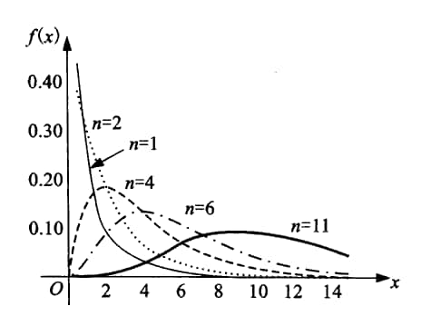
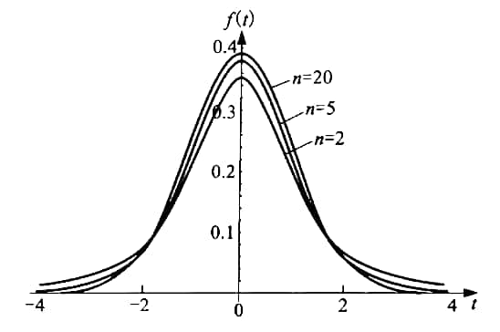
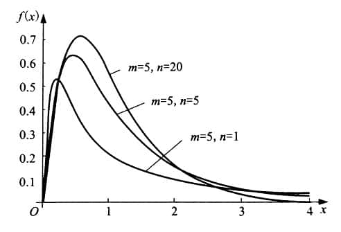

# Statistics

## 统计量

### 样本均值

$$
\overline{X} = \frac{1}{n}\sum_{i=1}^nX_i
$$

### 样本方差

$$
\begin{aligned}
S^2 &= \frac{1}{n-1}\sum_{i=1}^n\left(X_i - \overline{X}\right)^2\\
&=\frac{1}{n-1}\left(\sum_{i=1}^nX_i^2-n\overline{X}^2\right)
\end{aligned}
$$

### $k$ 阶原点矩

$$
A_k = \frac{1}{n}\sum_{i=1}^n X_i^k
$$

### $k$ 阶中心矩

$$
B_k = \frac{1}{n}\sum_{i=1}^n\left(X_i - \overline{X}\right)^k
$$

特别地，有 $B_2 = S_n^2$.

## 抽样分布

### $\chi^2$ 分布

若随机变量 $X_1, X_2, \cdots, X_n$ 相互独立且均服从 $N(0, 1)$，则

$$
\chi^2 = \sum_{i=1}^nX_i^2
$$

服从自由度为 $n$ 的 $\chi^2$ 分布，记为 $\chi^2\sim\chi^2(n)$. 其概率密度函数如下图所示.

{: width=280px}

### t 分布

若两个随机变量 $X\sim N(0, 1)$，$Y\sim\chi^2(n)$，且相互独立，则

$$
T = \frac{X}{\sqrt{\dfrac{Y}{n}}}
$$

服从自由度为 $n$ 的 t 分布，记为 $T\sim t(n)$. 其概率密度函数如下图所示.

{: width=320px}

t 分布和标准正态分布很接近，在 $n$ 足够大时，

$$
\lim_{n\rightarrow\infty} f(t) = \sqrt{\frac{1}{2\pi}}\exp\left(-\frac{t^2}{2}\right)
$$

事实上，当 $n>30$ 时就可以将 t 分布近似视为标准正态分布了.

### F 分布

若两个随机变量 $U\sim\chi^2(m)$，$V\sim\chi^2(n)$，且相互独立，则

$$
F = \frac{U/m}{V/n}
$$

服从自由度为 $(m, n)$ 的 F 分布，记作 $F\sim F(m, n)$. 其概率密度函数如下如所示.

{: width=320px}

### 正态分布总体下的抽样分布

设正态总体 $X\sim N(\mu, \sigma^2)$，从中独立地抽取规模为 $n$ 的样本，则

$$
\frac{\overline{X}-\mu}{\sigma/\sqrt{n}} \sim N(0, 1);
$$

$$
\frac{(n-1)S^2}{\sigma^2} \sim \chi^2(n-1);
$$

$$
\frac{\overline{X}-\mu}{S/\sqrt{n}} \sim t(n-1).
$$

设正态总体 $X\sim N(\mu_X, \sigma_X^2)$，$Y\sim N(\mu_Y, \sigma_Y^2)$，分别从中独立地抽取规模为 $m$ 和 $n$ 的样本，则

$$
\frac{(\overline{X}-\overline{Y})-(\mu_X - \mu_Y)}{\sqrt{\dfrac{\sigma_X^2}{m}+\dfrac{\sigma_Y^2}{n}}} \sim N(0, 1);
$$

若 $\sigma_X = \sigma_Y = \sigma$，

$$
\frac{(\overline{X}-\overline{Y})-(\mu_X - \mu_Y)}{S_\omega\sqrt{\dfrac{1}{m}+\dfrac{1}{n}}} \sim t(m+n-2),
$$

其中 $S_\omega = \sqrt{\cfrac{(m-1)S_X^2 + (n-1)S_Y^2}{m+n-2}};$

$$
\frac{S_X^2/S_Y^2}{\sigma_X^2/\sigma_Y^2} \sim F(m-1, n-1).
$$
