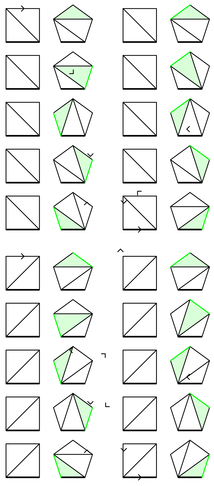

---
date:
    created: 2023-04-24
categories:
    - Maths
---

# Catalan Number

The Catalan numbers are a sequence of integers named after the mathematician Eugène Charles Catalan.

The $n$th Catalan number is

$$
C_n = \frac{1}{n+1}\binom{2n}{n}, \quad n \ge 0. \tag 1
$$

<!-- more -->

The fist Catalan numbers are listed below.[^A000108]

[^A000108]: [A000108 - OEIS](https://oeis.org/A000108){: target="_blank"}

$$
\begin{matrix*}[r]
n & 0 & 1 & 2 & 3 & 4 & 5 & 6 \\
C_n & 1 & 1 & 2 & 5 & 14 & 42 & 132
\end{matrix*}
$$

## Alternate forms

The definition immediately derives that

$$
C_n = \frac{(2n)!}{n!(n+1)!}, \quad n \ge 0. \tag 2
$$

For $n > 1$, expanding the equation above,

$$
\begin{aligned}
C_n &= \frac{(2n)!}{n!(n+1)!} \\
&= \frac{\prod_{k=1}^{2n}k}{\prod_{k=1}^{n}k\prod_{k=1}^{n+1}k} \\
&= \frac{(n+1)(n+2)(n+3)\cdots(2n-1)(2n)}{1\cdot 2\cdot 3\cdots (n-1)\cdot n\cdot (n+1)} \\
&= \frac{(n+2)(n+3)\cdots(2n-1)(2n)}{2\cdot 3\cdots (n-1)\cdot n} \\
&= \prod_{k=2}^n \frac{n+k}{k}.
\end{aligned} \tag 3
$$

For a recurrence relation

$$
\begin{aligned}
C_n/C_{n-1} &= \frac{(2n)!/(2n-2)!}{(n!(n+1)!)/((n-1)!n!)} \\
&= \frac{2(2n-1)}{n+1}.
\end{aligned}
$$

therefore

$$
\begin{aligned}
C_0 &= 1 \\
C_n &= \frac{2(2n-1)}{n+1}C_{n-1},\quad n > 0. \tag 4
\end{aligned}
$$

Another important recurrence relation is

$$
\begin{aligned}
C_0 &= 1 \\
C_n &= \sum_{i=0}^{n-1}C_iC_{n-i-1},\quad n > 0, \tag 5
\end{aligned}
$$

and it can be proved by the generating function[^wikicatalanproof][^secatalanrecur].

[^wikicatalanproof]: [Catalan number - Wikipedia](https://en.wikipedia.org/wiki/Catalan_number#First_proof){: target="_blank"}

[^secatalanrecur]: [Simplifying Catalan number recurrence relation](https://math.stackexchange.com/a/338385){: target="_blank"}

## Applications in combinatorics

### Binary trees with $n$ nodes

There are $C_n$ structurally different binary trees with $n$ nodes.

If the left subtree of the root has $i$ nodes, the right subtree has $n-1-i$ nodes. This immediately leads to the recurrence relation $(5)$. It is essentially the same for the number of associations of $n$ applications of a binary operator.

### $n$ pairs of correctly matched parentheses

There are $C_n$ different sequences of $n$ pairs of parentheses that are correctly matched.

$$
\large ()()()\quad (())() \quad ()(()) \quad (()()) \quad ((()))
$$

A sequence of parentheses is correctly matched if and only if:

* any prefix of the sequence contains no more close parentheses than open parentheses,
* total number of open and close parentheses are equal.

Re-interpreting an open parenthesis as a step rightwards and a close parenthesis as a step rightwards, $C_n$ counts the number of different monotonic lattice paths in $n\times n$ square cells from bottom left corner to top right corner that do not cross above the diagonal, as shown below.

It is obvious that there are $\binom{2n}{n}$ monotonic lattice paths without constraint of the diagonal, because one can choose arbitrary $n$ steps upwards from $2n$ steps in a path.

We define *exceedance* of a path to be the number of steps upwards in the path, and the set of all paths of exceedance $k$ in a $n\times n$ grid are denoted by $P_n^k$. All possible exceedances are $k = 0, 1, 2, \cdots, n$, as in $P_n^0$ are the desired ones, and the paths in $P_n^n$ stays above the diagonal.

By showing that there is a bijection between $P_n^i$ and $P_n^{i-1}$ for any $i = 1, 2, \cdots, n$, we can prove that all $P_n^k$ for $k = 0, 1, 2, \cdots, n$ have the same size. Because there are $n+1$ possible exceedances, the desired paths, i.e. the paths of zero exceedance $P_n^0$, account for $(n+1)$th of all possible $\binom{2n}{n}$ monotonic lattice paths. Therefore there are $C_n$ desired paths according to formula $(1)$.

The forward part of the bijection from $P_n^k$ to $P_n^{k-1}$ can be established by swapping the sections before and after the first step rightwards ending on the diagonal of a bad path (the black one) in all paths in $P_n^k$, thus reducing the exceedance by 1.

Similarly, the backward part of the bijection from $P_n^{k-1}$ to $P_n^k$ is swapping the sections before and after the last step rightwards starting from the diagonal, increasing the exceedance by 1. The following diagram shows all possible swapping in a $3\times 3$ grid.

### Divisions of a convex polygon into $n$ triangles

The Catalan numbers are the answer for Euler's polygon division problem. Explicitly, a triangulation of a convex $(n+2)$-gon divides the polygon into $n$ triangles by $n-1$ lines, and $C_n$ counts the number of different triangulations of a convex $(n+2)$-gon. All possible triangulations of a convex 4-gon (quadrilateral), 5-gon (pentagon) and 6-gon (hexagon) are listed below[^wolframpolygon].

[^wolframpolygon]: [Catalan Number -- from Wolfram MathWorld](https://mathworld.wolfram.com/CatalanNumber.html)

We denote the number of triangulations of a convex $(n+2)$-gon by $t_n$. Next, we will prove this sequence for $n\in N$ is the Catalan numbers, that is, $t_n = C_n$. In the following proof, we view a triangulation of a convex $(n+2)$-gon as a graph

$$
T_{n+2} = \langle V(T_{n+2}), E(T_{n+2}) \rangle,
$$

where $T_{n+2}$ is the triangulation, $V(T_{n+2})$ is the set of $n+2$ vertices in this polygon and $E(T_{n+2})$ is the set of $2n+1$ edges, comprising $n+2$ sides and $n-1$ internal edges.

For a convex $(n+2)$-gon, $A$ is defined to be the set of triples $\langle T_{n+2}, e, d \rangle$, where

* $T_{n+2}$ is one of the triangulations of this polygon, with a total of $t_n$ possible choices;
* $e \in E(T_{n+2})$ is one of the edges in $T_{n+2}$, with a total of $2n+1$ possible choices for each $T_{n+2}$;
* $d \in \{1, -1\}$ is one of the possible directions of $e$, with a total of 2 possible choices for each $e$.

The size of $A$ is the product of number of choices of each item in the triple

$$
|A| = 2(2n+1)t_n.
$$

For the triangulations of a convex $(n+3)$-gon, we select one of its sides to be the "base", and $B$ is defined to be the set of pairs $\langle T_{n+3}, e' \rangle$, where

* $T_{n+3}$ is one of the triangulations of this polygon, with a total of $t_{n+1}$ possible choices;
* $e'$ is one of the sides of this polygon, except the base, with $n+2$ possible choices.

Similarly, the size of $B$ is

$$
|B| = (n+2)t_{n+1}.
$$

We show that there is a bijection between $A$ and $B$. For any element in $A$, split the selected edge $e$ into two along its direction $d$, resulting in two different edges sharing the start point. Connecting the two end points, the original edge is expanded into a triangle. Thus, $T_{n+2}$ is transformed into $T_{n+3}$ with a newly formed side $e'$.

The other direction of the bijection collapses the selected edge $e'$ in $T_{n+3}$, thus the triangle that comprises $e'$ shrinks into an edge $e$, with the direction $d$ points to the disappeared side.

The base edge serves as a standard for comparison, which remains unchanged during the transformation in the bijection and do not disappear when going from $T_{n+2}$ to $T_{n+3}$.

The diagram below illustrates this bijection in the case $n = 2$. The base edges are depicted in thicker lines. The newly formed triangles and edges are shown in green.

{: width=375px}

Hence $A$ and $B$ are of equal sizes, that is, $2(2n+1)t_n = (n+2)t_{n+1}$. Applying $t_1 = 1$ we have $t_n = C_n$ according to equation $(4)$.

## See Also

* [Catalan Addendum](https://math.mit.edu/~rstan/ec/catadd.pdf){: target="_blank"}
